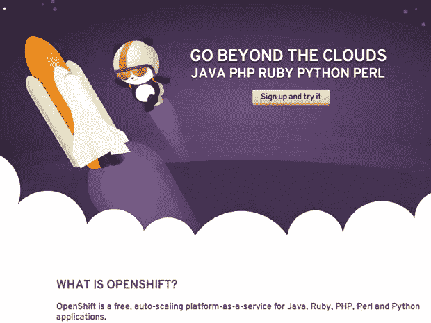
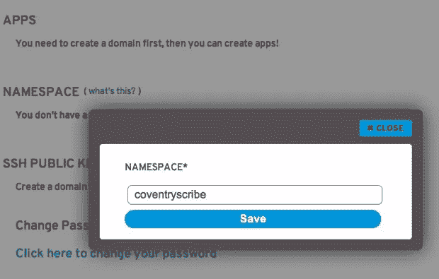
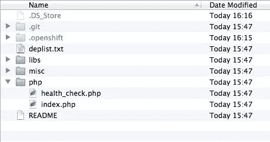
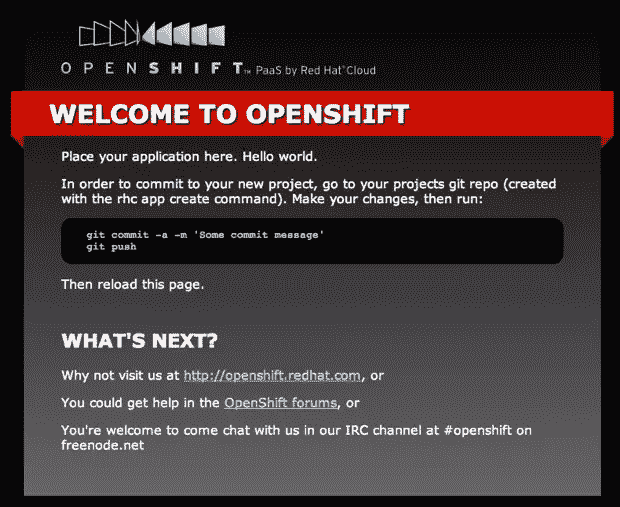

# 使用 OpenShift 开始运行

> 原文：<https://www.sitepoint.com/get-up-and-running-with-openshift/>

[OpenShift](http://openshift.redhat.com) 是一个平台即服务(PaaS)系统，与越来越多的此类系统相呼应。尽管 OpenShift 有一些东西是许多基于 PaaS 系统的初创公司所没有的。OpenShift 是由著名的开源/Linux 公司 Red Hat 创建的。Red Hat 是为企业创建稳定、健壮的系统的同义词，所以他们加入 PaaS 提供商的行列也就不足为奇了。

在本文中，我将向您展示如何设置 OpenShift，并在其上部署一个现有的简单 PHP web 应用程序，并继续在 OpenShift cloud 上开发应用程序。

## 1.获得一个帐户

注册一个免费账户只需几秒钟，所以先注册吧:



## 2.确保您的系统符合要求

有一些具体的操作要求，但以下列表涵盖了一般要求:

1.  应该安装 Git
2.  应该安装 Ruby(至少版本 1.8.7)

### Linux 要求

对于大多数 Linux 发行版，您需要 root 访问权限，以及您已经安装的 Ruby 版本的开发包。你需要 Git，也需要 rubygems。

### Windows 要求

您需要运行 Cygwin(一个类似 Linux 的 Windows 环境),并带有以下可选组件:

*   openssh
*   红宝石
*   制造
*   （同 groundcontrolcenter）地面控制中心
*   饭桶

### Mac 要求

对于 Mac(雪豹和狮子)，你需要 Git 或者完整的 XCode 套件。

## 3.设置帮助

值得注意的是，一旦您确认了您的帐户并登录，有许多“入门”视频可以帮助您设置系统。

## 4.客户端工具的安装

不管你的操作系统是什么，你都需要安装 OpenShift 客户端工具 Ruby gems。进入命令行/控制台，执行以下操作:

```
gem install rhc 
```

如果你在 Mac 上，你还需要安装 json_pure gem。

如果您在 Linux/Windows 上使用 Cygwin，您可能需要使用“sudo”来安装 gems。

## 5.创建名称空间

您将获得一个链接，通过该链接可以访问控制面板，以便创建一个名称空间:



您还需要添加您的公钥。如果您不确定如何生成自己的公钥/私钥对，只需进入终端并执行以下操作:

```
ssh-keygen
```

接受默认选择是好的。

## 6.创建应用程序

现在我们可以创建一个应用程序。OpenShift 支持 Java、Perl、Python、Ruby 或 PHP 应用程序。我们将创建一个 PHP 应用程序，因此返回到终端并执行以下操作:

```
rhc app create -a shouter -t php-5.3 -l your user name
```

所以在这里，我们正在创建一个名为“shouter”的新应用程序，其类型设置为 PHP 5.3。然后，您还可以添加您的用户名来登录。然后会提示您输入密码。

过一会儿，你应该会收到一条确认消息，表明你的应用程序已经创建好了。您还将获得一个 url，您可以在 web 浏览器中查看您的新应用程序。提供的另一个重要信息是 Git 克隆地址。

> 注意:系统会要求您将 web 应用程序 url 添加到已知主机列表中。你应该回答是。

## 7.克隆应用程序

打开一个新的终端窗口(我喜欢在应用程序上打开一个命令)，cd 到一个项目目录，然后做:

```
git clone the-clone-url-you-were-provided-with shouter
```

### 关于应用程序的说明

我这里指的 app 叫“shouter”。这是一个基于 CodeIgniter 的 PHP 应用程序，提供了一个简单的基于浏览器的“呼喊”或消息系统。你显然可以使用自己的应用程序，只需将“shouter”替换为你的应用程序的名称。

克隆完成后，您将看到如下所示的目录结构:



这是我们最感兴趣的 PHP 文件夹，因为这是我们的主要应用程序文件所在的位置。

## 8.只是确保一切正常…

现在我们可以做一个简单的更改，提交并推送它，然后检查我们是否可以在浏览器中看到更改。向 index.php 添加一小段文本(任何您喜欢的内容)，然后提交它:

```
git commit -am 'just a test commit'
```

然后我们可以推回到 OpenShift 云:

```
git push origin master
```

刷新您的浏览器，您应该会看到您的更改:



## 9.安装一些墨盒

OpenShift 使用了墨盒的概念。它们可以被认为是可以安装来支持您的应用程序的软件包。所以对于一个 PHP 应用来说，有 MySQL 和 phpMyAdmin 可用是相当常见的。我们可以通过终端的简单命令将它们添加到我们的应用程序中:

```
rhc app cartridge add -a your-app -c mysql-5.1 -l your-user-name
```

和 phpMyAdmin:

```
rhc app cartridge add -a your-app -c phpmyadmin-3.4 -l your-user-name
```

现在，您的应用程序运行了一个 MySQL，可以通过 phpMyAdmin 管理它。务必仔细记下提供给您的登录凭据。你会需要它们的！

## 10.开发您的应用

因此，如果你想在 OpenShift 上运行一个现有的应用程序，把它移过来是很简单的。不过有一点需要注意，根据 Red Hat 的说法，OpenShift 是一个开发者预览版。这意味着它可能不适合生产代码。说到这里，我已经用了一个星期了，没有任何问题。

如果您的项目已经在 Git 源代码管理下，您很可能需要删除 Git 文件，只需将您的应用程序复制到 OpenShift 项目的本地克隆中。将历史从一个回购转移到另一个回购是一件棘手的事情，通常只适用于你有一个文件夹的情况。

我倾向于保留我的旧 repo 作为参考点，并将代码复制到 OpenShift repo 中。

### 工作周期

因此，现在您可以继续开发，为您的应用程序添加新功能。您可以在每次更新内容时提交并推送至 OpenShift，或者您可以使用本地 AMP(MAMP/WAMP，本地 Apache)设置在将更改推送至 OpenShift 之前在本地测试这些更改。这意味着你可以像使用 Github 一样远程管理你的源代码。这里唯一的区别是，当您推送到远程时，您实际上是在部署您的代码。

### 配置文件

我之前提到过，我的应用程序是建立在 CodeIgniter 框架之上的。使用框架的一个优点是，您可以轻松地操作配置文件，使其在本地设置或 OpenShift 部署上工作。例如，使用 CodeIgniter，您可以在 application/config/config.php 中执行如下操作:

```
if($_SERVER['SERVER_NAME'] == "shouter.dev")
{
    //local environment
    $config['base_url'] = 'http://shouter.dev/';
}
else
{
    //OpenShift
    $config['base_url'] = 'http://your-url.rhcloud.com/';
}
```

您可以对数据库配置进行同样的操作。

### 。htaccess

您可以创建自定义。htaccess 文件，它们按预期工作。

## 名称空间

OpenShift 使用名称空间的概念来充当域。一个命名空间可以包含多个应用程序；您为应用程序指定的名称将构成您用来访问应用程序的 url 的一部分。如果您想要更多的名称空间，您必须为每个名称空间创建一个新帐户。

## 域名

如果你有一个域名，你可以指向你的 OpenShift 应用。回到终端，执行以下操作:

```
rhc-ctl-app -a appname -c add-alias --alias www.mydomain.com
```

然后，在 mydomain.com 的 DNS 管理中，您可以添加一个 cname 来将 www.mydomain.com 指向 app-namespace.rhcloud.com。

## 最后…

当然，有很多 PaaS 选项。考虑到 OpenShift 是开发者预览版，感觉已经很稳定了。Red Hat 还在开发一个基于浏览器的管理控制台，使设置新应用程序、管理您的名称空间和访问您的帐户详细信息变得更加容易。本文概述了如何设置并开始/继续开发您的应用程序。请记住，支持 Ruby、Python 和 Java 应用程序。

## 分享这篇文章