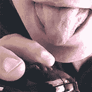

# HTML5 的新感官元素

> 原文：<https://www.sitepoint.com/html5-new-sensory-elements/>

网络主要是一种视觉媒介，到处都有一些声音。HTML5 支持`video`和`audio`标签，但我们的其他感官却被可耻地忽略了。直到现在。

W3C 将很快宣布三个新的 HTML5 元素，它们支持不同的感官界面:

*   `<texture>`为触摸
*   `<aroma>`为气味，而
*   `<flavor>`为品尝

## HTML 用法

新元素通常用作其他项目的包装。例如，您可能想要将新鲜的青草气味应用到田地的图像中，例如

```
 <aroma fresh="50%" sweet="20%" warm="35%">
	
</aroma> 
```

分类属性将根据标签而变化，例如

*   质地:光滑度，坚实度，松弛度，温度
*   香气:甜、辣、辛、香、暖、干、酸
*   味道:甜味、酸味、咸味

还支持音量和静音属性来指示气味和味道的*强度*。

然而，除非你是化学专家，否则定义这些属性并不容易。因此，所有标签都可以使用 src 和 type 属性来指向感官定义文件，这些文件包含一种或多种质地、香味或风味

```
 <aroma src="cheese.odor" type="stilton">
	
</aroma> 
```

供应商将在其浏览器中提供几个预定义的感官包。然而，Chrome 对 Roquefort 的表现很可能与 IE 不同；我们可能要过几年才能达到公认的感官标准。幸运的是，如果出现兼容性问题，可以开发自己的定义文件。

## CSS 属性

纹理、气味和味道也可以从 CSS 中应用。例如，我们的在线奶酪店可以链接到一个[臭气熏天的主教](http://en.wikipedia.org/wiki/Stinking_Bishop_cheese)页面:

```
 <a id="stinking" href="stinking-bishop.html">
	
</a> 
```

当用户悬停或聚焦于链接时，CSS 可以应用适当的香味、味道和纹理。可以使用感官定义文件或分类:

```
 a#stinking:hover, a#stinking:focus {
	aroma: url("cheese.odor") stinkingbishop 50%; /* pack, type, volume */
	flavor: url("cheese.taste") stinkingbishop 98%; /* pack, type, volume */
	texture: 25% 30% 20; /* smoothness, hardness, temperature (degrees C) */
} 
```

## JavaScript APIs

JavaScript APIs 将可用于新的感官元素。例如，您可以静音或改变感官标签的音量(强度)

```
 var cheese = document.getElementById("stinking");
var c = 0;
Pungent();

function Pungent() {
	cheese.aroma.volume = c + "%";
	c += 5;
	if (c < 100) setTimeout(arguments.callee, 500);
} 
```

这个例子随着时间的推移增加了奶酪的气味。请注意，香味生成设备的响应时间可能比屏幕输出慢:需要进行彻底的测试，以确保香味和口味不会发生冲突。

## 硬件支持



支持这些传感元件的硬件设备将在明年推出。其中之一是斯堪的纳维亚个人电脑制造商 Ollofipra 生产的多感官鼠标。它使用获得专利的橡胶网来改变形状、质地和温度。它还会发出一系列气味，中央转盘会产生不同的味道。该公司希望将这项技术添加到触摸感应显示器上，使它们变得可以被点击。

请注意，W3C 对感觉元素的规范还处于早期的 daft 阶段，实现的变化是不可避免的。然而，未来看起来很有希望，这些标签有可能彻底改变网络界面。你今天当然应该和你的同事讨论一下。

## 分享这篇文章