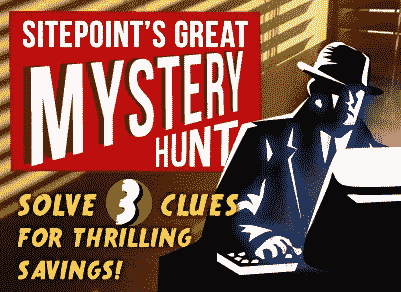

# 你参与了 SitePoint 的神秘大追捕吗？

> 原文：<https://www.sitepoint.com/are-you-on-the-case-in-sitepoints-great-mystery-hunt/>

2012 年仅仅过去了三个月，已经有两本新的 SitePoint 书籍面向所有开发者和设计者( [CSS](https://www.sitepoint.com/books/cssant4) 和 [jQuery](https://www.sitepoint.com/books/jquery2) )。另外，DealFuel.com 的[现在每周都为你提供超值优惠。](http://www.dealfuel.com)

但是现在，让我们找点乐子吧！:)

** SitePoint 的[大神秘狩猎](http://www.dealfuel.com/?utm_source=sitepoint&utm_medium=blog-link&utm_campaign=great-mystery-hunt)开始了！**

在 SitePoint 上搜索三条线索的答案，并在我们的–[终极设计套装](http://dealfuel.com/seller/save-60-on-sitepoints-ultimate-designers-digital-bundle/?utm_source=google&utm_medium=cpc&utm_campaign=great-mystery-hunt)上为自己节省 75%的费用，该套装包括:

*   *jQuery:忍者新手，第二版(电子书)*
*   *美丽网页设计原理，第二版(电子书)*
*   *SEO 指南工具包(数字版)*
*   *1 个月的可学习会员资格*

请确保您也注册了 DealFuel，以获得我们刚刚发布的 HTML5 海报的免费数字副本。

祝狩猎快乐！

## 分享这篇文章