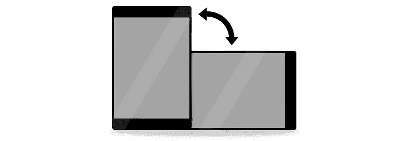
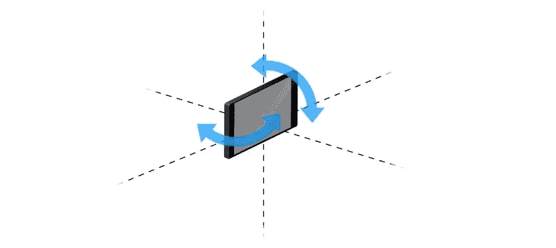
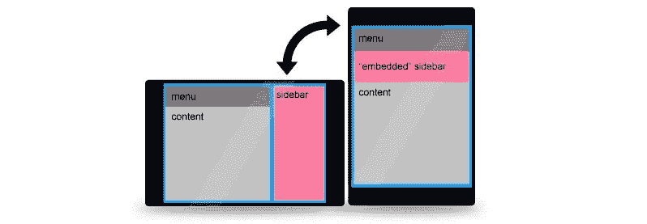
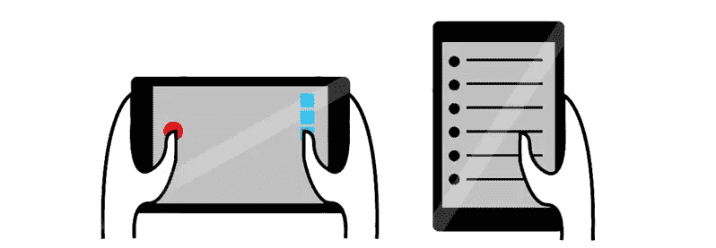
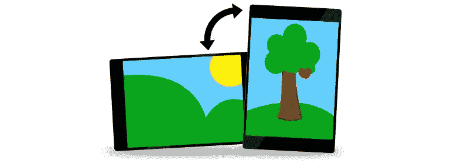

# 在您的移动网站上使用方向

> 原文：<https://www.sitepoint.com/how-to-use-orientation-on-your-mobile-sites/>

[](https://www.sitepoint.com/wp-content/uploads/2012/02/07.jpg)

### 方向和设备方向。有什么区别？

在我们开始之前，我认为有必要澄清一下“方向”与“*设备*方向”是不同的*方向*本身只涉及浏览器窗口的比例，允许您通过 CSS 媒体查询为“纵向”和“横向”模式分配不同的属性。

[](https://www.sitepoint.com/wp-content/uploads/2012/02/01.jpg)

方向:

*   仅识别两个角度(横向和纵向)，
*   很容易区分这两种“方向”,
*   检测“方向”而不需要大量的处理资源，
*   看起来相当静态，但对传统网站很有用。

*设备方向*大不相同；它涉及在更深的层次上访问宿主设备的运动数据。设备定向允许您创建实时 3D 定向功能。我们已经在许多原生游戏中看到了这一点(比如 iOS 版的 [Jenga，由 Steve Jobs](http://www.youtube.com/watch?v=ORcu-c-qnjg) 演示)，你可以通过改变设备的角度来控制事件。设备定位功能现在作为 HTML5 规范的[部分可用。](http://dev.w3.org/geo/api/spec-source-orientation.html) [](https://www.sitepoint.com/wp-content/uploads/2012/02/02.jpg) 设备方位:

*   识别所有角度，
*   需要高级编码技能，
*   需要更多的处理资源，
*   具有动态外观，
*   对于特殊功能非常有用。

在这篇文章中，我将坚持传统的用例，强调 CSS 定向媒体查询提供的一些巨大机会。

### 关于增强功能

有很多关于响应式设计的讨论，这种设计可以为所有不同尺寸的屏幕提供优化的体验。实现响应式设计的最重要的工具是相对值和屏幕宽度的媒体查询。但是，还有更多！

当用户在平板电脑或移动设备上浏览时，您永远无法 100%确定设备的物理位置。横向视图和纵向视图在许多方面彼此不同。在某些情况下，一个可能比另一个更好，但这取决于访问者的选择。在许多情况下，用户甚至可以锁定他们首选的横向或纵向设置的方向。如果你想提供最好的用户体验，你将需要迎合这两个方向。

### 如何开始使用定向

在进入用例之前，这里是你需要开始定位媒体查询的基本 CSS。

```
/* Portrait */
@media screen and (orientation:portrait) {
.yourclass { property: value; }
}
/* end of Portrait */

/* Landscape */
@media screen and (orientation:landscape) {
.yourclass { property: value; }
}
/*end of Landscape*/
```

### 航行

垂直滚动对纵向模式来说似乎很自然，但对横向模式来说就不那么自然了。您可能会考虑使用垂直内容布局，添加内容滑块或实现自动滚动功能。[](https://www.sitepoint.com/wp-content/uploads/2012/02/03.jpg)

### 量身定制的元素

仅依靠屏幕宽度的媒体查询，如果屏幕的比例不再对您有利，可能有一些布局元素需要下移或消失。使用方向，您可以简单地调整单个元素的大小或外观，以更好地适应给定的方向。创建侧边栏的替代品，重新调整你的广告比例，甚至重新着色元素，如果它们在不同的环境下效果更好的话。

[](https://www.sitepoint.com/wp-content/uploads/2012/02/05.jpg)

### 菜单

你可能需要重新考虑两个方向的菜单布局。横向布局的菜单项更容易访问。纵向视图可能会使你的屏幕宽度变小，所以你可以把菜单项一个接一个地放在下面。也许甚至是两列，只要你的手指能舒服地对准它们。

**一个拇指，两个拇指**

当在纵向位置拿着设备时，访问者很可能仅使用一个拇指来导航。风景更适合双手同时使用。您可以通过添加预测手部位置的相关导航和功能来利用这种预测。如果你的网站是一个网络应用，增加多点触控功能会特别令人兴奋。

[](https://www.sitepoint.com/wp-content/uploads/2012/02/04.jpg)

**引导用户**

如果您非常确定某个内容在横向或纵向方向(如宽屏视频)更令人愉快，您可能希望将用户引导到最佳位置。向用户发送友好的淡出消息，建议将设备转到正确的位置，这对双方都有好处。

**图像**

我所说的图像是指那些在你的布局中不变的、永久的部分。如果你考虑到屏幕的比例，你的设计可能会更好看。当选择图像素材时，您可以将埃菲尔铁塔的照片指定为肖像模式，将另一张伦敦桥的照片指定为风景模式。因此，它们都很好地补充了所选择的方向，而不必对布局做出太大的妥协。

[](https://www.sitepoint.com/wp-content/uploads/2012/02/06.jpg)

### 支持

大多数移动浏览器的最新版本都可以识别方向，包括:Opera、Safari、Firefox、Dolphin 和原生 Android 浏览器。这是相当坚实的移动浏览器覆盖面。奇怪的是，一些桌面浏览器也能识别它，包括最新版本的 Safari、Firefox 和 Chrome。在某些情况下，最好通过 CSS 分配或特定的媒体查询来排除非手持设备。

你是否充分利用 CSS 媒体查询来设计合适的方向？有没有设计好的定向的例子分享一下？

## 分享这篇文章