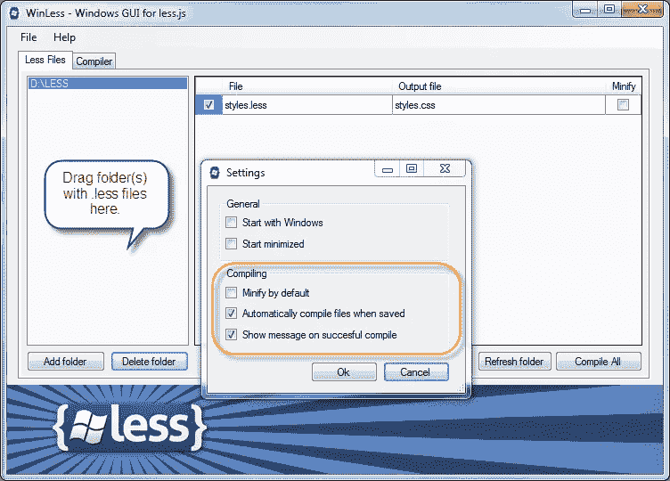
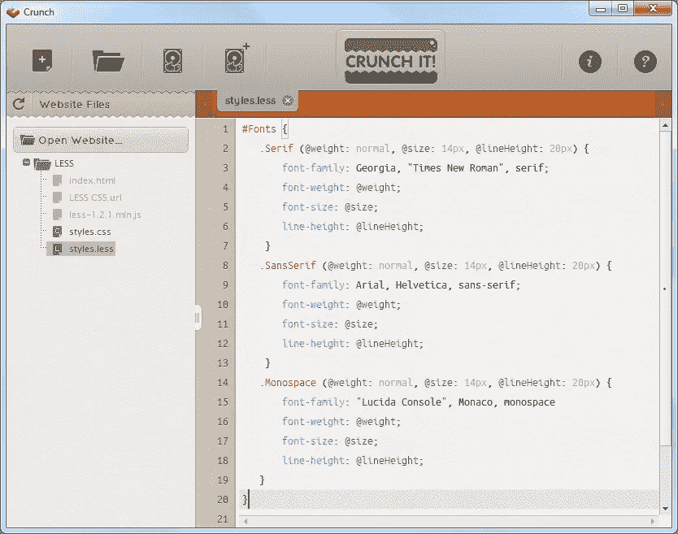

# Less: Mixins 的全面介绍

> 原文：<https://www.sitepoint.com/a-comprehensive-introduction-to-less-mixins/>

## 混合…什么？

用 Less，我们可以定义所谓的“mixins”，它与编程语言中的函数有一些相似之处。简而言之，它们被用来将 CSS 指令分组到方便的、可重用的类中。Mixins 允许您将一个类的所有属性嵌入到另一个类中，只需将类名作为它的属性之一。就像变量一样，但是对整个类来说。任何 CSS 类或 id 规则集都可以混合使用，这样:

```
.round-borders {
  border-radius: 5px;
  -moz-border-radius: 5px;
  -webkit-border-radius: 5px;
}

#menu {
  color: gray;
  .round-borders;
}

// Output
.round-borders {
  border-radius: 5px;
  -moz-border-radius: 5px;
  -webkit-border-radius: 5px;
}

#menu {
  color: gray;
  border-radius: 5px;
  -moz-border-radius: 5px;
  -webkit-border-radius: 5px;
}
```

如您所见，这个输出是 mixin 本身和 CSS 规则集。如果你不想让 mixin 出现在你编译的`.css`文件中，只需要在 mixin 名称后面加上空括号。你可能想知道为什么我在 mixin 名称中使用大写字母。这是因为 CSS 类选择器也使用点符号，没有办法把它和一个不太混杂的名字区分开来。这就是为什么我通常使用大写字母，就像在面向对象编程中，类使用大写字母一样。

## 请输入你的论点

Mixins 可以参数化，这意味着它们可以接受参数来增强它们的效用。参数混合本身在编译时不会输出。它的属性只有混合到另一个块中才会出现。典型的例子是创建一个跨浏览器工作的圆角 mixin:

```
.round-borders (@radius) {
  border-radius: @radius;
  -moz-border-radius: @radius;
  -webkit-border-radius: @radius;
}
```

下面是我们如何将它融入各种规则集:

```
header {
  .round-borders(4px);
}

.button {
  .round-borders(6px);
}
```

参数混音的参数也可以有默认值:

```
.round-borders (@radius: 5px) {
  border-radius: @radius;
  -moz-border-radius: @radius;
  -webkit-border-radius: @radius;
}
```

现在我们可以这样调用它:

```
header {
  .round-borders;
}
```

并且会包括一个 5px `border-radius`。

如果您有一个没有任何参数的 mixin，但是您不希望它出现在最终输出中，那么就给它一个空白的参数列表:

```
.hiddenMixin() {
  color: black;
}
```

```
p {
  .hiddenMixin()
}
```

它将输出:

```
p {
  color: black;
}
```

在 mixin 中有一个名为`@arguments`的特殊变量，它包含传递给 mixin 的所有参数，以及任何具有默认值的剩余参数。变量值包含所有用空格分隔的值。这对于快速分配所有参数非常有用:

```
.box-shadow(@x: 0, @y: 0, @blur: 1px, @color: #000) {
  box-shadow: @arguments;
  -moz-box-shadow: @arguments;
  -webkit-box-shadow: @arguments;
}

.box-shadow(2px, 5px);
```

这导致:

```
box-shadow: 2px 5px 1px #000;
-moz-box-shadow: 2px 5px 1px #000;
-webkit-box-shadow: 2px 5px 1px #000;
```

## 一点牵线:)

当您在一个 mix in 中混合时，根据传递给 mixin 的内容以及它的声明方式，检查当前作用域中该名称的所有可用 mixin，看它们是否匹配。

最简单的情况是 arity 匹配(mixin 接受的参数数量)。只有与传入的参数数量相匹配的混合才被使用，零参数混合除外，它总是被包含在内。这里有一个例子:

```
.mixin() { // this is always included
  background-color: white;
}

.mixin(@a)  {
  color: @a;
}

.mixin(@a, @b) {
  color: fade(@a, @b);
}
```

现在如果我们用单个参数调用`.mixin`，我们会得到第一个定义的输出，但是如果我们用两个参数调用它，我们会得到第二个定义，即`@a`褪为`@b`。

控制 mixin 是否匹配的另一种方法是在声明 mixin 时指定一个值来代替参数名:

```
.mixin (dark, @color) {
  color: darken(@color, 10%);
}

.mixin (light, @color) {
  color: lighten(@color, 10%);
}

.mixin (@_, @color) { // this is always included
  display: block;
}

@switch: light;

.class {
  .mixin(@switch, #888);
}
```

我们将得到下面的 CSS:

```
.class {
  color: #a2a2a2;
  display: block;
}
```

传递给`.mixin`的颜色变亮。如果`@switch`的值较暗，结果会是较暗的颜色。只使用匹配的 mixin 定义。变量匹配并绑定到任何值，而变量之外的任何值只匹配等于其自身的值。

## 护卫队

另一种限制 mixin 混入的方法是使用防护装置。一个保护是一个特殊的表达式，它与在 mixin 过程中被评估的 mixin 声明相关联。在 mixin 可以使用之前，它必须评估为 true。与简单的值或 arity 相反，当您希望对表达式进行匹配时，保护非常有用。

我们使用`when`关键字来开始描述一系列保护表达式。

```
.mixin (@a) when (lightness(@a) >= 50%) {   
  background-color: black;
}

.mixin (@a) when (lightness(@a) < 50%) {
  background-color: white;
}

.mixin (@a) { // this is always included
  color: @a;
}

.class1 {
  .mixin(#ddd);
} // this matches the first mixin

.class2 {
  .mixin(#555);
} // this matches the second mixin
```

这是我们将得到的:

```
.class1 {
  background-color: black;
  color: #ddd;
}

.class2 {
  background-color: white;
  color: #555;
}
```

守卫中可用的比较运算符的完整列表是: >、> =、=、=

如果想基于值类型匹配 mixins，可以使用 is*函数。它们是 iscolor、isnumber、isstring、iskeyword 和 isurl。如果您想检查一个值，除了是一个数字之外，是否是一个特定的单位，您可以使用其中之一 ispixel，ispercentage，isem。这里有一个简单的例子:

```
.mixin (@a) when (iscolor(@a)) {
  color: @a;
}

.mixin (@a) when (ispixel(@a)) {
  width: @a;
}

body {
  .mixin(black);
}

div {
  .mixin(960px);
}

// Output
body {
  color: #000000;
}

div {
  width: 960px;
}
```

守卫可以用逗号分隔，如果任何守卫的计算结果为 true，则认为是匹配的:

```
.mixin (@a) when (@a > 10), (@a < -10) { ... }
```

我们可以使用关键字`and`而不是逗号，这样所有的守卫必须匹配才能触发 mixin:

```
.mixin (@a) when (isnumber(@a)) and (@a > 0) { ... }
```

最后，您可以使用`not`关键字来否定条件:

```
.mixin (@b) when not (@b > 0) { ... }
```

## 觉得数学不好？再想想。

样式表中的一些元素与其他元素成比例吗？运算允许您对属性值和颜色进行加、减、除和乘运算，使您能够在属性之间创建复杂的关系。与其添加更多变量，不如用更少的变量对现有值执行操作。您可以用任何数字、颜色或变量构建表达式。

```
@sidebarWidth: 400px;
@sidebarColor: #FFCC00;
#sidebar {
  color: @sidebarColor + #FFDD00;
  width: @sidebarWidth / 2;
  margin: @sidebarWidth / 2 * 0.05;
}

// Output
#sidebar {
  color: #FFFF00; // color is brighter 
  width: 200px;   // width is reduced to 200px
  margin: 10px;   // margin is set to 5% of the width
}
```

圆括号可以用来控制求值的顺序。它们在复合值中是必需的:

```
border: (@width * 2) solid black;
```

Less 还为您提供了一些方便的数学函数。这些是:

```
round(1.67); // returns 2 
ceil(2.4);   // returns 3 
floor(2.6);  // returns 2
```

此外，如果您需要将值转换成百分比，可以使用 percentage 函数:

```
percentage(0.5); // returns 50%
```

在这里我给大家展示一个小秘密:如何在你的设计中运用黄金比例。你根本不需要任何计算器。看看这个:

```
@baseWidth: 960px;
@mainWidth: round(@baseWidth / 1.618);
@sidebarWidth: round(@baseWidth * 0.382);

#main {
  width: @mainWidth;
}

#sidebar {
  width: @sidebarWidth;
}
```

答案是:

```
#main {
  width: 593px;
}

#sidebar {
  width: 367px;
}
```

瞧吧！你的布局按照黄金比例进行了合理的划分。你还觉得数学不好吗？！我觉得不是:)

## 色彩炼金术

Less 提供了多种变换颜色的函数。颜色首先被转换到 HSL 颜色空间，然后在通道级别进行处理。所有颜色操作都以一种颜色和一个百分比作为参数，除了 spin 和 mix，前者使用 0 到 255 之间的整数而不是百分比来修改色调，后者以两种颜色作为参数。这里有一个快速参考:

```
lighten(@color, 10%);    // lightens color by percent and returns it
darken(@color, 10%);     // darkens color by percent and returns it
saturate(@color, 10%);   // saturates color by percent and returns it
desaturate(@color, 10%); // desaturates color by percent and returns it
fadein(@color, 10%);     // makes color less transparent by percent and returns it
fadeout(@color, 10%);    // makes color more transparent by percent and returns it
fade(@color, 50%);       // returns a color with the alpha set to amount

spin(@color, -10);       // returns a color with amount degrees added to hue
mix(@color1, @color2);   // return a mix of @color1 and @color2
```

您还可以从色调、饱和度、亮度和 alpha 通道中提取颜色信息:

```
hue(@color);        // returns the 'hue' channel of @color
saturation(@color); // returns the 'saturation' channel of @color
lightness(@color);  // returns the 'lightness' channel of @color
alpha(@color);      // returns the 'alpha' channel of @color
```

如果您想要基于另一种颜色的通道创建新颜色，这很有用，例如:

```
@new: hsl(hue(@old), 45%, 90%);
```

如果你想进一步探索色彩炼金术，我们有一个关于[创建更少的配色方案和调色板](https://www.sitepoint.com/color-alchemy-with-less-creating-color-schemes-and-palettes/)的新指南，有更多的细节！

## 你喜欢等级制度吗？是的，我知道。

在 CSS 中，我们分别写出每一个规则集，这通常会导致长选择器一遍又一遍地重复某些部分。在 Less 中，您可以简单地将选择器嵌套在其他选择器中，而不是构造长的选择器名称来指定继承。这使得继承更清晰，样式表更短:

```
header {}
header nav {}
header nav ul {}
header nav ul li {}
header nav ul li a {}
```

用更少的你可以写:

```
header {
  nav {
    ul {
      li {
        a {}
      }
    }
  }
}
```

正如您所看到的，这为您提供了干净、结构良好的代码，由一个强大的视觉层次来表示。现在，您不必一遍又一遍地重复选择器。只需将相关的规则集嵌套在另一个规则集中来表示层次结构。生成的代码将更加简洁，并模仿 DOM 树的结构。如果您想为伪类提供这种嵌套结构，可以使用&操作符。&运算符表示父代的选择器。当您希望嵌套选择器连接到其父选择器，而不是作为后代时，可以使用它。

例如，下面的代码:

```
header { 
  color: black; 
}

header nav {
  font-size: 12px;
}

header .logo {
  width: 300px;
}

header .logo:hover {
  text-decoration: none;
}
```

可以这样写:

```
header {
  color: black;
  nav {
    font-size: 12px;
  }
  .logo {
    width: 300px;
    &:hover { text-decoration: none }
  }
}
```

或者这样:

```
header    { color: black;
  nav { font-size: 12px }
  .logo   { width: 300px;
    &:hover { text-decoration: none }
  }
}
```

## 命名它，使用它，再使用它。有这么简单吗？

如果您想将 mixins 组合成单独的包，以便以后重用或分发，该怎么办？Less 通过将 mixins 嵌套在一个带有 ID 的规则集内，比如#namespace，让您能够做到这一点。

例如:

```
#fonts {
  .serif (@weight: normal, @size: 14px, @lineHeight: 20px) {
    font-family: Georgia, "Times New Roman", serif;
    font-weight: @weight;
    font-size: @size;       
    line-height: @lineHeight;
  }
  .sans-serif (@weight: normal, @size: 14px, @lineHeight: 20px) { 
    font-family: Arial, Helvetica, sans-serif;
    font-weight: @weight;
    font-size: @size;       
    line-height: @lineHeight;
  }
  .monospace (@weight: normal, @size: 14px, @lineHeight: 20px) {
    font-family: "Lucida Console", Monaco, monospace
    font-weight: @weight;
    font-size: @size;       
    line-height: @lineHeight;
  }
}
```

然后，要调用特定组中的 mixin，您可以这样做:

```
body {
  #fonts > .sans-serif;
}
```

输出是:

```
body {
  font-family: Arial, Helvetica, sans-serif;
  font-weight: normal;
  font-size: 14px;       
  line-height: 20px;
}
```

在定义不带参数的 mixins 时，记得添加空括号。这样，初始定义就不会包含在呈现的 CSS 中，只会包含在使用 mixin 的代码中。这既缩短了您的输出代码，又允许您保留一个定义库，直到它们被实际使用时才增加输出的重量。

## 一些特殊情况

### 字符串插值

字符串插值是一种将变量值直接插入字符串的便捷方法。变量可以用`@{name}`结构嵌入到字符串中:

```
@baseURL: "http://example.com";
border-image: url("@{base-urimg/border.png");
```

### 逃避

有时，您可能需要输出一个 CSS 值，该值要么是无效的 CSS 语法，要么使用 Less 无法识别的专有语法。如果是这种情况，只需将值放在以~运算符为前缀的字符串中，例如:

```
body {
  @size ~"20px/80px";
  font: @size sans-serif;
}
```

这称为“转义值”，将导致:

```
body {
  font: 20px/80px sans-serif;
}
```

## 我准备好了。请给我展示一下魔术。

Less 背后的想法是仅仅加速和简化开发步骤。这意味着你最终网站上的内容应该是简单的，旧的 CSS，而不是更少。幸运的是，这非常容易做到。你所需要做的就是得到一个更少的编译器，让它完成它的工作。我推荐[WinLess](http://winless.org)(Windows 版)和[less . app](http://incident57.com/less)(OS X 版)

在这里，我将向您解释如何与 WinLess 一起工作。首先，下载并安装它。当你启动 WinLess 时，你需要做的就是拖动一个包含`.less`文件的文件夹，然后你就可以开始了。要配置无 WinLess 行为，请打开文件>设置。我没有选中“默认缩小”，因为我希望我的文件是可读的，并且只在输出用于生产时才缩小我的文件。我检查了下面的另外两个选项，因为我不想每次保存文件时都手动编译，还因为我想知道编译是否成功。顺便说一下，出于培训的目的，你可以使用 [WinLess Online Less 编译器](http://winless.org/online-less-compiler)——如果你想快速尝试一些东西的话，这是个理想的选择。



要使用 LESS.app，您可以在其网站的主页上查看视频教程。

对于那些不使用 PC 或 Mac 的人来说，还有一个选择。可以得到[嘎吱！](http://crunchapp.net/)，这是一个跨平台的 AIR 应用。Crunch 不仅是一个少编译器，也是一个少编辑器。这很酷，因为据我所知，Crunch 是唯一的编辑器，它可以让您高亮显示`.less`文件的语法。试试看我的意思。你猜怎么着我告诉你我的小秘密。实际上，我两个都在用——WinLess 用于编译，Crunch 用于编辑。听起来很酷，是吧？



## 好的。我真的很着迷。我在哪里可以找到更多？

这是给你的一点奖金。这是一个简短的资源列表，可以立即用于您的项目中。有一些现成的 Less mixins 和变量，加上一些使用 Less 作为基础的项目。

*   [官方少文档](http://lesscss.org/)—好的。这不能在你的项目中使用:)但是，你应该定期检查它是否有任何更新和添加到语言中的新特性。
*   [Less Elements](http://lesselements.com/)—有用的 Less mixins 集合。
*   [pre boot . Less](http://markdotto.com/bootstrap/)—另一个较少混合和变量的集合。
*   语义网格系统—一个简单易用的页面布局工具。它支持固定的、流动的和响应性的布局。顺便说一下，你也可以用它和 Sass 和 Stylus 一起使用(如果你还没有爱上 Less 的话)。
*   [百分比](http://centage.peruste.net/)—如果你需要充分的流动性和灵活性，你一定要检查这个。
*   [Perkins CSS3 Less Framework](http://p.erkins.com/)—一个好看又丰富的 Less 框架，使用了 HTML5 和 CSS3。

如果你想找到更多关于更少的资源，GitHub 是一个合适的地方。正如你将会看到的，那里有很多更少的好东西。那么，你还在等什么？去看看他们。

## 最后几句话

简而言之，Less 是一种快速、简单、现代的编写和制作 CSS 代码的方式。所以不要太保守，试一试就好。花些时间用更少的东西，你会比以前更快更容易地创建和调整复杂的样式表。祝你编码愉快，永远记住——少即是多:)

如果你喜欢读这篇文章，你会爱上[可学的](https://learnable.com?utm_source=sitepoint&utm_medium=link&utm_campaign=learnablelink)；向大师们学习新技能和技术的地方。会员可以即时访问 SitePoint 的所有电子书和交互式在线课程，如[发布到更少的](https://learnable.com/courses/launch-into-less-2764?utm_source=sitepoint&utm_medium=link&utm_campaign=learnablelink)。

对本文的评论已经关闭。对少有疑问？为什么不在我们的[论坛](https://www.sitepoint.com/forums/forumdisplay.php?53-CSS-amp-Page-Layout?utm_source=sitepoint&utm_medium=link&utm_campaign=forumlink)上问呢？

## 分享这篇文章