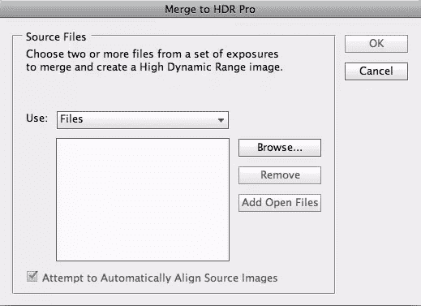
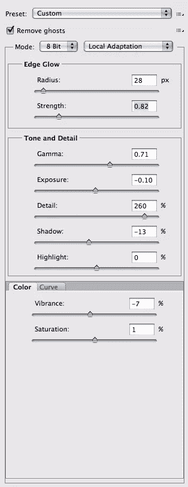
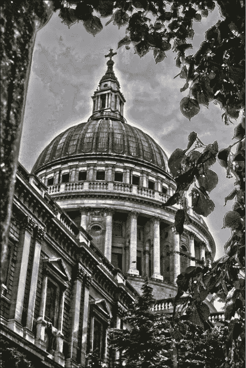
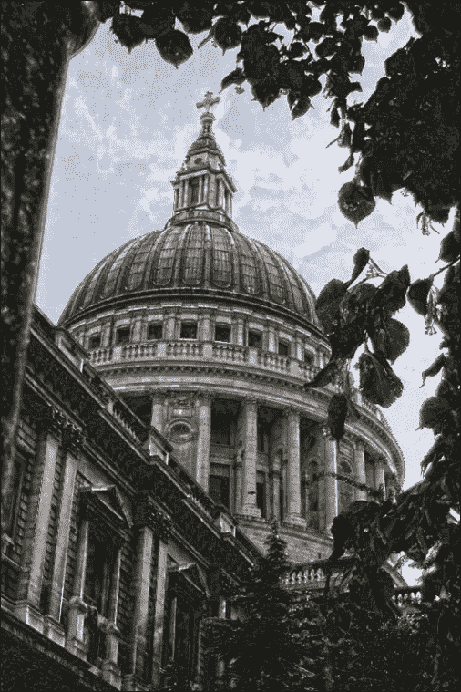
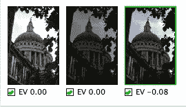
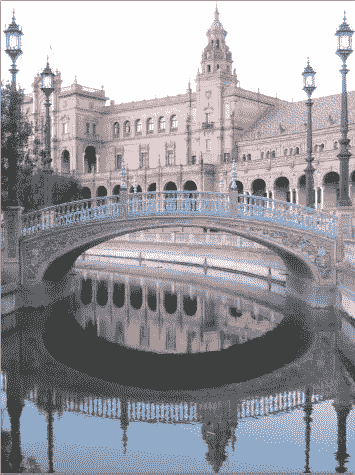
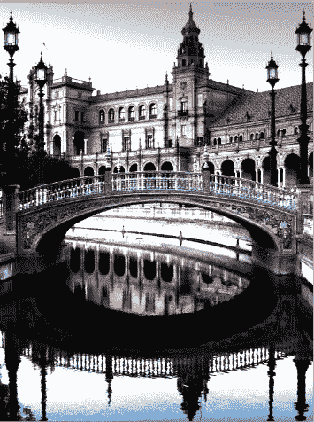
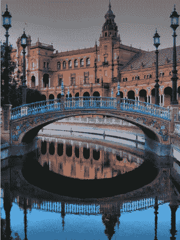
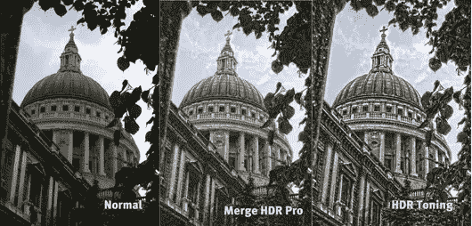

# 用 Photoshop 模拟高动态范围(HDR)

> 原文：<https://www.sitepoint.com/simulating-high-dynamic-range-hdr-with-photoshop/>

高动态范围(HDR)是一种将同一张图像的多次曝光分层并合并在一起的摄影技术。随着不同的曝光合并在一起，您可以获得更广泛的色调值，这给你一个更详细和生动的图像。你可以用 Photoshop 等图像编辑软件将这些不同的曝光合并在一起。

## 方法 1:合并到 HDR 专业版

Photoshop 有几个很棒的工具可以模拟 HDR。一个是合并到 HDR 专业。这种方法允许您对同一场景进行多次曝光，同时将它们导入 Photoshop，并将它们合并在一起，以创建一张真实的 HDR 照片。这确实需要一些深谋远虑，因为你将需要至少 3 个独立的图像组合成一个单一的 HDR 图像。

### 第一步:设置

为了获得最佳效果，你的三张照片应该有相同的主体透视，但它们应该有明显不同的曝光。这将防止重影。你可以通过使用一个稳定的三脚架，并在拍摄之间简单地改变相机的设置来实现这一点。

### 步骤 2:导入您的图像

打开 Photoshop，选择“文件”>“自动化”>“合并到 HDR 专业版”会出现一个小框，你可以在下拉菜单中选择打开离散文件或图像文件夹。

### 步骤 3:选择您的文件

如果您只想选择某些图像，请按住 command/ctrl 并单击您想要的每个图像。做出选择后，您需要确保选中“尝试自动对齐图像源”。然后，点击“确定”然后 Photoshop 将每个图像叠加到自己的图层上，并尽可能精确地将每个图像放置在下一个图像上。这有助于让你的 HDR 形象看起来尽可能鲜明。

### 第四步:开始调整你的形象

一旦你选择了你的图像，Photoshop 会为你做所有的艰苦工作，并自动覆盖每张图像。然后弹出一个对话框，你有几个选项可用。

### 第五步:清除鬼魂

选中“移除重影”选项很重要，因为这样你会得到更干净、更专业的效果。如果您忘记检查删除重影，结果如下:

你看到天空中所有的紫色条纹和紫色斑点了吗？这在 HDR 的图像中并不常见。以下是选中“移除重影”选项后的更好结果:

你会注意到天空中没有紫色的条纹或斑点。

### 第六步:半径

您可以使用 2 个滑块来调整边缘发光。半径决定光晕效果的大小。如果你把半径调得太高，那么你的图像会在某些物体周围出现奇怪的光晕。如果发生这种情况，降低强度设置，它应该有所帮助。为了得到我为 HDR 图像所做的结果，你需要将半径设置为 18。你不希望你的形象有太多的光环效应。

### 第七步:力量

强度决定光晕效果的对比度。将强度设置为 0.75。这将使你的图像看起来更加清晰。如果颜色区域开始变得模糊或暗淡，那么你就太远了。力度太大会让你的形象看起来更像影印，这不是我们想要的。

### 第八步:伽马射线——不要搞砸了！

下一个框“色调和细节”控制灰度系数、曝光、细节、阴影和高光。Gamma 滑块控制高光和阴影之间的差异。此设置使您能够控制图像中的对比度，它可用于混合图像中对比度过大的粗糙区域。Gamma 是一个你可能不想管的设置。如果你的图像看起来太灰或太模糊，那么你可以向左移动滑块来使它变亮，否则，保持设置为 1。

### 曝光——让事情变得轻松一些

曝光可调整整体图像色调，从而决定图像是亮还是暗。你必须调整每张照片的曝光值。这真的只是取决于图像本身。如果您的图像在阴影区域有很多图像信息，那么您会想要增加曝光。如果高亮部分有更多的细节，那么你可以减少设置。

### 第十步:细节决定成败

“细节”设置查找图像细节或图像中的像素信息。您可以调整细节滑块以获得所需的风格化 HDR 外观。最有可能的是，你会把这个设置提高到相当高的程度，甚至可能一直提高到 300。不然 250 应该不少了。这一个设置对实现 HDR 外观很有帮助，但是其他滑块也很重要。其他设置取决于您合并的图像，因为每种情况都不同。细节是很重要的，因为它告诉 Photoshop 在图像细节中你想要多少对比度。设置太低会使你的图像看起来模糊，更像油画而不是 HDR 的图像。对于这个图像，我们将细节滑块设置为 250。

### 步骤 11:暴露隐藏的细节

“阴影”滑块允许您控制图像阴影区域的亮度级别，而“高光”滑块控制图像高光区域的亮度级别。如果阴影或高光区域看起来太暗，您可以使用这些滑块来调整它们。这对于在黑暗区域显示细节非常有用，但是在给图像的高光区域增加亮度时要小心，因为这很容易使这些区域变得模糊。对于阴影，我设置我们的图像为 45%，对于高光，我设置为-15%。这实际上带回了明亮天空中的一些细节。

### 第十二步:不要给你的颜色添加太多的色彩

你可以通过两个滑块来调整 HDR 图像中的颜色，饱和度和饱和度，或者通过色调曲线。这真的取决于你的喜好。对于鲜艳度和饱和度，我把这两个都设置为 0，因为树叶已经很亮了，我们不想让它超过我们的图像。

### 第十三步:像专业人士一样预习

如果您的图像看起来不合适，或者如果您认为某个曝光妨碍了您获得理想的 HDR 混合效果，Photoshop 底部有一个部分，您可以在预览中关闭每个单独的曝光。这可以让你看到你的 HDR 图像在每次曝光和不曝光时的样子。

## 方法 2: HDR 调色

HDR 的另一个选项包括使用“图像”>“调整”>“HDR 调色”此菜单与使用方法#1(“合并到 HDR 专业版”选项)的区别在于，您不需要多次曝光来创建此效果。方法#2 将使用单次曝光来模拟 HDR 效应。使用 HDR 调色给你几个选择。会弹出一个对话框，允许您调整许多不同的设置。

### 第一步:选择你的图像

在下图中，你可以在这里下载。

### 第二步:尝试预设

我们将从 HDR 调色菜单中选择一个预设。有几种不同的预设，如平面、单色、更饱和、照片级、饱和和超现实。它们各有各的结果，但如果你想寻找 HDR 那种以坚韧不拔、高度细致著称的风格，那么“更饱和”或“超现实主义”是最佳选择。

**原件**

**超现实主义**

**更加饱和**

你会注意到，每张图片都有更多的细节，每种变体的颜色或对比度都更丰富。这对于模拟 HDR 效应非常有用。

## 比较两种方法

让我们并排比较一下“合并到 HDR 专业版”图像和使用 HDR 调色创建的图像的中间色调版本:

如你所见，结果有点出乎意料！我自己的合并曝光(通过“合并到 HDR 专业版”技术)的结果没有 Photoshop 的 HDR 调色法那样清晰或详细。这些都是用完全相同的设置完成的，但是你可以看到结果的不同。合并到 HDR 专业技术可能更自然，但它依赖于你的摄影技巧和选择正确的曝光组合来合并在一起的能力。HDR 调色图像更加粗糙、粗糙和详细，但它不能提供与更密集的“合并到 HDR 专业版”方法相同程度的控制。

你认为哪个 HDR 结果最好？你喜欢一种方法还是另一种方法？你经常在摄影或设计项目中使用 HDR 吗？

## 分享这篇文章