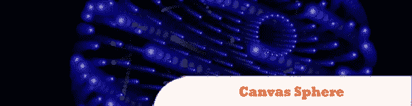
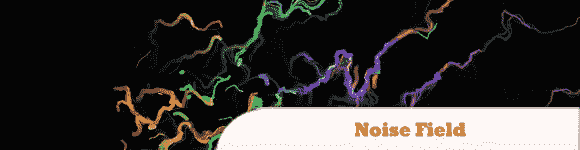
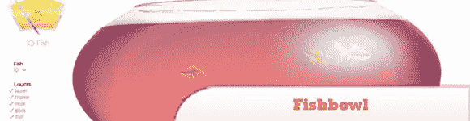
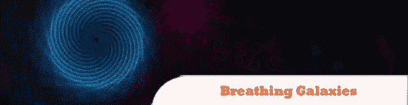
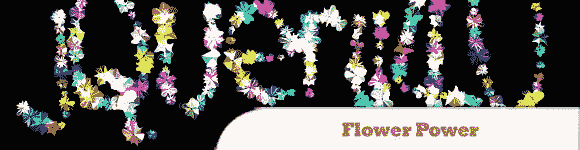
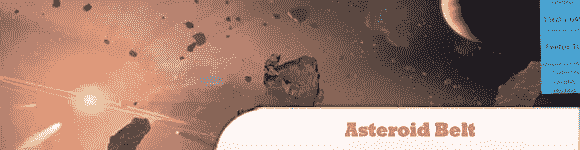
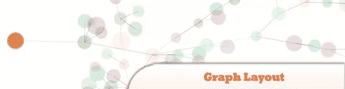

# 10 疯狂的 HTML5 和 JS 实验展示

> 原文：<https://www.sitepoint.com/10-crazy-html5-js-experiment-showcase/>

查看我们收集的一些疯狂的 HTML5 和 JavaScript 实验，这些实验展示了该框架在呈现各种酷的交互效果方面的性能。请注意，这里的大多数演示可以在谷歌 Chrome 和 Firefox 上流畅运行，但不能在 IE 上运行，因为它还不完全支持 HTML5。玩得开心！

相关帖子:

*   **HTML5 画布动画演示**
*   [**10 随机 HTML5 Web 工具&资源**](http://www.jquery4u.com/html/html5-web-tools/)
*   [**jQuery 和新 HTML5 要领**](http://www.jquery4u.com/html/jquery-html5-essentials/)

## 1.画布球体

由 Emil Korngold 创作的 Canvas Sphere 使用一个小型的 sprite 3D 引擎渲染一个球体的 3D 点的 2D 投影。该演示使用 z 排序和阿尔法运动模糊，以给出 3D 和旋转的感觉。看看这个令人敬畏的演示！

  
[来源](http://www.canvasdemos.com/2010/02/06/canvas-sphere/)
[演示](http://clublime.com/lab/html5/sphere/)

## 2.大理石

使用最新发布的 A3 WebGL 引擎的简单物理演示。确保使用 Chrome 才能看到演示。相当酷！

  
[来源](http://www.chromeexperiments.com/detail/marbles/?f=)
[演示](http://experiments.joshua-perez.com/marbles/)

## 3.噪声场

通过柏林噪声的粒子轨迹。移动鼠标来改变粒子运动。点按以随机化参数。

  
[来源](http://www.chromeexperiments.com/detail/noise-field/?f=)
[演示](http://www.airtightinteractive.com/demos/processing_js/noisefield08.html)

## 4.玻璃鱼缸

一个令人惊奇的 HTML 5 测试，由微软创建来测试你的浏览器的性能。试试看你能跑多少条鱼。

  
[源+演示](http://ie.microsoft.com/testdrive/performance/fishbowl/default.html)

## 5.粘稠的东西

扔出去，看能不能粘住。

  
[来源](http://www.chromeexperiments.com/detail/sticky-thing/)
[演示](http://www.spielzeugz.de/html5/sticky-thing/)

## 6.呼吸星系

是一个由 JavaScript 驱动的动态改变颜色和直径的次摆线。您可以使用键盘中途更改形状，或者移动鼠标来创建新的形状。

  
[来源](http://www.chromeexperiments.com/detail/breathing-galaxies/)
[演示](http://mudcu.be/labs/JS1k/BreathingGalaxies.html)

## 7.花的力量

另一个受自然启发的实验——简单的绘画工具，使用贝塞尔曲线将花作为画笔。

  
[来源](http://www.chromeexperiments.com/detail/flowerpower/)
[演示](http://www.openrise.com/lab/FlowerPower/)

## 8.每秒一小时

神圣的 nyans！YouTube 现在每秒钟有一个小时的视频上传到网站。为了将这个令人难以置信的数字放在上下文中，Youtube 创建了一个 HTML5 网站，并提供了一些数字来进行比较——例如，一天有多少只 nyan 猫“nyan”(例如，24 秒的上传)？答案:34.56 万！

  
[来源](http://www.chromeexperiments.com/detail/one-hour-per-second/?f=)
[演示](http://www.onehourpersecond.com/)

## 9.小行星带

HTML5 在照片上渲染的动画效果。

  
[源+演示](http://ie.microsoft.com/testdrive/Performance/AsteroidBelt/Default.html#)

## 10.图表布局

交互式力导向图形布局。

  
[来源](http://www.chromeexperiments.com/detail/graph-layout/?f=)
[演示](http://canvas-test.appspot.com/)

## 分享这篇文章