# 创建草图，并与你的朋友在画东西竞争

> 原文：<https://www.sitepoint.com/create-sketches-and-compete-with-your-friends-in-draw-something/>

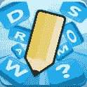

在过去的六年里，OMGPOP 在科技领域可谓风光无限。曾经的在线约会服务现在已经发展成为一种社交网络服务，世界各地的用户都可以与他们的朋友聊天，玩有趣的多人游戏，如跳棋、tonk 或 pool。OMGPOP 最受欢迎的游戏之一， *Draw My Thing* ，已经发展成为 Android 和 iOS 应用程序，名为 Draw Something，目前是[在 80 多个国家排名第一的文字游戏](https://venturebeat.com/2012/03/16/omgpops-draw-something-takes-no-1-daily-game-title-from-zynga-in-socialmobile/)，包括美国、加拿大、挪威、瑞典、马来西亚、新加坡和澳大利亚。这样的成功并没有被忽视，最近[游戏巨头 Zynga 以 2 亿美元](https://allthingsd.com/20120321/looks-like-zynga-just-bought-omgpop-for-200-million/?mod=atdtweet)收购了该公司。

如果你还没有赶上绘画热潮，现在还不算太晚。让我们仔细看看高度上瘾的*图片猜谜*风格的绘画游戏。

* * *

<iframe width="640" height="360">
 
 <h3>首次运行和主屏幕</h3> 
首次使用该应用程序时，您可以选择使用您的脸书帐户或电子邮件地址注册游戏。注册完成后，你会被直接带到应用程序的主屏幕。点击“创建游戏”按钮，开始你的第一个游戏。
 
 
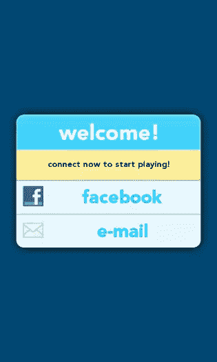 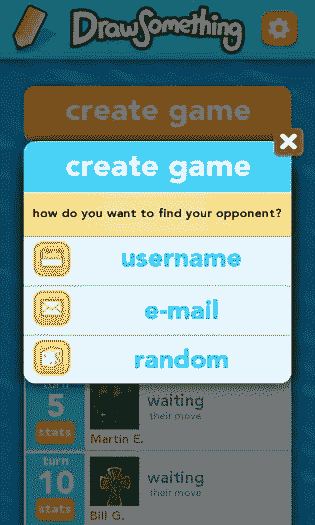
 
 
从这里，你可以通过输入另一个玩家的用户名，输入他们的电子邮件地址，或者让系统选择一个随机的对手来创建一个游戏。如果你注册了脸书，你也可以挑战你的脸书朋友来玩游戏。
 
 
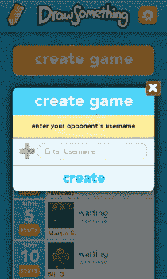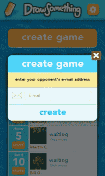
 
 
在我们开始游戏之前，让我们看看主屏幕上的两个选项——设置和炸弹商店。
 <h3>设置和炸弹商店</h3> 
在主屏幕的底部，有一个按钮可以让你购买炸弹在游戏中使用。当你猜测对手的抽牌时，炸弹被用来从你的 12 个可用字母中消除 4 个未使用的字母。
 
炸弹是用硬币购买的，硬币是你通过猜测对手的话积累起来的。点击当前硬币总数左侧的加号按钮，您将进入<strong>硬币商店</strong>，在这里您可以通过游戏内购买购买更多硬币。
 
右上角的齿轮按钮为应用程序的设置带来了一个模式框。你可以切换应用程序的声音，你可以点击“帐户”按钮来更改你的用户名、电子邮件或密码。您也可以从该屏幕退出应用程序。
 
 
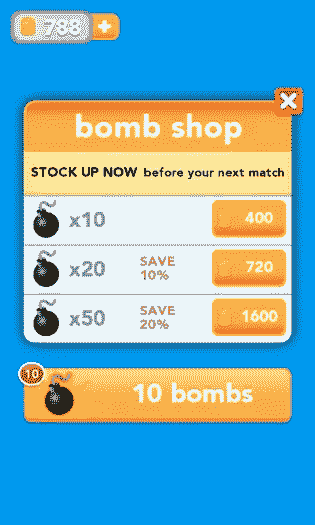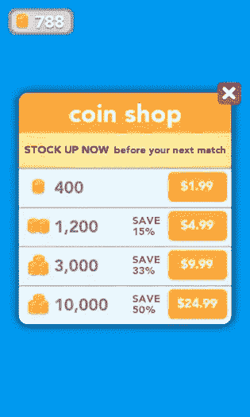 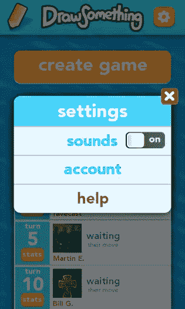
 
 <h3>游戏部分</h3> 
Draw Something 最好的部分是简单直观的游戏。一旦你开始游戏，你要么必须先猜对手的牌，要么你先听牌。
 
当轮到你抽签时，你会有三个词可供选择，每个词的难度都不同(容易、中等、困难)。每个单词相当于一个硬币的数量，如果你的对手猜对了，这些硬币将进入你的银行，你可以用它来购买炸弹或其他颜色。如果你不喜欢你有的单词，你可以用你的一个炸弹把你的单词换成新的。一旦你选择了你的词，你就可以开始画了。
 
 
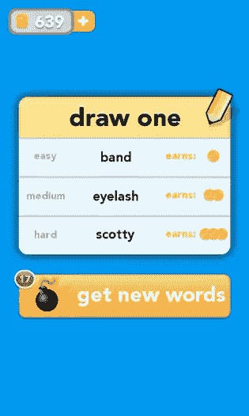 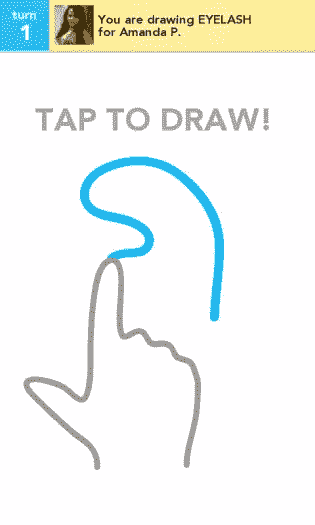
 
 
你开始有一些基本的颜色，但你可以购买额外的颜色包，每包 249 个硬币。只需点击颜色栏末端的加号，您就可以从十五种不同的颜色包中进行选择。您有四种不同的铅笔宽度可供选择，以及四种不同的橡皮擦宽度。如果你把你的画搞砸了，点击垃圾桶图标来清空你的屏幕并重新开始。一旦你画完画，点击“完成”按钮结束你的回合。
 
 
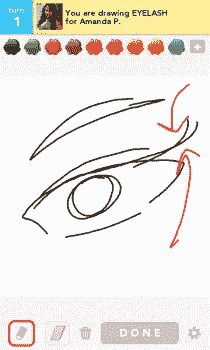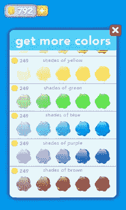
 
 
一旦你的对手猜对了你的抽牌，你会收到一个通知，让你看到他们猜对的即时回放。接下来，轮到你猜对手的抽牌了。你可以在这里使用你的炸弹来消除四个字母，这对于混乱的图纸来说是一个很大的帮助。然后你和你的对手来来回回，直到你们中的一个猜错了另一个的抽牌，游戏重新开始。Android、iOS 或脸书上的玩家之间的游戏是无缝的，所以你可以轻松地在这些平台上继续游戏。
 
 
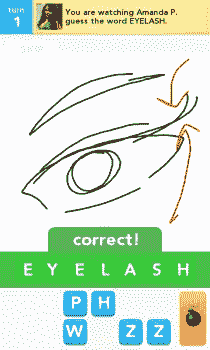 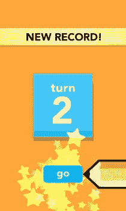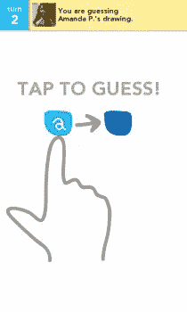
 
 <h3>缺点</h3> 
即使有了 Draw Something 的直观和简单的游戏，该应用程序也有一些缺点，可能会阻止一些游戏玩家。一个显著的缺点与新转弯的通知有关。有时应用程序会给你一个声音通知音，让你知道轮到你玩了，但应用程序不会显示出来。为了显示新的回合，你必须强制关闭应用程序，然后重新启动它，以便玩你的回合。
 
另一个大缺点与游戏无关，而是与对手有关。Draw Something 应用程序在 Google Play 上的评级为“低成熟度”，但在我与随机对手玩的几次回合中，我看到一些相当明确和“成熟”的绘画正在完成。该应用程序没有给你一种方法来限制你将收到的对手的类型，所以如果小孩子在玩这个游戏，这可能是一个问题。
 
剩下的缺点相对较小。在 Android 版本的游戏上删除游戏可能会有点混乱，因为删除的手势模仿了 iOS 手势(按住然后滑动而不是长按)。此外，如果你的游戏进行了多轮，应用程序将在 99 轮后停止显示新的回合数。玩了那么久，你也一定会碰到重复的单词。
 <h3>结论</h3> 
Draw Something 是一个有趣的游戏，它将图片和文字的元素与朋友结合到一个直观而简单的界面中。虽然在通知和删除游戏方面存在一些问题，但总的来说，这款游戏与市场上的其他文字游戏相比有了很大的变化，有足够的多样性，值得下载。
 
 

 
Draw Something 可以在 Google Play 上免费获得，需要 Android OS v1.5 或更高版本才能运行。从下面的谷歌 Play 商店链接或点击提供的 Google Play 徽章下载该应用程序。
 
<a href="https://play.google.com/store/apps/details?id=com.omgpop.dstfree" target="_blank">下载画点东西</a>
 
<aside class="flex space-x-4"><h2 class="text-lg my-2 mr-2">分享这篇文章</h2><button aria-label="Share Sitepoint on facebook" data-network="facebook" class="social-share-button mr-2 cursor-pointer transform transition duration-200 hover:scale-125 text-primary-700"><svg aria-hidden="true" focusable="false" data-prefix="fab" data-icon="facebook-square" class="svg-inline--fa fa-facebook-square fa-w-14 fa-lg share-icon" role="img" viewbox="0 0 448 512"><path fill="currentColor" d="M400 32H48A48 48 0 0 0 0 80v352a48 48 0 0 0 48 48h137.25V327.69h-63V256h63v-54.64c0-62.15 37-96.48 93.67-96.48 27.14 0 55.52 4.84 55.52 4.84v61h-31.27c-30.81 0-40.42 19.12-40.42 38.73V256h68.78l-11 71.69h-57.78V480H400a48 48 0 0 0 48-48V80a48 48 0 0 0-48-48z"/></svg></button><button aria-label="Share Sitepoint on reddit" data-network="reddit" class="social-share-button mr-2 cursor-pointer transform transition duration-200 hover:scale-125 text-primary-700"><svg aria-hidden="true" focusable="false" data-prefix="fab" data-icon="reddit" class="svg-inline--fa fa-reddit fa-w-16 fa-lg share-icon" role="img" viewbox="0 0 512 512"><path fill="currentColor" d="M201.5 305.5c-13.8 0-24.9-11.1-24.9-24.6 0-13.8 11.1-24.9 24.9-24.9 13.6 0 24.6 11.1 24.6 24.9 0 13.6-11.1 24.6-24.6 24.6zM504 256c0 137-111 248-248 248S8 393 8 256 119 8 256 8s248 111 248 248zm-132.3-41.2c-9.4 0-17.7 3.9-23.8 10-22.4-15.5-52.6-25.5-86.1-26.6l17.4-78.3 55.4 12.5c0 13.6 11.1 24.6 24.6 24.6 13.8 0 24.9-11.3 24.9-24.9s-11.1-24.9-24.9-24.9c-9.7 0-18 5.8-22.1 13.8l-61.2-13.6c-3-.8-6.1 1.4-6.9 4.4l-19.1 86.4c-33.2 1.4-63.1 11.3-85.5 26.8-6.1-6.4-14.7-10.2-24.1-10.2-34.9 0-46.3 46.9-14.4 62.8-1.1 5-1.7 10.2-1.7 15.5 0 52.6 59.2 95.2 132 95.2 73.1 0 132.3-42.6 132.3-95.2 0-5.3-.6-10.8-1.9-15.8 31.3-16 19.8-62.5-14.9-62.5zM302.8 331c-18.2 18.2-76.1 17.9-93.6 0-2.2-2.2-6.1-2.2-8.3 0-2.5 2.5-2.5 6.4 0 8.6 22.8 22.8 87.3 22.8 110.2 0 2.5-2.2 2.5-6.1 0-8.6-2.2-2.2-6.1-2.2-8.3 0zm7.7-75c-13.6 0-24.6 11.1-24.6 24.9 0 13.6 11.1 24.6 24.6 24.6 13.8 0 24.9-11.1 24.9-24.6 0-13.8-11-24.9-24.9-24.9z"/></svg></button><button aria-label="Share Sitepoint on twitter" data-network="twitter" class="social-share-button mr-2 cursor-pointer transform transition duration-200 hover:scale-125 text-primary-700"><svg aria-hidden="true" focusable="false" data-prefix="fab" data-icon="twitter-square" class="svg-inline--fa fa-twitter-square fa-w-14 fa-lg share-icon" role="img" viewbox="0 0 448 512"><path fill="currentColor" d="M400 32H48C21.5 32 0 53.5 0 80v352c0 26.5 21.5 48 48 48h352c26.5 0 48-21.5 48-48V80c0-26.5-21.5-48-48-48zm-48.9 158.8c.2 2.8.2 5.7.2 8.5 0 86.7-66 186.6-186.6 186.6-37.2 0-71.7-10.8-100.7-29.4 5.3.6 10.4.8 15.8.8 30.7 0 58.9-10.4 81.4-28-28.8-.6-53-19.5-61.3-45.5 10.1 1.5 19.2 1.5 29.6-1.2-30-6.1-52.5-32.5-52.5-64.4v-.8c8.7 4.9 18.9 7.9 29.6 8.3a65.447 65.447 0 0 1-29.2-54.6c0-12.2 3.2-23.4 8.9-33.1 32.3 39.8 80.8 65.8 135.2 68.6-9.3-44.5 24-80.6 64-80.6 18.9 0 35.9 7.9 47.9 20.7 14.8-2.8 29-8.3 41.6-15.8-4.9 15.2-15.2 28-28.8 36.1 13.2-1.4 26-5.1 37.8-10.2-8.9 13.1-20.1 24.7-32.9 34z"/></svg></button><button aria-label="Share Sitepoint on linkedin" data-network="linkedin" class="social-share-button mr-2 cursor-pointer transform transition duration-200 hover:scale-125 text-primary-700"><svg aria-hidden="true" focusable="false" data-prefix="fab" data-icon="linkedin" class="svg-inline--fa fa-linkedin fa-w-14 fa-lg share-icon" role="img" viewbox="0 0 448 512"><path fill="currentColor" d="M416 32H31.9C14.3 32 0 46.5 0 64.3v383.4C0 465.5 14.3 480 31.9 480H416c17.6 0 32-14.5 32-32.3V64.3c0-17.8-14.4-32.3-32-32.3zM135.4 416H69V202.2h66.5V416zm-33.2-243c-21.3 0-38.5-17.3-38.5-38.5S80.9 96 102.2 96c21.2 0 38.5 17.3 38.5 38.5 0 21.3-17.2 38.5-38.5 38.5zm282.1 243h-66.4V312c0-24.8-.5-56.7-34.5-56.7-34.6 0-39.9 27-39.9 54.9V416h-66.4V202.2h63.7v29.2h.9c8.9-16.8 30.6-34.5 62.9-34.5 67.2 0 79.7 44.3 79.7 101.9V416z"/></svg></button><button aria-label="Share Sitepoint on email" data-network="email" class="social-share-button mr-2 cursor-pointer transform transition duration-200 hover:scale-125 text-primary-700"><svg aria-hidden="true" focusable="false" data-prefix="fas" data-icon="envelope" class="svg-inline--fa fa-envelope fa-w-16 fa-lg share-icon" role="img" viewbox="0 0 512 512"><path fill="currentColor" d="M502.3 190.8c3.9-3.1 9.7-.2 9.7 4.7V400c0 26.5-21.5 48-48 48H48c-26.5 0-48-21.5-48-48V195.6c0-5 5.7-7.8 9.7-4.7 22.4 17.4 52.1 39.5 154.1 113.6 21.1 15.4 56.7 47.8 92.2 47.6 35.7.3 72-32.8 92.3-47.6 102-74.1 131.6-96.3 154-113.7zM256 320c23.2.4 56.6-29.2 73.4-41.4 132.7-96.3 142.8-104.7 173.4-128.7 5.8-4.5 9.2-11.5 9.2-18.9v-19c0-26.5-21.5-48-48-48H48C21.5 64 0 85.5 0 112v19c0 7.4 3.4 14.3 9.2 18.9 30.6 23.9 40.7 32.4 173.4 128.7 16.8 12.2 50.2 41.8 73.4 41.4z"/></svg></button></aside> </body> </html></iframe>