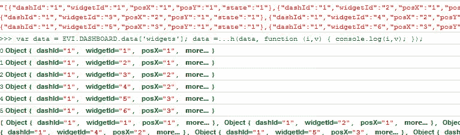
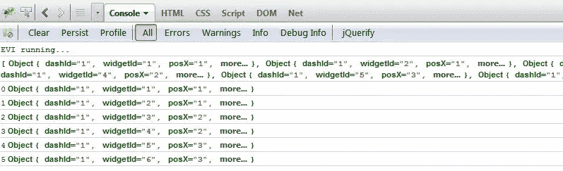

# jquery 将 json 字符串转换为数组

> 原文：<https://www.sitepoint.com/convert-json-string-array/>

简单的 jQuery 代码片段将 JSON 字符串转换成对象数组，然后交互输出它们的值。




```
var data = JQUERY4U.DASHBOARD.data['widgets'];
data = $.parseJSON(data);
$.each(data, function (i,v)
{
  console.log(i,v);
});
```

然后要转换回来，只需使用 stringify:

```
$('#columns').html(data.stringify);
```



为了简单地将 json 转换成 array，从 jquery 1.4.1 开始，您可以在本地完成这项工作。

## 分享这篇文章