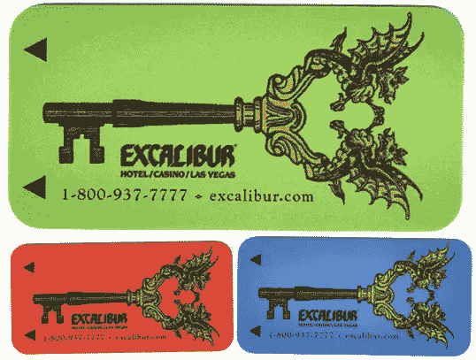
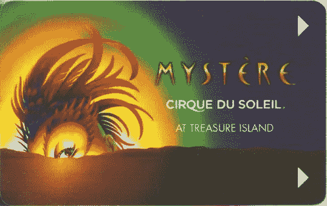
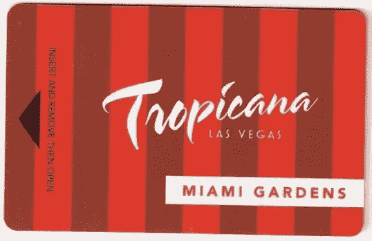
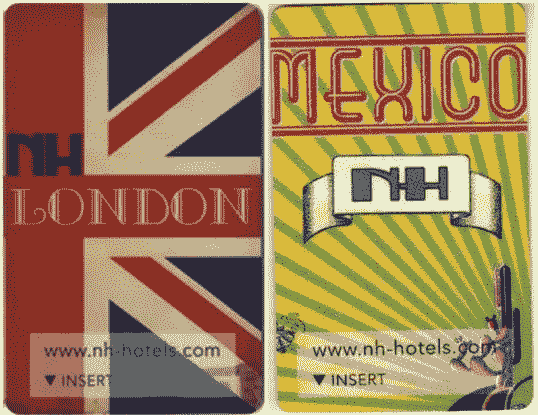
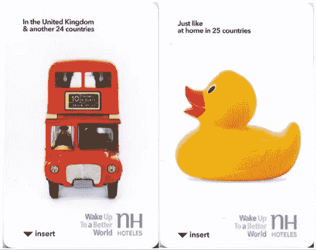
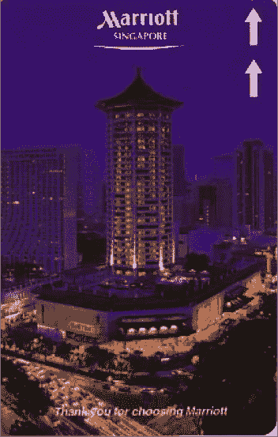
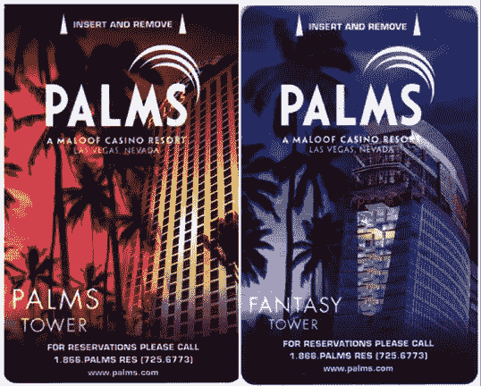
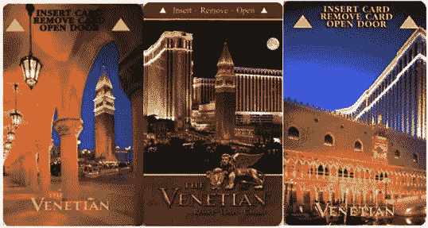
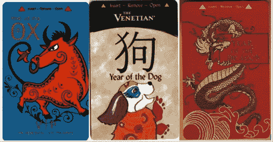

# 12 个定制钥匙卡设计示例

> 原文：<https://www.sitepoint.com/hotel-key-card-design/>

钥匙卡设计是酒店营销中一个被忽视和利用不足的方面。由于预算限制或缺乏创意，数量惊人的酒店选择使用空白、乏味或通用的钥匙卡。具有讽刺意味的是，这些企业往往投入大量的时间和精力为同一家酒店设计名片、三折小册子和小促销品。他们设计这些营销材料的唯一目的是让它们进入顾客的口袋，却忽略了钥匙卡最终会自动进入顾客口袋的事实。事实上，无论是空白设计还是大胆设计，大多数钥匙卡最终都会被顾客带回家。

把时间和资源投入到精心设计的门卡上，而不是那些鸡毛蒜皮的小玩意上，岂不是更划算，更有效？令人欣慰的是，一些酒店正在使用定制的钥匙卡，以非常优惠的价格给顾客留下深刻印象。下面是十几个定制钥匙卡设计的例子。

### 百乐宫（美国酒店名）

 贝拉焦酒店的门卡反映了酒店房间的优雅、装饰和建筑风格。

### 埃克斯卡利伯

 神剑华丽的金属钥匙设计让人想起了“神剑”的传说。

### 金银岛——推广太阳马戏团的“我的蜜雪儿”

 金银岛的门卡激起了那些来看著名的太阳马戏团表演的人的好奇心。

### 纯果乐——拉斯维加斯的迈阿密花园

 纯品康纳的迈阿密花园门卡采用了装饰艺术设计，强调了他们从半个美国模仿的“南海滩”感觉。

### 米高梅大酒店

米高梅大酒店和赌场——可以说是拉斯维加斯最知名的机构——放弃了任何促销或营销文案，取而代之的是无处不在的经典狮子标志。

### NH 酒店–伦敦和墨西哥

 NH 酒店的门卡设计重点是各自酒店所在地的国旗和标志。他们想让你记住你的旅行，而不是你的酒店房间。

### NH 酒店-英国和国际

 对于英国的 NH 酒店来说，重点再次放在特定国家的熟悉标志上。对于他们的通用钥匙卡，通用的“橡胶鸭子”在所有文化中都意味着舒适。

### 新加坡万豪酒店

万豪新加坡酒店的游客可能会把钥匙卡带回家，这张照片不仅捕捉到了新加坡的吸引力，还捕捉到了酒店本身独特的位置和建筑。

### 拉斯维加斯棕榈赌场和度假村

 棕榈赌场和度假村选择棕榈树意象来强化他们的品牌，日落和月光效果来引出对拉斯维加斯夜生活的印象。

### 星团

 Stardust 以复古的方式庆祝他们成立 45 周年。可悲的是，这个度假村在 2007 年被拆除了。

### 威尼斯人

 威尼斯人的经典钥匙卡提供了他们令人印象深刻的位置和建筑的简单照片。

### 威尼斯人–中国新年版

 为了庆祝中国新年，威尼斯人对他们的门卡做了大幅度的改动。

### 更多设计

所有图片均由 Oomph 提供，Oomph 是一家充满热情的塑料卡片打印机，提供各种各样的会员卡和酒店钥匙卡。你可以在网上看到他们更多的门卡设计，你也可以在推特上关注他们，网址是[@ madebyoumph](http://www.twitter.com/madebyoomph)。

你认为钥匙卡是一个未被充分利用的给顾客留下印象的机会吗？它们真的比其他促销品更有效、更划算吗？你有什么钥匙卡设计(或者设计思路)可以分享吗？

## 分享这篇文章