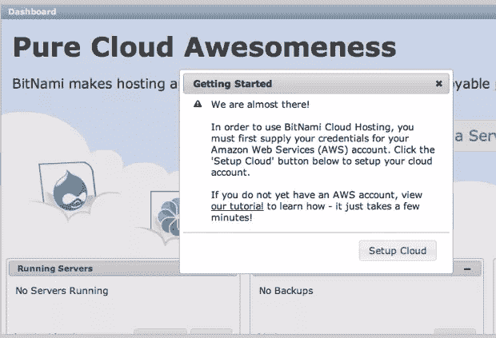
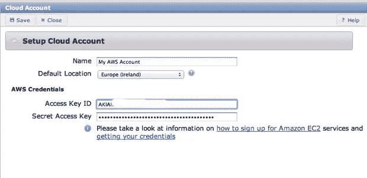
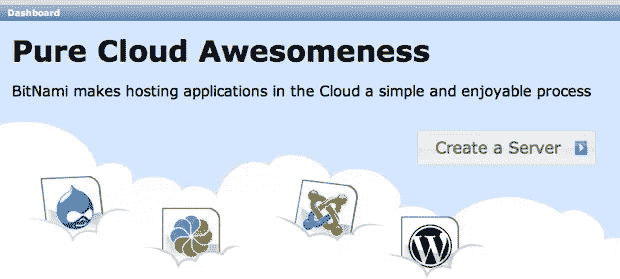
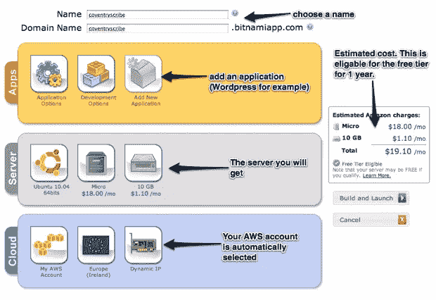
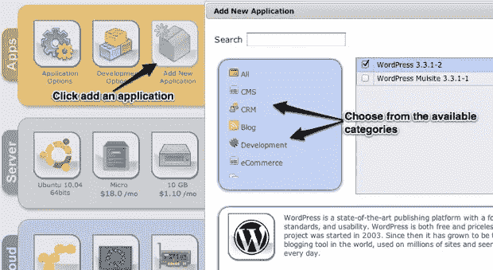
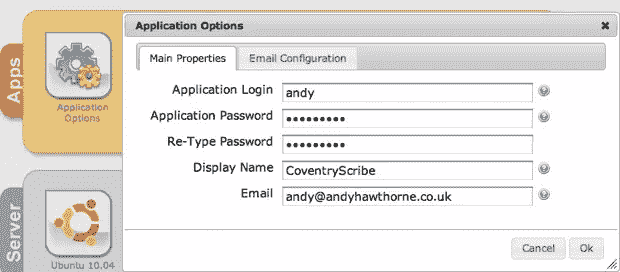
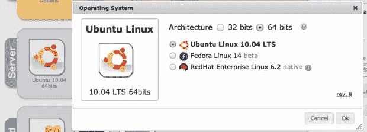
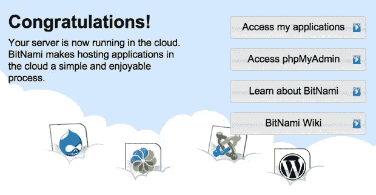
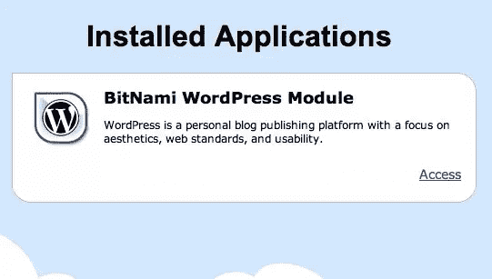

# 在 Amazon EC2 上设置 WordPress

> 原文：<https://www.sitepoint.com/setting-up-wordpress-on-amazon-ec2/>

普遍的共识是，自主经营 WordPress 博客是博客成功的最佳方式。它为您的写作平台提供了最大的灵活性和控制力。问题是，如果你不想花时间建立一个托管域会发生什么？如果你不确定怎么做呢？

这可能是考虑云中托管解决方案的时候了。将 WordPress 托管在云中意味着所有的服务器/数据库需求都会得到满足。你所要做的就是开始创建你的内容。嗯，差不多了。将有少量的设置工作要做。

在这篇文章中，我将向你展示如何使用流行的亚马逊 EC2 云建立一个 WordPress 博客，并得到 BitNami 的一点帮助。

## 亚马逊什么？

下面是亚马逊网络服务网站上关于 EC2 的内容:

> “亚马逊弹性计算云(Amazon EC2)是一种在云中提供可调整计算能力的 web 服务。它旨在让开发人员更容易进行网络规模的计算。”

是的，在 BitNami 的帮助下，你甚至不需要成为一名开发者:

> “BitNami 为您喜爱的开源 web 应用程序和框架提供免费的、现成的运行环境，包括 Drupal、Joomla！、WordPress、PHP、Rails、Django 等等。”

这意味着，我们可以获得一个亚马逊网络服务账户，然后用它来托管 Bitnami WordPress 的安装。然后你马上就可以在云端写作了。

## 首先，获得一个亚马逊网络服务账户——这是免费的

将你的浏览器指向[http://aws.amazon.com](http://aws.amazon.com)，点击“注册”按钮。目前你可以免费运行一个微型服务器一年，所以一定要选择“我是新用户”选项。不要把这个亚马逊账户和你的亚马逊零售账户搞混了。AWS 系统完全不同。

然后，您将通过一个典型的注册表单，您将被提示输入信用卡信息。但是，如果您运行一台微型服务器，第一年将不会收费。

账户注册的最后一部分包括亚马逊的自动服务，它会根据你在联系方式部分提供的号码给你打电话。它会要求您键入或说出将出现在浏览器窗口中的 pin 码。我发现打出来没用，而说出来马上就有用了。

然后，您将收到一封欢迎您使用该服务的电子邮件。它将包含到 AWS 门户的链接，在那里您可以找到使用该服务所需的访问密钥。我们将很快回到这些。首先，你需要一个 BitNami cloud 的账户。

## 获取 BitNami 云帐户

原始的亚马逊 EC2 不适合胆小的人。有很多东西需要学习:如何部署和配置它。输入 BitNami。通过 BitNami 部署到您的亚马逊云，所有的技术难题都迎刃而解。

您将获得:

1.  正确配置的服务器，安装了操作系统和必需的软件。
2.  只需点击一个按钮，即可安装您想要运行的应用程序。
3.  为您安装和配置的任何数据库要求。
4.  自动备份

将你的浏览器指向[http://bitnami.org/cloud](http://bitnami.org/cloud)并注册一个账户(免费)。注册过程就像任何其他注册过程一样，直到您接近尾声:



通过该链接添加您的 AWS 凭据为您提供了另一个简单的表单:



输入所需信息后，您将被发送到仪表板。仪表板是您进行所有设置和配置的地方。我们现在可以点击大的*创建服务器*按钮:



现在我们到了重要的屏幕。在服务器配置屏幕上，您可以选择所需的所有设置:



### 选择应用程序

第一个选项是选择一个应用程序:



因为我们关注的是 WordPress，所以我们会选择它。

### 设置配置选项

你现在可以点击应用程序选项按钮来设置你想要使用的 WordPress 凭证:



您还应该通过电子邮件配置选项卡添加电子邮件凭据。这样你就可以从你的 WordPress 站点接收电子邮件。

### 操作系统的选择

如果你不喜欢 Ubuntu，你也可以选择不同的 Linux 操作系统:



### 构建和发布

现在你可以点击构建和启动按钮，去喝杯茶。Bitnami 现在将创建您的服务器，并设置它为您运行。一旦你的服务器启动并运行，你甚至会收到他们的邮件。

## 访问您的服务器

在仪表板的运行服务器部分点击*视图*，您的新网站将在新的浏览器选项卡中打开:



点击*访问我的应用程序*，您将看到已安装的应用程序页面:



点击*访问*链接，在那里，你将会看到你的 WordPress 安装。在地址栏的 url 中添加“wp-admin ”,你就可以访问普通的 WordPress 管理面板。

## 外壳访问

如果您希望通过 SSH 访问您的服务器，您可以在完成几个导入任务后:

### 1.获取您的密钥对

从 Bitnami web 管理区域的*管理服务器*部分下载您的密钥对:


### 2.设置权限

您需要对下载的文件设置权限，因此在控制台/终端中:

```
chmod 666 bitnami-hosting.pem
```

这将确保只有你有读/写权限。

> 如果你使用的是 Windows，请遵循 Bitnami wiki 中的建议。

确保你把。pem 文件放在容易记住的地方！

### 3.通过 ssh 连接

在控制台/终端中，您可以连接:

```
ssh -i bitnami-hosting.pem bitnami@your-chosen-site-name.bitnami.com
```

然后，您将可以通过 shell 访问您的服务器。不过，没有什么特别的原因让你需要这样做，因为大多数常见的服务器管理任务都可以在你的 Bitnami 帐户的 web 管理区执行。但是如果您喜欢涉足更技术性的东西，您可以使用 shell 来实现这一点。

## 最后…

或许明智的做法是，深呼吸，仔细想想我们到底想要什么。Amazon EC2 上托管的完整 WordPress 安装。不仅如此，启动和运行它不需要真正的服务器技术知识。免费的一年过后，这当然不是运行 WordPress 安装的最便宜的方式，但是它必须是让一个完全配置好的 Linux 服务器开始运行，并且在云托管服务上运行的最不费力的方式之一。

## 分享这篇文章