# 在网页设计中优雅地使用纹理

> 原文：<https://www.sitepoint.com/textured-web-designs/>

纹理在网页设计中不仅仅是一种短暂的趋势。这是一个为平面页面增加深度和维度的重要工具。最好的设计师知道网站的纹理可以吸引浏览者的注意力，并强调重要的文字或图像。正确的纹理和颜色有能力将一个网页设计变成一个美观、有效的网站。向站点添加多用途纹理的选项是无限的，正确使用纹理可以实现几个设计目标:

*   **吸引注意力:**设计师可以利用纹理将注意力集中在标题、图标、页脚、行动按钮、插图、字体或标志上。许多设计师会选择一个纹理清晰的背景上的标志，或一个干净的标志对纹理背景的戏剧性效果。通常，网站的纹理部分往往最先吸引访问者。当访问者知道去哪里看时，处理信息就更容易了。
*   **添加对比度:**纹理可以为侧栏、信息框或其他不同的内容部分提供急需的对比度。换句话说，通过添加各种精心插入的纹理，网站架构得到了极大的改善。有了一点纹理，设计师可以在页面上添加更多的信息，而不会显得杂乱无章或令人不知所措。
*   提供独特的氛围:大多数设计师都非常重视氛围。最好的网站邀请访问者进入他们的门户网站，并长时间吸引他们。品牌占据了中心舞台，毫无疑问，公司在政策、产品、服务和原则上的立场是明确的。在设计美学中，一切都被清晰地表达出来——情绪、图像、颜色和纹理。
***   创造现实主义:一些设计师喜欢他们的页面看起来像自然——可以是冰、水滴、木头、植物、皮毛或其他纹理。这种现实主义唤起观众的情感，如果处理得当，会给人留下深刻印象。**

 **但是，与此同时，如果你在网页设计中过度使用纹理，你肯定会“过犹不及”。糟糕的纹理使用会造成一个脱节、混乱的环境，掩盖了网站的要点，或者——更糟糕的是——一个缺乏真正创造力或想象力的陈词滥调的设计。最近几年，业余设计师很快赶上了纹理潮流，创造了一个又一个纹理布局模板，冲刷了所有其他 WordPress 博客和乐队网站。因此，一些设计师认为有纹理的网页设计“低劣”或“不专业”

### 要考虑的纹理技巧

*   易读性是最重要的。如果网站的任何部分变得更加难以阅读，一旦纹理被纳入，它必须被删除。如果访问者在几秒钟内找不到他们想要的信息，他们就走了——不管网站看起来有多漂亮。
*   纹理应该被最小限度地、有目的地使用。正如一个人不应该同时穿着圆点、条纹和格子衣服出门一样，设计师也不应该试图将多种纹理缝合在一起，这样会使内容更难欣赏。
*   Web 开发人员应该在他们的设计中密切关注加载时间。可以在不牺牲速度和效率的情况下包括纹理。创建一个小而无缝的平铺图像比加载一个巨大的纹理文件要好得多。

下面是 23 个令人印象深刻的基于纹理的设计的例子。

### 反压

[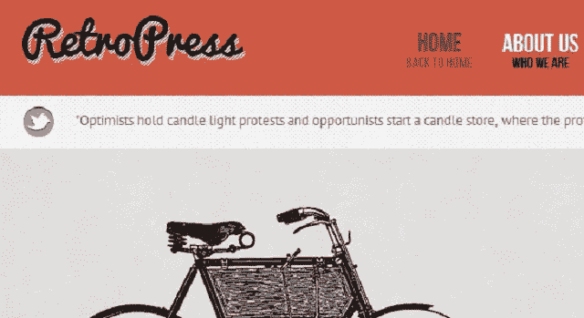](https://www.sitepoint.com/wp-content/uploads/2012/03/image002.jpg)

### 佩恩日报

[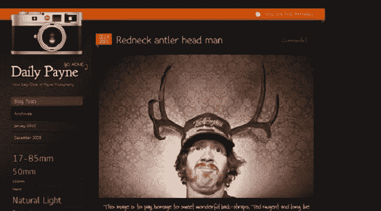](https://www.sitepoint.com/wp-content/uploads/2012/03/image003.jpg)

### 乌鸦艺术

[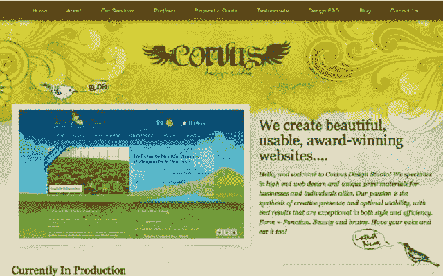](https://www.sitepoint.com/wp-content/uploads/2012/03/image004.png)

### 蓝月亮决斗钢琴酒吧

[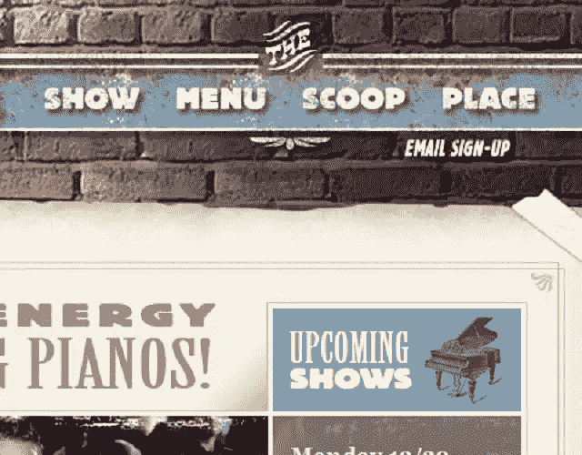](https://www.sitepoint.com/wp-content/uploads/2012/03/image006.jpg)

### 蛋糕甜蛋糕

[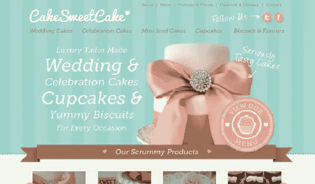](https://www.sitepoint.com/wp-content/uploads/2012/03/image007.jpg)

### 迷雾重重的谷歌

[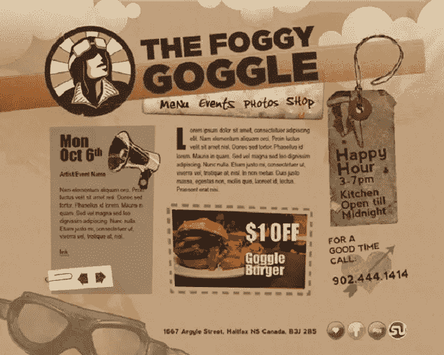](https://www.sitepoint.com/wp-content/uploads/2012/03/image008.jpg)

### 迪莉娅探险家

[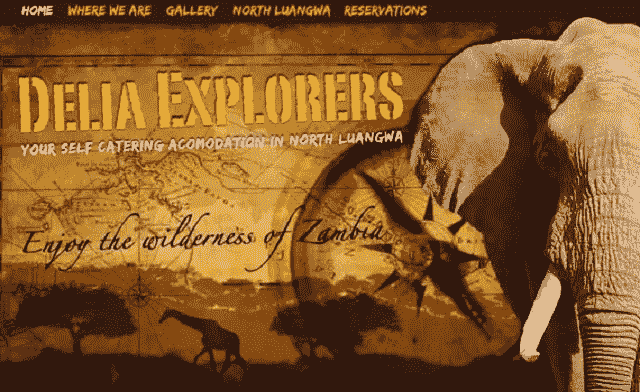](https://www.sitepoint.com/wp-content/uploads/2012/03/image009.jpg)

### 狗屋卡

[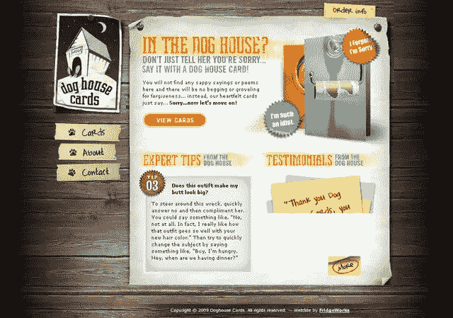](https://www.sitepoint.com/wp-content/uploads/2012/03/image010.jpg)

### 火箭俱乐部

[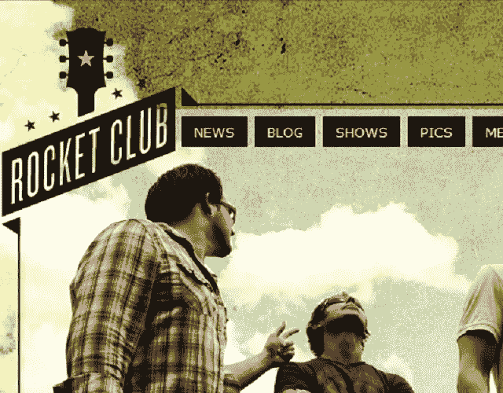](https://www.sitepoint.com/wp-content/uploads/2012/03/image011.jpg)

### 瑞安·舍夫

### 永远沉重

[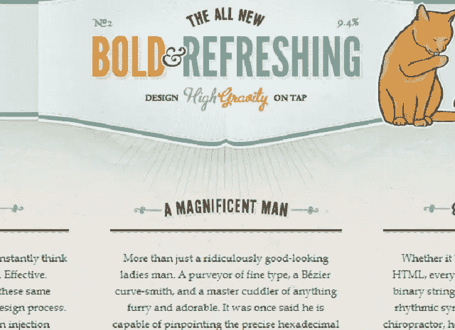](https://www.sitepoint.com/wp-content/uploads/2012/03/image013.jpg)

### 流浪山羊咖啡公司

[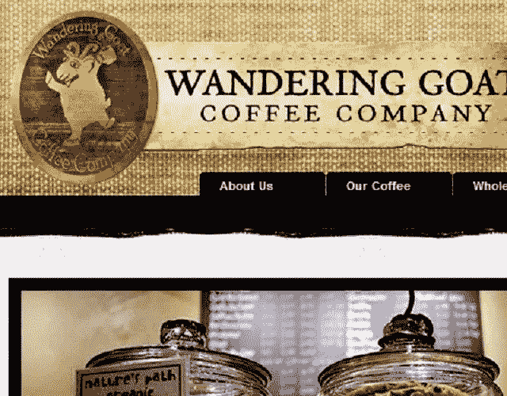](https://www.sitepoint.com/wp-content/uploads/2012/03/image014.jpg)

### 生命树创意

[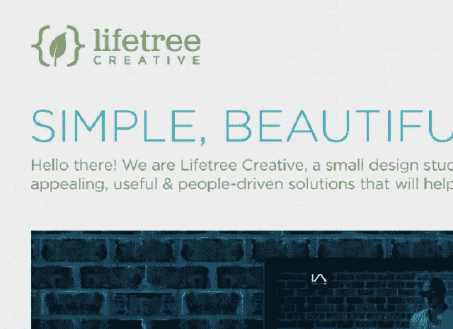](https://www.sitepoint.com/wp-content/uploads/2012/03/image015.jpg)

### 外交政策设计

[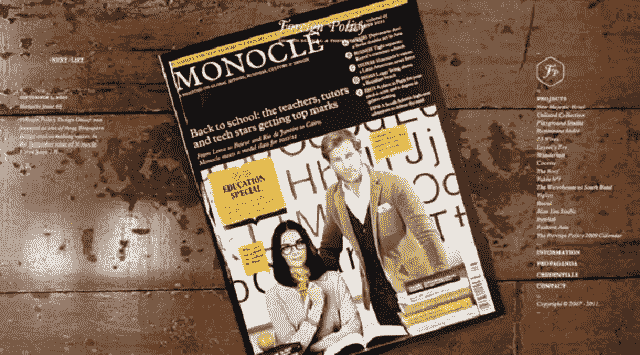](https://www.sitepoint.com/wp-content/uploads/2012/03/image016.jpg)

### 中性牛奶酒店

[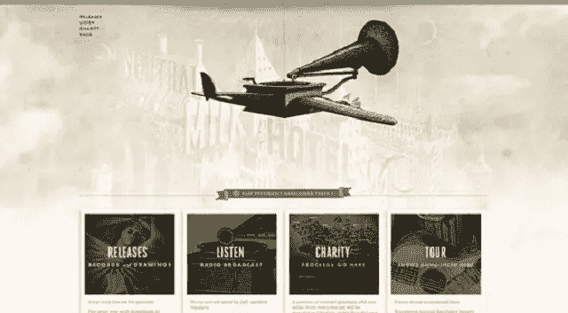](https://www.sitepoint.com/wp-content/uploads/2012/03/image017.jpg)

### 五分摊位

[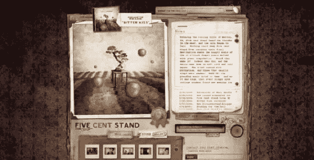](https://www.sitepoint.com/wp-content/uploads/2012/03/image018.jpg)

### 三楼

[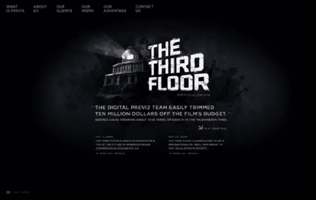](https://www.sitepoint.com/wp-content/uploads/2012/03/image019.jpg)

### Slabovia.tv

[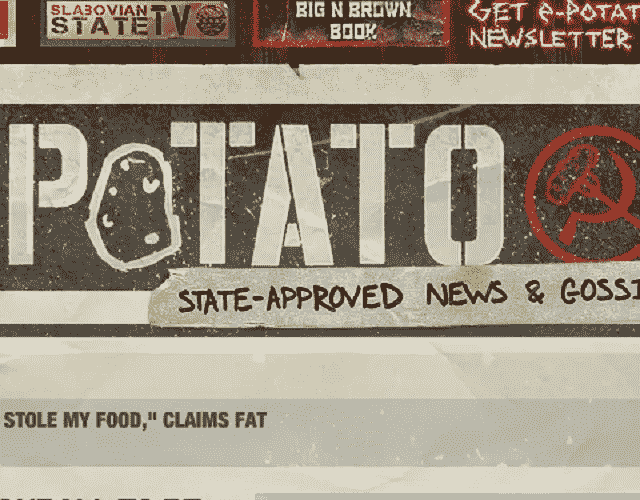](https://www.sitepoint.com/wp-content/uploads/2012/03/image020.jpg)

### 牛仔之星

[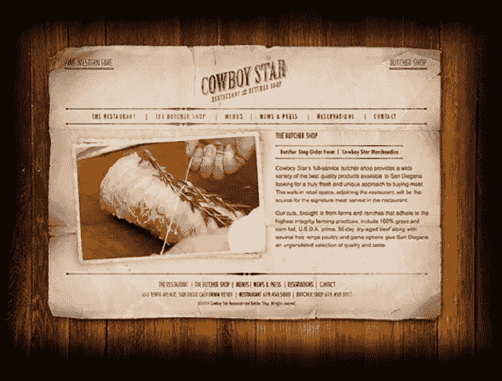](https://www.sitepoint.com/wp-content/uploads/2012/03/image021.jpg)

### 西耶娜在线

[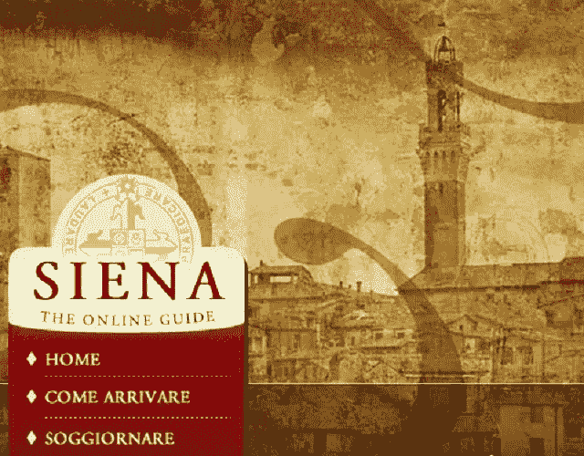](https://www.sitepoint.com/wp-content/uploads/2012/03/image022.jpg)

### 马库斯·詹姆斯葡萄酒

[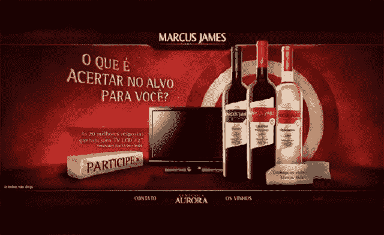](https://www.sitepoint.com/wp-content/uploads/2012/03/image023.jpg)

### 艾伦·索利

[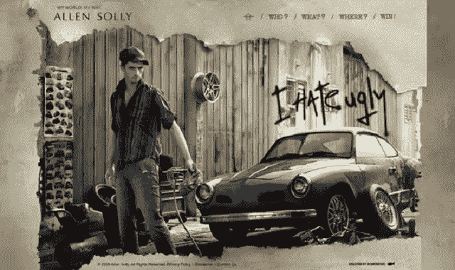](https://www.sitepoint.com/wp-content/uploads/2012/03/image024.jpg)

### 澳洲烧烤

[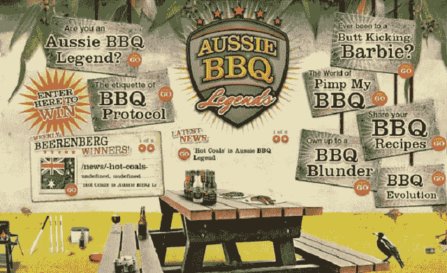](https://www.sitepoint.com/wp-content/uploads/2012/03/image025.jpg)

当优雅地执行时，纹理设计展示了设计师对细节和复杂感受的敏锐眼光。

*你有什么基于纹理的设计(或者纹理小技巧)可以分享吗？你认为纹理在网页设计中只是昙花一现吗？*** 

## **分享这篇文章**