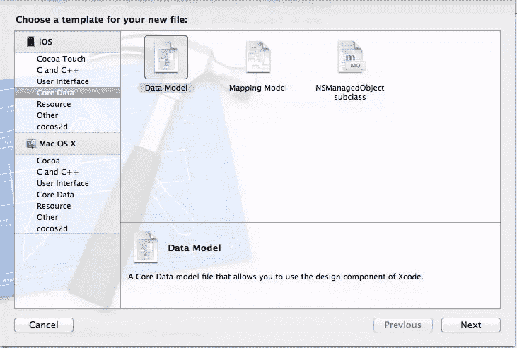

# 如何在苹果设备上使用 SQLite 或核心数据保存用户数据

> 原文：<https://www.sitepoint.com/sqlite-vs-core-data-on-apple-devices/>

在构建 iOS 应用程序时，要考虑的一件事是一个叫做“数据持久性”的概念。数据持久性是一种在应用程序或设备重置时保留数据的方法。没有人想玩游戏或更新他们的支票簿，并在重置后失去一切，因为一个设计糟糕的应用程序没有存储他们的信息。有许多方法可以确保捕获和保存用户数据，但我想强调的两种方法是使用 SQLite 数据库和使用苹果的核心数据框架。

Apple 在应用程序中嵌入了使用 SQLite 数据库的功能。这个方法是专门针对 SQLite 数据库的，而*不是* mySQL 数据库。有什么区别？两者的主要区别在于 SQLite 数据库嵌入在应用程序中，它们是一个独立的文件。MySQL 数据库由于依赖于多个文件而占用了更多的空间，并且它们不能嵌入到应用程序中。你需要一个特殊的编辑器来查看这些 SQLite 数据库。我使用并推荐 [SQLVue Lite](http://itunes.apple.com/us/app/sqlvue-lite/id433341470?mt=12 "SQLVue Lite on the App Store") 。还有一个价格更高并提供一些额外功能的完整版本。

与 SQLite 不同，苹果的核心数据框架更多地采用面向对象的方法来存储用户数据。使用核心数据，您可以创建类似于类和对象的实体来存储数据。这些实体保存在数据模型中，用于存储数据的各种属性。您可以在 Objective-C 中存储类似于实例变量的属性、对象和其他数据之间的关系，以及提取的属性，这与前面提到的关系非常相似。关系和获取的属性之间的唯一区别是，关系先发制人地用对象拉所有数据，而获取的属性识别相关数据的存在，但不立即拉它。

在我们定义每种方法之间的确切区别之前，让我们来看一些将用于每种技术的示例代码。比较这两个代码示例会让我们更好地理解这两种方法之间的区别。

### SQLite

可以想象，这种方法需要使用 SQL 语句。如果你不熟悉这些，在深入之前看看它们是如何构成的会有所帮助。一些好的文档可以在这里找到。

(注意:所有的例子都来自 XCode 4.2)

在开始之前，我们需要包含动态库，它将为我们的数据存储提供所有必要的功能。在您的系统上找到您的 iOS SDK，并转到 usr/lib/libsqlite3.dylib。

要访问数据库，我们首先必须在代码中打开到它的连接。这部分出奇的简单。代码看起来就像这样:

```
sqlite3 *database;

int result = sqlite3_open(“/path/to/database/file”, &amp;database);
```

然后，当您完成它时，您关闭该语句。

```
sqlite3_close(database);
```

没有理由不进行任何有意义的更改就打开和关闭数据库。这样做的目的是利用数据库，所以让我们看一下 sqlite3_exec 命令。这里有一点小技巧。您可能认为应该在所有情况下都使用这个命令，但事实并非如此。这仅适用于不返回任何数据的 SQL 语句。这将包括 DQL 命令，如创建、插入、更新、删除等。

让我们看看使用 SELECT 语句检索数据的两种不同方法。第一种方法相当基本，但是如果通过 sqlite3_exec 传递，它比等效的语句稍微复杂一些。

```
NSString *query = @”SELECT ID, FIELD_DATA FROM FIELDS ORDER BY ROW”;

sqlite3_stmt = *statement;

int result = (sqlite3_prepare_v2(database, [query UTF8String], -1, &amp;statement, nil);

while(sqlite3_step(statement) == SQLITE_ROW){

int rowNum = sqlite3_column_int(statement, 0);

char *rowData = (char *)sqlite3_column_text(statement, 1);

NSString *fieldValue = [[NSString alloc] initWithUTF8String:rowData];

// do something with the data

[fieldValue release];

}

sqlite3_finalize(statement);
```

上面的标记中有几个重要的步骤。首先，我们创建 SQL 语句。然后，我们必须准备要使用的数据库。在查看 sqlite3_prepare_v2 函数时，我们看到第一个参数是我们创建的数据库变量。然后，我们将查询字符串转换成基于 UTF8 的 C 字符串。最后，我们有我们的返回声明。我们有可能存储查询中任何未使用的部分，但是我们将其设置为 nil。

一旦有了这些语句，我们就开始使用 sqlite3_step(语句)遍历所有结果，并确保每个结果都成为数据库中的一行。剩下的都是相当基础的。我们首先确定我们在哪一行，它包含什么数据，然后我们将它存储在一个可以使用的 NSString 对象中。这是你可以对数据进行创造性处理的部分。一种非常常见的策略是将数据存储为 NSDictionary 或 NSArray，以便在显示大量信息或使用表格视图时使用。

我提到的另一个方法在概念上是相同的，但是我们可以在语句中使用变量来获取特定的信息。略有不同，为了进行更多的练习，我们使用 INSERT 语句和 sqlite3_exec 命令。

```
char *sql = “insert into foo values (?,?);”;

sqlite3_stmt *stmt;

if(sqlite3_prepare_v2(database, sql, -1, &amp;stmt, nil) == SQLITE_OK){

sqlite3_bind_int(stmt, 1, 235);

sqlite3_bind_text(stmt, 2, ”bar”, -1, NULL);

}

if(sqlite3_step(stmt) != SQLITE_DONE){

NSLog(@”This should be real error checking!”);

}

sqlite3_finalize(stmt);
```

这两种技术之间的处理方法在几个方面有所不同。我们再次从创建查询和语句句柄开始。请注意，在查询字符串中有两个问号。这些将成为我们绑定后的值。为了绑定它们，我们使用 sqlite3_bind 命令，添加一个整数和一个文本值。第一个参数是语句句柄，然后是我们想把它放在哪里(第一个问号是 1，第二个是 2)，后面是值。

SQLite 语句的其余部分应该看起来非常熟悉，所以我们不会重复这个过程。总的来说，这会让您对如何在应用程序中使用 SQLite 有一个很好的了解。现在是时候看看核心数据了。

从核心数据开始，您需要创建一个数据模型，可以通过单击“文件”->“新建”->“新建文件”来创建。然后，在左侧的 iOS 下，选择“核心数据”，然后选择“数据模型”

[](https://www.sitepoint.com/wp-content/uploads/2012/02/Persistence-CD1.jpg)

在这个新文件中，您可以使用视图左下角的按钮创建您的实体。继续创建一个。我只是把我的作为“实体”现在我们已经有了核心数据的开端，我们可以开始挖掘代码了。

首先从机器上安装 iOS SDK 的地方导入框架 CoreData，并在应用程序中添加 AppDelegate.h。此外，将 AppDelegate.h 导入到 ViewController.m 中，然后在 ViewController.m 中对 ViewDidLoad 函数进行以下更改:

```
- (void)viewDidLoad

{

AppDelegate *appDelegate = [[UIApplication sharedApplication] delegate];

NSManagedObjectContext *context = [appDelegate managedObjectContext];

NSEntityDescription *entityDescription = [NSEntityDescription entityForName:@&quot;Entity&quot; inManagedObjectContext:context];

NSFetchRequest *request = [[NSFetchRequest alloc] init];

[request setEntity:entityDescription];

NSError *error;

NSArray *objects = [context executeFetchRequest:request error:&amp;error];

if(objects == nil){

NSLog(@&quot;There was an error!&quot;);

}

for(NSManagedObject *oneObject in objects){

NSNumber *lineNum = [oneObject valueForKey:@&quot;lineNum&quot;];

NSString *lineText = [oneObject valueForKey:@&quot;lineText&quot;];

NSString *fieldName = [NSString stringWithFormat:@&quot;line%d&quot;, [lineNum integerValue]];

UITextField *theField = [self valueForKey:fieldName];

theField.text = lineText;

}

[request release];

}
```

上面的这个方法做了一些在任何应用程序中都不常见的事情。在视图控制器中，我们引用应用程序委托的实例来获得核心数据的一些基本功能。接下来的几行需要更多的解释。

```
NSManagedObjectContext *context = [appDelegate managedObjectContext];

NSEntityDescription *entityDescription = [NSEntityDescription entityForName:@&quot;Entity&quot; inManagedObjectContext:context];

NSFetchRequest *request = [[NSFetchRequest alloc] init];

[request setEntity:entityDescription];
```

核心数据在上下文中工作。上下文用于引用所有实体的存储位置。然后，我们在我们定义的上下文中获取我们的实体(名为“实体”)的描述。最后，我们简单地请求该特定实体的所有属性、关系和获取的属性。

就像 SQLite3 一样，我们循环遍历对象中的所有值，并将它们赋给变量以备后用。显然，这项技术还可以做更多的事情，但是这些只是了解这两种方法之间差异的基本示例。

在运行这段代码之前，确保将以下内容添加到 AppDelegate.h 中。

```
NSManagedObjectContext *managedContext_;

NSManageObjectModel *managedObjectModel_;

NSPersistentStoreCoordinator *persistentStoreCoordinator_;
```

此外，一定要为它们添加属性，并在实现文件中合成它们。

那么，两者之间的关键区别是什么呢？SQLite 方法的语法相当复杂，它需要所有的字符串值都是基于 C 语言的 UTF8 格式。SQLite 的一个优点是可以很容易地查看文件，了解不同数据之间的关系。相反，核心数据方法基于 Objective-C，将数据存储为可管理的对象。这允许一个友好的界面来创建对象和添加属性。与较小的 SQLite 数据库相比，使用核心数据可能会导致更大的文件大小，但这使得获取和确定检索数据所需运行的代码变得非常容易。

一个比另一个好吗？不一定。我个人更喜欢使用核心数据，因为它为您做了所有的脏活累活。但是，如果你需要一个轻量级的、精简的应用程序，或者如果你使用非常少量的存储，SQLite 可能更适合你的目的。

## 分享这篇文章