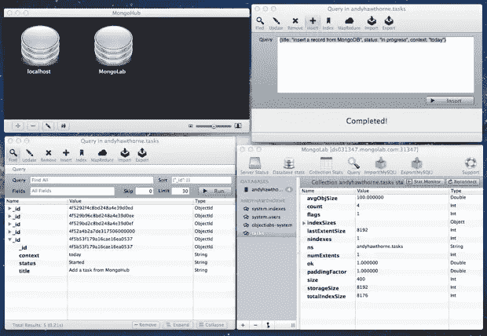
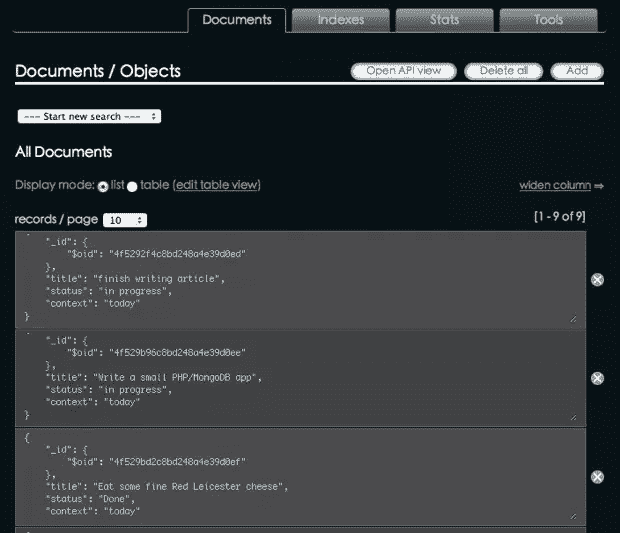
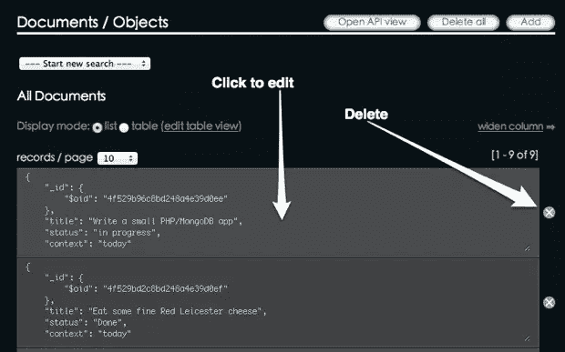
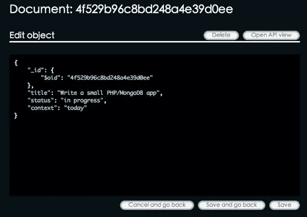

# MongoLab 入门:第 2 部分

> 原文：<https://www.sitepoint.com/getting-started-with-mongolab-part-2/>

在关于 MongoLab 的第一篇文章中，我向您展示了如何使用 MongoDB 进行本地开发，以及 MongoLab，这是专门为处理 MongoDB 数据库的远程部署而构建的 PaaS 服务。

在本文中，我将向您展示如何与 MongoLab 无缝协作，继续构建一个使用 MongoDB 数据库的简单 PHP 应用程序。

我还将向您展示从您自己的计算机连接到 MongoLab 的更好方法。它完全不需要运行 MongoDB 的本地实例。

## 改进了与 MongoDB 的连接

MongDB 似乎有一个问题，默认连接参数是为 localhost 设置的。这意味着，如第一篇文章所示，它必须运行，然后通过 shell 连接到 MongoLab。

在您自己的机器上更改 MongoDB 的安装过程可以解决这个问题。在我的 Mac 上，我使用了流行的名为 [HomeBrew](https://github.com/mxcl/homebrew) 的包管理器来安装 MongoDB。

一旦你安装了自制软件，运行起来就很简单了:

```
brew install mongodb
```

从终端应用程序。请务必注意安装完成后出现的内容，其中提供了一些非常有用的信息。我将它包含在这里以供参考:

```
==> Caveats
If this is your first install, automatically load on login   with:
mkdir -p ~/Library/LaunchAgents
cp /usr/local/Cellar/mongodb/2.0.3-x86_64/homebrew.mxcl.mongodb.plist ~/Library/LaunchAgents/
launchctl load -w ~/Library/LaunchAgents/homebrew.mxcl.mongodb.plist

If this is an upgrade and you already have the homebrew.mxcl.mongodb.plist loaded:
launchctl unload -w ~/Library/LaunchAgents/homebrew.mxcl.mongodb.plist
cp /usr/local/Cellar/mongodb/2.0.3-x86_64/homebrew.mxcl.mongodb.plist ~/Library/LaunchAgents/
launchctl load -w ~/Library/LaunchAgents/homebrew.mxcl.mongodb.plist

Or start it manually:
mongod run --config /usr/local/Cellar/mongodb/2.0.3-x86_64/mongod.conf

The launchctl plist above expects the config file to be at /usr/local/etc/mongod.conf.
If this is a first install, you can copy one from /usr/local/Cellar/mongodb/2.0.3-x86_64/mongod.conf:
cp /usr/local/Cellar/mongodb/2.0.3-x86_64/mongod.conf /usr/local/etc/mongod.conf
==> Summary
```

### Windows 用户呢？

安装 MongoDB for Windows 的推荐方式是通过[预构建的二进制文件](http://www.mongodb.org/downloads)。这将提供本文中描述的相同功能。

### 我在 Linux 上，我该怎么做？

在 [MongoDB 网站](http://www.mongodb.org/display/DOCS/Quickstart+Unix)上有针对流行 Linux 发行版的具体建议。

## 连接到 MongoLab

我将假设您有一个如第 1 部分所述的帐户。如果有，那么您可以跳转到控制台/终端窗口并输入以下命令(在您的 MongoLab 帐户的数据库窗口中找到):

```
mongo youraccount.mongolab.com:31347/your_database -u <user> -p <password>
```

您将直接连接到您在 MongoLab 的云上托管的数据库。回到控制台/终端类型:

```
show collections
```

这将显示您当前数据库中的收藏列表。请记住，在 MongoDB 语言中，集合大致相当于一个数据库表。

现在我们有了 MongoLab 数据库的直接连接，所以我们将继续构建我们的小应用程序。

## 添加任务

因此，如果您遵循上一篇文章，您将在浏览器中看到一个基本的任务列表。任务是从我们的 MongoLab 数据库中读取的，但是我们可以像使用 localhost 一样处理数据。

我们可以通过 MongoLab web 界面添加文档:


或者您可以安装一个可用于 MongoDB 的 GUI 工具:

*   MongoHub–Mac
*   [MongoVue](http://www.mongovue.com/)–Windows
*   [JMongoBrowser](http://edgytech.com/jmongobrowser/)–Windows、Mac、Linux

这是 MongoLab 的另一个不错的特性。能够连接到云服务意味着您可以从上面列出的 GUI 执行同样的操作:



### 编码时间到了

上次我们停止了显示任务列表。如果我们可以通过 PHP 添加一个任务，使用一个简单的 web 表单，那就太好了。在项目中创建一个名为“create.php”的新文件，然后向其中添加一个简单的表单:

```
<!DOCTYPE html>
<head>
    <meta http-equiv="Content-Type" content="text/html; charset=iso-8859-1" />
    <title>Add a task</title>
    <link type="text/css" rel="stylesheet" href="" />
    <!--[if lt IE 9]>
        <script src="http://html5shim.googlecode.com/svn/trunk/html5.js"></script>
    <![endif]-->
</head>
<body>
    <h1>Task Creator</h1>
    <form action="<?php echo $_SERVER['PHP_SELF'];?>" method="post">
        <h3>Title</h3>
        <p><input type="text" name="title" id="title" /></p>
        <h3>Status</h3>
        <p><input type="text" name="status" id="status" /></p>
        <h3>Context</h3>
        <p><input type="text" name="context" id="context" /></p>
        <p><input type="submit" name="submit" value="Save"/></p>
    </form>
    </body>
</html>
```

注意，我们使用 PHP_SELF 将表单发送回自身。这样，我们可以做一个简单的条件测试，看看表单处于什么状态。

### 连接到 MongoLab

接下来，我们可以在文件的顶部编写连接例程来连接 MongoLab:

```
<?php
try 
{
    $connection = new Mongo('mongodb://<user>:<password>your_database.mongolab.com:31347/your_database');
    $database   = $connection->selectDB('your_database');
    $collection = $database->selectCollection('tasks');
} 
catch(MongoConnectionException $e) 
{
    die("Failed to connect to database ".$e->getMessage());
}
```

### 插入文档例程

现在，我们可以在 try 块中添加一个从表单传入的变量数组，作为$_POST 值:

```
try {

        $connection = new Mongo('mongodb://<user>:<password>your_database.mongolab.com:31347/your_database');
        $database   = $connection->selectDB('your_database');
        $collection = $database->selectCollection('tasks');

         $task               = array();
         $task['title']      = $_POST['title'];
         $task['status']     = $_POST['status'];
         $task['context']    = $_POST['context'];
         $task['saved_at'] = new MongoDate();

         $collection->insert($task);
```

除了调用$collection->insert 之外，这里没有任何异常。这是对 PHP Mongo 类中的方法的调用[；它试图插入到我们在连接中引用的集合中。](http://www.php.net/manual/en/mongocollection.insert.php)

如果插入不起作用，我们也可以在这里添加另一个“catch”异常:

```
catch(MongoException $e) 
{
    $die('Failed to insert data '.$e->getMessage());
}
```

### 给表格装上电线

现在我们只需要放入一个触发器来检查:表单需要显示，或者一个成功的插入消息，这取决于是否添加了记录。

就在 PHP 块的顶部创建一个名为$trigger 的空变量。然后添加一个条件测试，查看表单提交按钮变量是否已设置并有值。如果有，那么我们可以触发保存操作，否则我们只需要显示表单:

```
$trigger = "";
if((!empty($_POST['submit'])) &amp;&amp; ($_POST['submit'] === 'Save')) 
{
    $trigger = "do_save";
}
else
{
    $trigger = "show_form";
}
```

然后，我们可以添加一个进一步的条件测试，看看$trigger 有什么值，并相应地继续进行。整个 PHP 块现在看起来像这样:

```
<?php
$trigger = "";

if((!empty($_POST['submit'])) &amp;&amp; ($_POST['submit'] === 'Save')) 
{
    $trigger = "do_save";
}
else
{
    $trigger = "show_form";
}

switch($trigger) 
{
    case 'do_save':

        try 
        {
            $connection = new Mongo('mongodb://<user>:<password>your_database.mongolab.com:31347/your_database');
            $database   = $connection->selectDB('andyhawthorne');
            $collection = $database->selectCollection('tasks');

            $task               = array();
            $task['title']      = $_POST['title'];
            $task['status']     = $_POST['status'];
            $task['context']    = $_POST['context'];
            $task['saved_date']   = new MongoDate();

            $collection->insert($task);       
        } 
        catch(MongoConnectionException $e) 
        {

            die("Failed to connect to database ".$e->getMessage());
        }

        catch(MongoException $e) 
        {

            $die('Failed to insert data '.$e->getMessage());
        }
        break;

    case 'show_form':
    default:
}
?>
```

您会注意到我们添加了一个插入字段:$ task[' saved _ date ']= new MongoDate()。MongoDB 不会抱怨，即使我们以前没有使用过那个字段。MongoDate()是 PHP 驱动程序中内置的时间戳函数。

剩下唯一要做的事情是:

```
<?php if ($trigger === 'show_form'): ?>
```

将它添加到开始表单标记的上方。然后在结束表单标记后:

```
<?php else: ?>
    <p>
        Task saved. _id: <?php echo $task['_id'];?>.
        <a href="<?php echo $_SERVER['PHP_SELF'];?>">Add another task?</a>
    </p>
<?php endif;?>
```

这将响应 PHP 块顶部的条件测试。

### 尝试一下

用你时髦的新表格添加一些记录。最精彩的部分来了。当您保存每个文档时，它将被发送到您的 MongoLab 数据库:



## 更新和删除记录

MongoLab 还不支持从 web 管理区批量上传，但是您可以创建、编辑和删除文档。在我们考虑如何从 PHP 实现这一点之前，让我们先来看看 MongoLab 内部的 CRUD 操作。

当您单击查看某个特定集合时，您会看到文档显示在分页列表中:



单击“x”确实会删除文档。单击单个文档会将您转到编辑屏幕:



编辑掉，然后保存新版本。简单吧。

### 从 PHP 开始呢？

对于编辑文档，过程类似于插入:

1.  创建 web 表单
2.  连接到 MongoLab 并检索一个文档
3.  用正确的记录填充表单
4.  保存更改

到目前为止，我们已经看到了如何使用$collection->find()方法来创建集合中所有文档的结果集。为了选择一个单独的文档，我们可以像这样使用:

```
$id = $_REQUEST['id'];
$task = $collection->findOne(array('_id' => new MongoId($id)));
```

要运行更新，您可以构建一个与插入相同的表单数据数组，并使用如下代码来运行更新:

```
$id = $_REQUEST['id'];
$collection->update(array('_id' => new MongoId($id)), $form_data);
```

其中$form_data 是从 web 表单发送的数据数组。删除文档遵循相同的思路:

```
$id = $_REQUEST['id'];
$collection->remove(array('_id' => new MongoId($id)));
```

## 最后…

多亏了 MongoLab，使用 MongoDB 变得容易多了。事实上，它在云中运行你的数据库，这意味着你可以开发你的应用程序，并部署它，而不必担心数据库的东西。

在本文中，您已经看到了一个通过 PHP 插入文档的完整示例，还看到了如何在 MongoLab web 管理区域管理这些文档。一旦添加了从管理区进行批量插入的能力，MongoLab 将拥有部署 MongoDB 数据库所需的一切。它已经拥有的特性使得构建基于 MongoDB 的 PHP web 应用程序的整个过程变得简单。

[树叶](http://www.shutterstock.com/cat.mhtml?lang=en&search_source=search_form&version=llv1&anyorall=all&safesearch=1&searchterm=leaf&search_group=&orient=&search_cat=&searchtermx=&photographer_name=&people_gender=&people_age=&people_ethnicity=&people_number=&commercial_ok=&color=&show_color_wheel=1#id=61372102&src=64d9fba491e06cb7536e633767809678-1-19)图片通过 Shutterstock

## 分享这篇文章