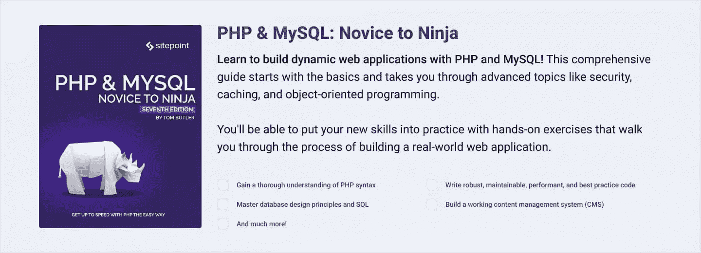
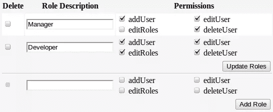

# PHP 中基于角色的访问控制

> 原文：<https://www.sitepoint.com/role-based-access-control-in-php/>

管理用户权限有几种不同的方法，每种方法都有各自的优缺点。例如，使用位屏蔽非常有效，但也会将您限制为 32 或 64 个权限(32 或 64 位整数中的位数)。另一种方法是使用访问控制列表(ACL)，但是您只能将权限分配给对象，而不能分配给特定的或有意义的操作。

在这篇文章中，我将讨论我个人最喜欢的方法:基于角色的访问控制(RBAC)。在 RBAC 模型中，为各种工作职能创建角色，然后将执行特定操作的权限与角色绑定在一起。可以为一个用户分配一个或多个角色，这些角色将用户的系统访问权限限制在他们被授权的权限范围内。

使用 RBAC 的缺点是，如果管理不当，您的角色和权限很容易变得混乱不堪。在快速变化的业务环境中，跟踪为新员工分配适当的角色，并及时将他们从以前的员工或那些调换职位的员工中移除，这本身就是一项工作。此外，确定独特工作职责的新角色以及修改或删除需要定期审查。未能正确管理您的角色会导致许多安全风险。

我将从讨论必要的数据库表开始，然后我将创建两个类文件:(`Role.php`)执行一些特定于角色的任务，以及(`PrivilegedUser.php`)扩展您现有的用户类。最后，我将通过一些例子说明如何将代码集成到应用程序中。角色管理和用户管理密切相关，因此在本文中，我假设您已经有了某种类型的用户认证系统。

[](https://www.sitepoint.com/premium/books/php-mysql-novice-to-ninja-7th-edition/)

## 数据库ˌ资料库

您需要四个表来存储角色和权限信息:`roles`表存储角色 ID 和角色名称，`permissions`表存储权限 ID 和描述，`role_perm`表关联哪些权限属于哪些角色，`user_role`表关联哪些角色被分配给哪些用户。

使用这个模式，您可以拥有无限数量的角色和权限，并且可以为每个用户分配多个角色。

这些是数据库的`CREATE TABLE`语句:

```
CREATE TABLE roles (
  role_id INTEGER UNSIGNED NOT NULL AUTO_INCREMENT,
  role_name VARCHAR(50) NOT NULL,

  PRIMARY KEY (role_id)
);

CREATE TABLE permissions (
  perm_id INTEGER UNSIGNED NOT NULL AUTO_INCREMENT,
  perm_desc VARCHAR(50) NOT NULL,

  PRIMARY KEY (perm_id)
);

CREATE TABLE role_perm (
  role_id INTEGER UNSIGNED NOT NULL,
  perm_id INTEGER UNSIGNED NOT NULL,

  FOREIGN KEY (role_id) REFERENCES roles(role_id),
  FOREIGN KEY (perm_id) REFERENCES permissions(perm_id)
);

CREATE TABLE user_role (
  user_id INTEGER UNSIGNED NOT NULL,
  role_id INTEGER UNSIGNED NOT NULL,

  FOREIGN KEY (user_id) REFERENCES users(user_id),
  FOREIGN KEY (role_id) REFERENCES roles(role_id)
);
```

注意最后一个表`user_role`引用了一个`users`表，我在这里没有定义它。这里假设`user_id`是`users`表的主键。

您不需要对您的`users`表进行任何修改来存储角色信息，因为这些信息是单独存储在这些新表中的。与其他一些 RBAC 系统相反，默认情况下，这里的用户不需要拥有角色；相反，在专门分配角色之前，用户不会有任何特权。或者，可以在`PrivilegedUser`类中检测一个空角色，并在需要时用一个默认的非特权角色来响应，或者您可以选择编写一个简短的 SQL 脚本来复制用户 id，并通过分配一个默认的非特权角色来初始化它们。

## 角色类别

`Role`类的主要目的是返回一个角色对象，其中填充了每个角色对应的权限。这将允许您轻松地检查权限是否可用，而不必对每个请求执行多余的 SQL 查询。

使用以下代码创建`Role.php`:

```
<?php
class Role
{
    protected $permissions;

    protected function __construct() {
        $this->permissions = array();
    }

    // return a role object with associated permissions
    public static function getRolePerms($role_id) {
        $role = new Role();
        $sql = "SELECT t2.perm_desc FROM role_perm as t1
                JOIN permissions as t2 ON t1.perm_id = t2.perm_id
                WHERE t1.role_id = :role_id";
        $sth = $GLOBALS["DB"]->prepare($sql);
        $sth->execute(array(":role_id" => $role_id));

        while($row = $sth->fetch(PDO::FETCH_ASSOC)) {
            $role->permissions[$row["perm_desc"]] = true;
        }
        return $role;
    }

    // check if a permission is set
    public function hasPerm($permission) {
        return isset($this->permissions[$permission]);
    }
}
```

`getRolePerms()`方法基于特定的角色 ID 创建一个新的`Role`对象，然后使用一个`JOIN`子句来组合`role_perm`和`perm_desc`表。对于与给定角色关联的每个权限，描述存储为键，其值设置为 true。`hasPerm()`方法接受权限描述并基于当前对象返回值。

## 特权用户类别

通过创建一个扩展现有用户类的新类，您可以重用现有的代码逻辑来管理用户，然后在这些方法的基础上添加一些专门针对特权工作的额外方法。

使用以下代码创建文件`PrivilegedUser.php`:

```
<?php
class PrivilegedUser extends User
{
    private $roles;

    public function __construct() {
        parent::__construct();
    }

    // override User method
    public static function getByUsername($username) {
        $sql = "SELECT * FROM users WHERE username = :username";
        $sth = $GLOBALS["DB"]->prepare($sql);
        $sth->execute(array(":username" => $username));
        $result = $sth->fetchAll();

        if (!empty($result)) {
            $privUser = new PrivilegedUser();
            $privUser->user_id = $result[0]["user_id"];
            $privUser->username = $username;
            $privUser->password = $result[0]["password"];
            $privUser->email_addr = $result[0]["email_addr"];
            $privUser->initRoles();
            return $privUser;
        } else {
            return false;
        }
    }

    // populate roles with their associated permissions
    protected function initRoles() {
        $this->roles = array();
        $sql = "SELECT t1.role_id, t2.role_name FROM user_role as t1
                JOIN roles as t2 ON t1.role_id = t2.role_id
                WHERE t1.user_id = :user_id";
        $sth = $GLOBALS["DB"]->prepare($sql);
        $sth->execute(array(":user_id" => $this->user_id));

        while($row = $sth->fetch(PDO::FETCH_ASSOC)) {
            $this->roles[$row["role_name"]] = Role::getRolePerms($row["role_id"]);
        }
    }

    // check if user has a specific privilege
    public function hasPrivilege($perm) {
        foreach ($this->roles as $role) {
            if ($role->hasPerm($perm)) {
                return true;
            }
        }
        return false;
    }
}
```

第一个方法`getByUsername()`返回一个填充了特定用户信息的对象。与此几乎相同的方法可能已经存在于您的用户类中，但是您需要在这里覆盖它，以便可以用适当的对象调用`PrivilegedUser`的方法。如果您试图在一个`User`对象上调用一个`PrivilegedUser`方法，您将得到一个错误，指出该方法不存在。

第二种方法`initRoles()`，使用一个`JOIN`来组合`user_role`和`roles`表，以收集与当前用户 ID 相关联的角色。然后，通过调用之前创建的`Role`类方法`Role::getRolePerms()`，每个角色都被填充了相应的权限。

最后一个方法`hasPrivilege()`接受权限描述，如果用户拥有权限，则返回 true，否则返回 false。

有了前面的两个类，检查用户是否有特定的权限就像下面这样简单:

```
<?php
require_once "Role.php";
require_once "PrivilegedUser.php";

// connect to database...
// ...

session_start();

if (isset($_SESSION["loggedin"])) {
    $u = PrivilegedUser::getByUsername($_SESSION["loggedin"]);
}

if ($u->hasPrivilege("thisPermission")) {
    // do something
}
```

这里，用户名存储在活动会话中，并为该用户创建一个新的`PrivilegedUser`对象，在该对象上可以调用`hasPrivilege()`方法。根据数据库中的信息，您的对象输出将如下所示:

```
object(PrivilegedUser)#3 (2) {
  ["roles":"PrivilegedUser":private]=>
  array(1) {
    ["Admin"]=>
    object(Role)#5 (1) {
      ["permissions":protected]=>
      array(4) {
        ["addUser"]=>bool(true)
        ["editUser"]=>bool(true)
        ["deleteUser"]=>bool(true)
        ["editRoles"]=>bool(true)
      }
    }
  }
  ["fields":"User":private]=>
  array(4) {
    ["user_id"]=>string(1) "2"
    ["username"]=>string(7) "mpsinas"
    ["password"]=>bool(false)
    ["email_addr"]=>string(0) ""
  }
}
```

## 保持事物有条理

在 RBAC 中使用 OOP 方法的众多好处之一是，它允许你将代码逻辑和验证与特定于对象的任务分开。例如，您可以将以下方法添加到您的`Role`类中，以帮助管理特定于角色的操作，例如插入新角色、删除角色等等:

```
// insert a new role
public static function insertRole($role_name) {
    $sql = "INSERT INTO roles (role_name) VALUES (:role_name)";
    $sth = $GLOBALS["DB"]->prepare($sql);
    return $sth->execute(array(":role_name" => $role_name));
}

// insert array of roles for specified user id
public static function insertUserRoles($user_id, $roles) {
    $sql = "INSERT INTO user_role (user_id, role_id) VALUES (:user_id, :role_id)";
    $sth = $GLOBALS["DB"]->prepare($sql);
    $sth->bindParam(":user_id", $user_id, PDO::PARAM_STR);
    $sth->bindParam(":role_id", $role_id, PDO::PARAM_INT);
    foreach ($roles as $role_id) {
        $sth->execute();
    }
    return true;
}

// delete array of roles, and all associations
public static function deleteRoles($roles) {
    $sql = "DELETE t1, t2, t3 FROM roles as t1
            JOIN user_role as t2 on t1.role_id = t2.role_id
            JOIN role_perm as t3 on t1.role_id = t3.role_id
            WHERE t1.role_id = :role_id";
    $sth = $GLOBALS["DB"]->prepare($sql);
    $sth->bindParam(":role_id", $role_id, PDO::PARAM_INT);
    foreach ($roles as $role_id) {
        $sth->execute();
    }
    return true;
}

// delete ALL roles for specified user id
public static function deleteUserRoles($user_id) {
    $sql = "DELETE FROM user_role WHERE user_id = :user_id";
    $sth = $GLOBALS["DB"]->prepare($sql);
    return $sth->execute(array(":user_id" => $user_id));
}
```

同样，您可以用类似的方法添加到您的`PrivilegedUser`类中:

```
// check if a user has a specific role
public function hasRole($role_name) {
    return isset($this->roles[$role_name]);
}

// insert a new role permission association
public static function insertPerm($role_id, $perm_id) {
    $sql = "INSERT INTO role_perm (role_id, perm_id) VALUES (:role_id, :perm_id)";
    $sth = $GLOBALS["DB"]->prepare($sql);
    return $sth->execute(array(":role_id" => $role_id, ":perm_id" => $perm_id));
}

// delete ALL role permissions
public static function deletePerms() {
    $sql = "TRUNCATE role_perm";
    $sth = $GLOBALS["DB"]->prepare($sql);
    return $sth->execute();
}
```

因为权限直接与应用程序的底层代码逻辑联系在一起，所以应该根据需要在数据库中手动插入或删除新的权限。另一方面，角色可以通过管理界面轻松创建、修改或删除。



您拥有的角色和权限越多，管理起来就越困难；保持列表最小化是重要的，但是有时相反的情况是不可避免的。我只能建议你做出最好的判断，不要失去理智。

## 摘要

现在，您已经了解了基于角色的访问控制，以及如何在现有应用程序中实现角色和权限。此外，您还了解了一些帮助管理您的角色并使事情井井有条的技巧。和往常一样，我鼓励你尝试，如果遇到困难，就提出问题。我们都在这里互相学习，我很乐意尽我所能帮助你们！

<small>图片 via[PILart](http://www.shutterstock.com/gallery-494302p1.html)/[Shutterstock](http://shutterstock.com)</small>

## 分享这篇文章