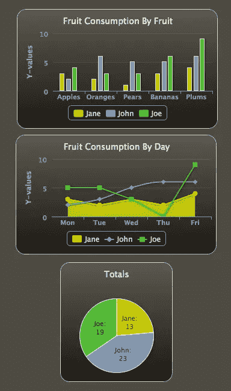
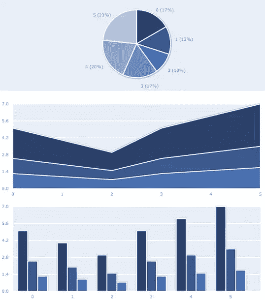
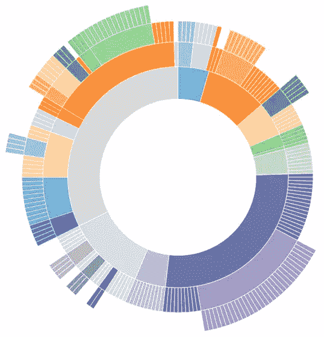
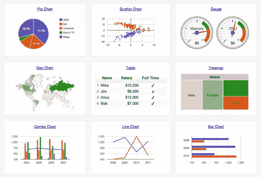
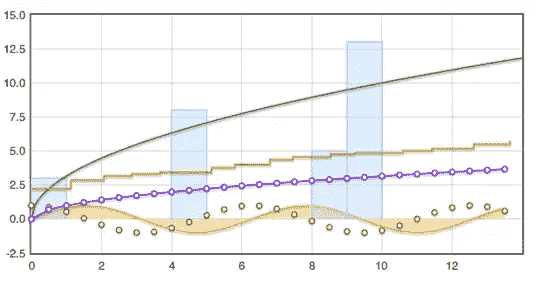

# 使用动态图表库可视化您的数据并加速您的站点

> 原文：<https://www.sitepoint.com/visualize-your-data-and-speed-up-your-site-with-dynamic-chart-libraries/>

在过去的文章中，我们已经深入研究了几十个美学主题，但是设计工作并不总是纯粹的美学。通常，一个真正“设计良好”的解决方案不仅在视觉上吸引人，而且灵活高效。有些情况下，只关注视觉外观而忽略项目的所有其他方面，会让你的设计看起来很美，但做起来却不切实际。

这方面的一个例子是高跟鞋；它可能看起来很时尚，对公众很有吸引力，但对不得不穿它的女性来说，它的脚很痛，在松软的地面上毫无用处，并且使跑步变得不可能。如果你对你的设计项目采取类似的方法，你可能会得到一个设计，就像一只高跟鞋一样，只有很少的功能。为了确保你的下一个界面或[登陆页面设计](https://www.sitepoint.com/10-landing-page-reviews/)不会遭受与你选择的糟糕鞋子相同的命运，你可能需要一种可视化数据的方法，在美学吸引力和实用性之间取得谨慎的平衡。

设计师的第一个倾向可能是在 Photoshop 或 Illustrator 中制作像素完美的图形或图表，但这种解决方案需要不断更新图表，即使是数据中最微小的变化，这也使得这种方法远非简单实用。如果您的指标只改变了几个单位或几个百分点，您可能每次都必须打开可编辑的文件，进行所需的更改，导出并上传静态图像。对于如此微小的变化，工作量很大。更糟糕的是，如果你的数据是基于时间线或其他不断变化的指标，那么你的图表每天都会过时。最后，静态图像最终不是交互式的，这使得你的编程知识和网站的交互能力没有得到很好的利用。

### 漂亮、实用的图表和图形

因此，与其用每一盎司的实用性(和交互性)来换取完美的信息图表，使用动态图表库可能是更好的选择。这些图表库可以显示令人惊讶的清晰图形，同时仍然保持灵活性和易于更新，这使它们成为设计师和普通观众的一个伟大的解决方案。其中一些库依赖于 HTML5，旧浏览器并不完全支持 html 5，但随着新浏览器的更新，这些兼容性问题正在迅速消失。动态图表也比大型图像文件小得多，轻得多，这在网站速度方面提供了额外的优势。使用动态图表库的优势越来越大，而其潜在的问题越来越少。

有相当多的库可供选择，它们都有独特的优点和缺点。

### 高图表

[](https://www.sitepoint.com/wp-content/uploads/2012/03/highcharts.jpg)

使用 HighCharts 查看水果消费数据的 3 种不同方式

HighCharts 是一个基于 JavaScript 的图表库，拥有时尚的图表、出色的支持和令人印象深刻的兼容性。你可以指望他们的图表在每一个浏览器中发挥作用，从可怕的 Internet Explorer 6 到 iOS 设备中最新版本的 mobile Safari。他们的图表也有微妙的动画——条形图的增长和趋势线的追踪——增加了他们的视觉吸引力。该库是开源的，因此可以根据任何项目的独特需求修改图表。对于非商业用途来说，HighCharts 是免费的，但是对于商业项目来说，它的成本很高。对于一个网站来说，使用 HighCharts 只需 80 美元，但对于一个由 10 名开发人员组成的团队来说，在多个项目中使用该库，价格将跃升至 2000 美元。如果你在应用程序中使用 HighCharts，你将不得不联系制作者，就价格和 HighCharts 的使用进行谈判。

### 绘图工具包

[](https://www.sitepoint.com/wp-content/uploads/2012/03/plotkit-demo.jpg)

使用 PlotKit 渲染的三个图表

PlotKit 的图表在视觉上可能不如 HighChart 的吸引人，但 [PlotKit](http://www.liquidx.net/plotkit/) 在所有情况下都是 100%免费的。它还有一个有用的快速入门指南，可以帮助您启动和运行图表。PlotKit 检测访问者的浏览器是否支持<画布>，如果支持就利用这项技术。否则，它会为较旧的浏览器提供后备方法来达到相同的目的。PlotKit 不是一个独立的库；它依靠 [MochiKit](http://mochi.github.com/mochikit/) 来正常工作，这可能会使安装和维护比独立的库稍微困难一些。

### d3.js

[](https://www.sitepoint.com/wp-content/uploads/2012/03/d3js.jpg)

使用 d3.js 的“旭日”图

d3.js 是一个基于 JavaScript 的图形库，它的文件大小非常美观，而且价格低廉。d3.js 是可视化大量复杂数据的绝佳选择。图表是丰富多彩和干净的，文档是广泛和有益的。d3.js 强调交互式的、基于动作的过渡和转换，这可以为你的网页设计中的图表和图形增加令人印象深刻的功能。d3.js 的制作者有教程让新用户入门，也有丰富的文档供老手使用。

### FusionCharts

[](https://www.sitepoint.com/wp-content/uploads/2012/03/fusioncharts.jpg)

使用融合图表的九个不同图表

[FusionCharts](http://www.fusioncharts.com/) 拥有种类繁多的图表类型，所有这些图表都有着精致、专业的外观。它们还拥有数百种功能，并为 Powerpoint、Joomla、Dreamweaver 和 Flex 等软件提供了扩展。但是，这些工具都是有价格的，FusionCharts 的许可费用可能高达 10，000 美元，这使得该选项只适用于预算庞大、需要显示大量数据的项目。

### 谷歌图表工具

[](https://www.sitepoint.com/wp-content/uploads/2012/03/google-chart-tools.jpg)

只是谷歌的一些通用图表工具

谷歌以[谷歌图表工具](http://code.google.com/apis/chart/interactive/docs/index.html)的形式提供自己的图表库。正如你对谷歌的期望，这些图表有一个直观、熟悉的外观，并且易于设置和查看分析。谷歌图表工具很好地利用了悬停效果；将鼠标悬停在图表图例中的数据类型上通常会突出显示图表或图形的相应部分。一旦您将必要的代码片段包含到您的网站中，绘制(或更新)图表数据就像插入逗号分隔的文本值一样简单，正如您可以在这个代码示例中看到的，该示例由按浇头排列的比萨饼切片消耗量组成:

```
// Create the data table.
var data = new google.visualization.DataTable();
data.addColumn('string', 'Topping');
data.addColumn('number', 'Slices');
data.addRows([
['Mushrooms', 3],
['Onions', 1],
['Olives', 1],
['Zucchini', 1],
['Pepperoni', 2]
]);
```

虽然您的图表将依赖于外部文件，但这些文件托管在可靠的谷歌服务器上，这将最大限度地减少您对图表中断或其他技术问题的担忧。

### Flot

[](https://www.sitepoint.com/wp-content/uploads/2012/03/flot.jpg)

Flot 的图表简单、干净、清晰

Flot 在上面的图表库中是独一无二的，因为它是为 JQuery 设计的，而不仅仅是 JavaScript 语言。这使得它成为那些希望在尽可能短的时间内开始学习的 JQuery 专家的首选。正如您对 JQuery 产品的期望，Flot 在使图表具有交互性方面做得很好。您可以用跟随光标的“X”和“Y”轴形成十字准线，也可以使用简单的表单在图形或图表中打开和关闭数据。为了获得更多的交互性，您可以将动态图形导出为静态 PNG 或 JPEG 图像文件。

### 结论

从上面的变化中，希望至少有一个图表库可以让你基于数据的设计既美观又实用。它们从简单免费到强大昂贵。从长远来看，熟悉动态制图工具可能会节省大量时间，否则这些时间将用于对静态图像进行微小而繁琐的校正。

有什么图表库或者绘图工具推荐吗？或者，静态图像是否有优势，使图像编辑器成为可视化数据的最佳工具？

## 分享这篇文章