# 使用木偶扭曲工具创建自定义类型

> 原文：<https://www.sitepoint.com/create-custom-type-using-the-puppet-warp-tool/>

横幅广告、小册子、品牌材料和模板有许多不同之处，但它们的共同目标是传递一种独特、精炼的信息，突出并吸引眼球。如果你的设计看起来和其他人的一样，通常很难吸引潜在客户并从竞争对手中脱颖而出。这就是为什么广泛使用的字体和标准排版样式可能并不总是您项目的最佳选择。创建自定义类型是吸引浏览者并为您的设计获得独特、醒目外观的好方法。

但是，创建你自己的自定义字体的每一个字母和衬线可能是乏味和非常耗时的。您可以使用木偶扭曲工具来获取任何线性图像，并将其弯曲以形成自定义字体，而不是倾倒在您自己手工制作的字体的复杂性上。不使用木偶扭曲工具，试图创建这个文本可能需要几个小时，但使用正确的 Photoshop 技术，你可以在几分钟内拥有独特的自定义文字。

第一步:为你的类型找到合适的材料

第一步是在网上搜索一个外观呈线性的图像。对于本教程，我正在创建一个链接文字效果，形成单词“链接”这将是一个有趣的杂志标题或社论插图的视觉效果。在网上搜索一条链的线性图像时，我发现了这个:

**第二步:提取你的材料** 

下一步是从背景中移除你的图像。点击 command/ctrl + "J "复制背景层，隐藏原始层。

**第三步:快速去除背景** 

选择快速选择工具并点击您想要移除的区域。按住 shift 键添加到选区，按住 alt/option 键单击从选区中减去区域。

[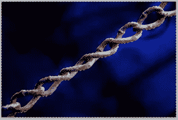](https://www.sitepoint.com/wp-content/uploads/2012/02/Screen-shot-2012-02-27-at-8.37.14-PM.png)

**第四步:使用面膜节省时间** 

在保留空间以便于编辑的同时进行仔细选择的一个好方法是单击遮罩图标来遮罩您的选择。这将掩盖你的链，这比追踪每个环节要容易得多。

第五步:翻转你的面具，露出链条

要反转遮罩，只需点击遮罩图标，然后按 command/ctrl + "I "。

第六步:清理你的面具并做调整

如果您所做的选择不完美，请使用画笔工具进行调整。确保选择了遮罩图标，并使用黑色来遮罩您想要隐藏的区域。使用白色来显示您不想遮盖的区域。

第七步:使用模糊来柔化粗糙的边缘

如果您的选择过于僵硬或粗糙，请按住 alt/option 键并单击遮罩图标，将视图切换到遮罩。要柔化蒙版的边缘，进入“滤镜”>“模糊”>“高斯模糊”选择小一点的，比如 0.5px 或者 1px。单击图层图标返回正常视图。

[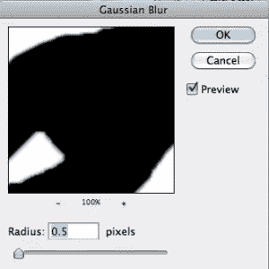](https://www.sitepoint.com/wp-content/uploads/2012/02/Screen-shot-2012-02-27-at-9.39.47-PM.png)

**第八步:应用蒙版去除背景，只留下链条** 

一旦你有你想要的图像蒙版，右击蒙版图标并选择“应用蒙版”这将应用你的面具，只留下你的图像没有背景。

如果我们要创建单独的字母，那么一个链图像就足够了。但是，由于我们将有多个字母串在一起，我们将不得不创建一个较长版本的链图像。

**第九步:延长你的链条** 

复制链层，并重叠结束，使它看起来像一个连续的链。对于这一步，我合并了三个链层在一起，使一个单一的长链。

[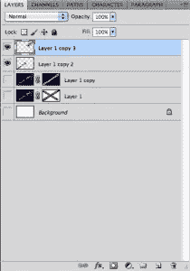](https://www.sitepoint.com/wp-content/uploads/2012/02/Screen-shot-2012-02-27-at-10.54.21-PM.png)

[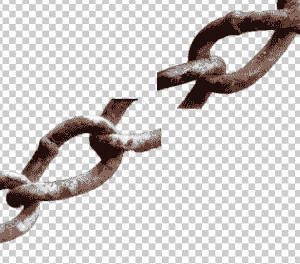](https://www.sitepoint.com/wp-content/uploads/2012/02/Screen-shot-2012-02-27-at-10.54.45-PM.png)

第十步:让你的链子又细又柔韧

一旦这些链被合并，然后你会想要点击 command/ctrl + "T "来变换你的层。按比例缩小链条，使其足够细，可以弯曲成字母形状。不要担心你的图像离开了画布。

**第十一步:保留多余的副本** 

将这条细长的链子复制几次，这样当你需要它们写信或者出错的时候就有了。

第十二步:创建你的背景

根据您选择的大小创建一个新文档。我创建了一个尺寸为 1024 像素乘 768 像素的。对于这张图片，粗糙的背景纹理是一个不错的选择。你可以在网上任何地方找到一个垃圾背景纹理。这个背景将由两幅图像创建。

**第十三步:使用质地良好的粉底** 

引入第一幅图像，保持原样。引入第二个纹理，确保它在第一个纹理之上。

步骤 14:混合第二个纹理，使用混合模式

第二个背景对项目来说可能太亮或太暗，所以将混合模式更改为“颜色”并使用混合模式来获得适合您的目的的背景。

**第十五步:拖动你的链层到新文件** 

回到原始文档，将链图像拖到新文档中。单击图层面板上的眼睛图标暂时隐藏该图层。

[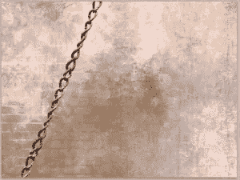](https://www.sitepoint.com/wp-content/uploads/2012/02/Screen-shot-2012-02-27-at-8.40.55-PM.png)

第十六步:为你的信息选择合适的字体

如果你要创建你自己的类型，风格真的取决于应用程序。我选择了一种字体，或者草书风格的字体，因为它从一个字母流向下一个字母。Scriptina Pro 对于这种应用来说是一个不错的选择。

[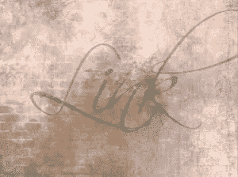](https://www.sitepoint.com/wp-content/uploads/2012/02/Screen-shot-2012-02-27-at-8.47.40-PM.png)

**第十七步:设置文字图层为导向** 

文字层只是一个临时的引导，所以我确保它在链图像的下面，我设置不透明度为 30%。

第十八步:放置你的文字材料

隐藏所有的链层，只留下一层，并将链的长度放在字母最长的地方。对于“L”来说，应该是竖线。

第十九步:形成你的文字

要把你的链子塑造成每个字母的形状，去“编辑”>“木偶扭曲”您的光标将从当前工具变成一个看起来像图钉的图标。

[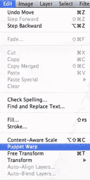](https://www.sitepoint.com/wp-content/uploads/2012/02/Screen-shot-2012-02-27-at-8.53.02-PM.png)

第 20 步:用别针操纵你的链子

使用木偶扭曲工具，你可以给你的图像添加大头针。这些大头针将允许你创建一个支点，或者一个操纵你的图像的点。您的图像也将有一个网格类型的覆盖。这将显示图层中具有可选像素信息的区域。

**第 21 步:随着你的行动形成你的字体** 

您可以放置任意数量的图钉，但是使直线图像符合曲线轮廓的最佳方法是在文字急转弯的开始、中间和结束处创建图钉。您可以根据单击并拖动大头针的角度来旋转图像。

**步骤 22:考虑笔画重叠** 

对你的链条重复这一过程，旋转你的链条以跟随每个字母的轮廓。我在链条重叠的地方创建了一个支点，如下图所示。

第 23 步:控制你的笔画如何重叠

在链的重叠部分，您可以控制哪个部分在上面。选择链重叠的销，右键单击它，并将其向前或向后移动，以实现所需的重叠。

[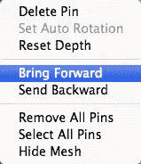](https://www.sitepoint.com/wp-content/uploads/2012/02/Screen-shot-2012-02-27-at-9.04.35-PM.png)

**步骤 24:现在进行所有必要的调整** 

如果您创建了一个不满意的 pin，只需右键单击它并选择“删除”请记住，一旦您点击另一个工具并点击“应用”，您将无法返回并编辑这些 p in。该信息将不再可用。

第 25 步:去掉多余的材料

如果你得到了比你需要的更多的链，简单地删除多余的链，直到它在文字结束的地方结束。

[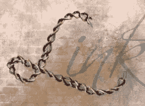](https://www.sitepoint.com/wp-content/uploads/2012/02/Screen-shot-2012-02-27-at-9.06.25-PM.png)

步骤 26:形成剩余的字母

使另一个链层可见，并使用相同的方法弯曲链周围的最后三个字母的轮廓。因为它们都是连接在一起的，所以我们将使用一条长而连续的链。如果你在正确的方向上弯曲链条有困难，在该点之后以及链条的更下方添加一个销，以帮助塑造链条材料。

[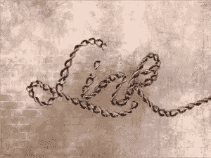](https://www.sitepoint.com/wp-content/uploads/2012/02/Screen-shot-2012-02-27-at-10.34.17-PM.png)

**步骤 27:为尺寸** 添加阴影

双击两个链层，并添加一个小阴影。将距离设置为 0px，大小设置为 5px。这将使你的链层在背景纹理上有一点清晰度和尺寸，并使它们更加突出。下面是完成的练习。

[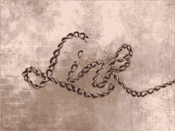](https://www.sitepoint.com/wp-content/uploads/2012/02/Screen-shot-2012-02-27-at-10.35.38-PM.png)

使用木偶扭曲工具，你可以很容易地将几乎任何类型的线性材料制作成定制类型。这种效果是大胆的，独特的和说明性的，这种概念可以用于品牌，标志设计，印刷材料和各种各样的其他设计。

你能分享一些用不寻常的材料制成的字体的例子吗？

## 分享这篇文章