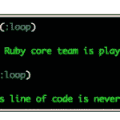
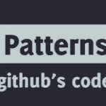

# 不在轨道上发生的事情

> 原文：<https://www.sitepoint.com/happenings-in-not-rails/>

在我的上一版《Ruby 发生的事情》中，一位评论者指出我的每一个链接都是关于 Rails 的。当然，我并没有意识到这一点，直到有人给我看了它。我想，我和其他人一样对传播 Ruby IS Rails 的神话感到内疚，所以本周我不会再提 R***了。永远不要说我不听读者的话。

我希望你喜欢这个版本的链接和诸如此类的…他们来了。

### 笑话在我们身上:Ruby 1.9 如何支持 Goto 语句

I’d be remiss if I didn’t point out this illuminating post by our own Pat Shaughnessy on how the keepers of Ruby have a sense of humor. If you have a burning desire to revert your local version of Ruby to the days of VB and Fortran, Pat shows you how. I still want Ruby to support a MAKE_CODE_SUCK_LESS compiler option…

### [用于管理 Heroku 应用程序的 iPhone 应用程序](http://blog.heroku.com/archives/2012/2/21/nezumi-2-for-iphone/?utm_source=feedburner&utm_medium=feed&utm_campaign=Feed%3A+heroku+%28Heroku+News%29)

This is not directly Ruby (or R****) related, but I think enough of us deploy apps to Heroku that it makes it relevant. Nezumi is an iOS app that allows you to connect to your Heroku applications and do much of (if not all) the things you can do from the heroku command line client. It’s not free, but for $9.99 it’s worth it. Especially if you’ve found yourself on the train realizing that you deployed to the production app, then forgot to migrate the database right before you left the office…(no, I haven’t been fired…yet)

### [麦芽酒上的红宝石](http://ruby.onales.com/)

Ruby on Ales is happening this week, and I am aware of just a few of the great presentations that are going on out on the other coast. I am REALLY hoping that they release these presos with video soon (or, at all) so I can drink ale and watch them in the comfort of my own home.

### [未加工的红宝石](http://subinterest.com/rubies-in-the-rough)

Rubies in the Rough is the venerable James Edward Gray II’s blog about Ruby. James is a Ruby Rogue, as well as being a crazy smart guy. He seems, to me, to be one of the more “real” well-known Ruby developers. The Rubies in the Rough series is not free (but, there are one or two free samples) but it’s cheap and well worth $6 month. I’ve noticed a move in our community to modest fees for great content, and I don’t have a problem with it (Don’t worry, Rubysource will always be free…)

### [Github 代码库中的 Ruby 模式](http://zachholman.com/talk/ruby-patterns)

This link has been all over Twitter and the Rubysphere, but I still felt the need to include it in our Happenings post. It’s that good. Zach explains some of the workflow and patterns used by Github with Ruby projects, and it’s all good. `git add thisPost && git commit -m "Making the community better"` I don’t know if they use Github in heaven, but if they don’t I bet they have a plan in place to switch to it.

### 包裹

你走了，这一轮的事情。所有时间都免费。我相信你很欣赏我没有包括任何链接的事实，比如:

*   [Rails 3.2.2 发布了！](http://weblog.rubyonrails.org/2012/3/1/ann-rails-3-2-2-has-been-released)
*   [主动资源间谍](http://blog.codesherpas.com/on_the_path/2012/02/active-resource-spy.html)

因为他们会毁了我们这周的非 R****方法。

黑掉！

## 分享这篇文章