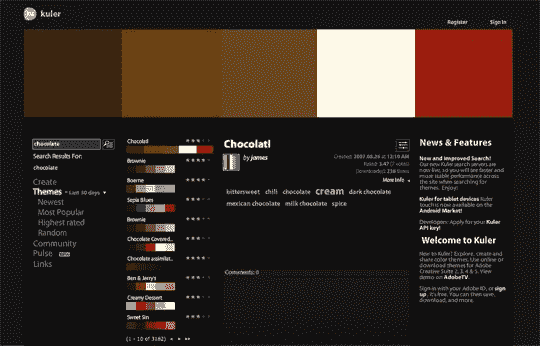

# 你试过库勒吗？

> 原文：<https://www.sitepoint.com/have-you-tried-kuler/>

在任何设计过程中，颜色的选择都是非常早的。通常，设计师被限制使用现有品牌中非常特殊的颜色。有时候，设计师有充分的自由(很少指导)从数百万种颜色中选择。这两种情况都不理想；有太多的约束和太多的选择一样困难。陷入基于颜色的难题可能会打乱你的时间表，减慢你的工作速度，并在项目一开始就让你感到沮丧。

在为设计选择颜色时，有相当多的传统经验法则可供选择:单色提供视觉稳定性，可以感受到强烈和权威，互补色往往在视觉上令人兴奋，类似的颜色在自然界中经常发现，因此悦目。但是，每个客户都将“脱颖而出”和“与众不同”作为他们的首要任务，遵循这些典型的标准经验法则可能弊大于利。

当你的设计截止日期迫近时，你不会想与那些不协调的颜色斗争。

Adobe Kuler 允许您查看数千个用户创建的调色板。调色板可以按受欢迎程度、评级和提交日期排序。他们也可以通过关键字搜索，或者访问者可以随意浏览。如果你的设计项目围绕一个特定的想法(或一个特定的*约束*)，比如“柑橘”或“巧克力”，在 Kuler 中进行简单的搜索就能提供一些即时的灵感。

或者，如果你没有像“柑橘色”或“巧克力色”这样的引导来开始，单一颜色如“卡罗莱纳蓝”或“木炭色”也会产生类似的有益结果。一般来说，你只需要一个想法开始；然后，Kuler 可以向您展示这个单一起点上的一系列令人印象深刻的变化。

Kuler 还有一个名为“ [Pulse](http://kuler.adobe.com/#pulse) ”的新功能，可以细致地跟踪每天下载的调色板种类。利用“脉动”，设计师可以对最近的设计趋势做出推断。他们还可以检查哪些颜色被广泛使用，哪些是真正稀有的商品。

Kuler 还提供了一个 Android 应用程序，但是一个与之相当的 iOS 应用程序明显不存在。因为 Kuler 是基于 Adobe Flash 的，所以苹果在其无处不在的 iOS 设备上缺乏对 Flash 的支持可能意味着 iOS 应用程序是不可能的。

你使用 Kuler 或类似的颜色工具来帮助设计决策吗？或者，使用预定义的调色板和使用标准的颜色经验法则一样典型和陈腐吗？

## 分享这篇文章