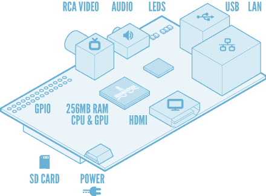

# 为什么 Web 开发人员想要一份树莓派

> 原文：<https://www.sitepoint.com/raspberry-pi-launch/>

2 月 29 日是产品发布的好日子，人们已经期待树莓派几个月了。这是一台信用卡大小的迷你电脑。费用:35 美元。你没看错。一台功能齐全的电脑，只需一顿像样的午餐。如果你不需要以太网接口，甚至还有一款售价 25 美元的型号。

诚然，你需要一个外壳、电视/显示器、键盘、微型 USB 电源线和 SD 卡来做任何事情，但 700MHz ARM 处理器和 256MB RAM 能够运行 Linux、办公应用程序和全屏视频。

该设备由英国慈善机构 Raspberry Pi Foundation 开发，该机构旨在促进计算机科学的研究，尤其是在学校层面，希望将乐趣带回计算中。从本质上说，他们希望孩子们和业余爱好者能够体验到 20 世纪 70 年代末和 80 年代初的兴奋感。8 位计算机可能是最基本的，但它们鼓励编程和实验。

Pi 可以使用各种版本的 Linux。它可以愉快地运行 web 服务器、PHP、Python、Ruby、node.js 和大多数其他语言。添加一些浏览器、MySQL、GIMP 和体面的文本编辑器，你就有了一个面向初露头角的 web 开发人员的成熟环境。这是学习技术的好方法:

*   工具是免费的
*   不管你是丢弃软件还是硬件都没关系
*   远胜于大部分学校教授的繁琐的微软 Office 技能。

希望这些知识能帮助未来的开发人员避免我们今天所犯的错误。

受益于树莓派的不仅仅是孩子。这些器件可能非常适合:

*   在不同的环境中测试您的应用程序，例如，您可以在一个 Pi 上安装 PHP5.3 和 MySQL 5.0，在另一个 Pi 上安装 PHP5.4 和 MySQL 5.5
*   测试 MySQL 复制或并行处理的多服务器设置
*   自动化备份
*   运行源代码控制系统
*   执行长期运行的数据分析任务
*   在没有互联网接入的地方演示应用程序。您甚至可以将 Pi 设备留给潜在客户进行进一步评估。

我想要一个。我相信你也是。不幸的是，许多其他人也是如此，两家网上商店在 UTC 时间今天早上 6:00 发布后几分钟内就崩溃了。你吃了一片覆盆子酱了吗？

更多信息，请参考[www.raspberrypi.org](https://www.raspberrypi.org/)

## 分享这篇文章