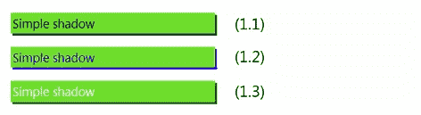
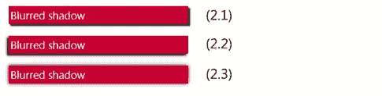
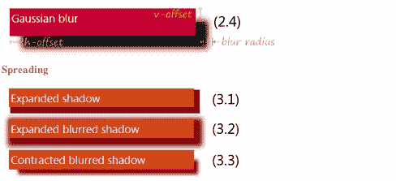
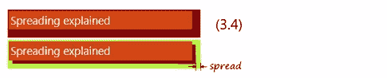
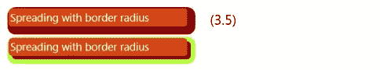
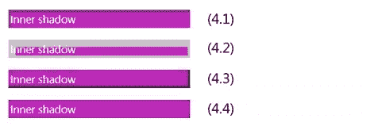
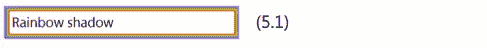
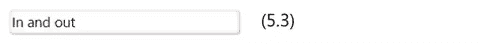
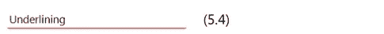
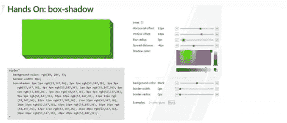

# 控制方框阴影

> 原文：<https://www.sitepoint.com/mastering-box-shadows/>

今天我们将学习用 CSS3 控制阴影的艺术。有两种类型:框阴影和文本阴影，分别在模块和 [CSS3 文本](https://www.w3.org/TR/css3-text/)中定义。

`box`和`text`的工作方式相似——`text-shadow`的定义是指向`box-shadow`的定义，但有一些例外。让我们从方框阴影开始:

## 浏览器支持

IE10 和其他现代浏览器支持 CSS3 框阴影。你也可以在用 html/js 构建的 Windows 8 的 [metro 风格应用中使用它。](http://dev.windows.com/)

## 箱形阴影

首先，有一件事你应该记住:阴影不会增加或减少盒子或其边界的大小。规范说:阴影不会触发滚动或增加可滚动区域的大小。

[](https://www.sitepoint.com/wp-content/uploads/2012/02/Screen-Shot-2012-02-28-at-12.00.05-PM.png)

要创建最基本的阴影，您只需要定义规则的前两个参数:阴影的水平和垂直偏移(1.1):

```
box-shadow: 3px 3px;
```

正值表示阴影向右下方移动，负值表示向左上方移动。

如果你不指定阴影的颜色，大多数浏览器将使用当前上下文中的文本颜色(1.2)。(规范于 2012 年 2 月更改，在之前的版本中省略了“颜色是 UA 选择的颜色”。所以你可能会发现一些浏览器有不同的行为。):

```
box-shadow: 3px 3px; color:blue;
```

要设置阴影的颜色，需要在末尾添加一个颜色值(1.3):

```
box-shadow: 3px 3px darkgreen;
```

要定义颜色，您可以使用任何可用的 CSS3 符号:#RGB、#RRGGBB，即通过 RGB()或 rgba()和 hsla()函数使用 alpha 通道。hsla 功能在构建复杂样品时非常有用。

## 模糊

[](https://www.sitepoint.com/wp-content/uploads/2012/02/Screen-Shot-2012-02-28-at-12.02.23-PM.png)

您可以设置的第三个长度是模糊半径，即定义阴影边缘模糊程度的正值(2.1–2.3):

```
box-shadow:3px 3px 3px darkgrey;
```

默认情况下，模糊半径等于零，阴影边缘清晰。

通过结合模糊和阴影的偏移，你可以实现许多效果。在样本(2.3)上，两个偏移都等于零，但是由于模糊效果，盒子周围有一个阴影:

```
box-shadow:0 0 9px black;
```

模糊算法不是由规范本身定义的，但它说模糊效果应该接近高斯模糊，标准差等于模糊半径的一半。换句话说，这意味着不同无人机生成的实际阴影有时会有所不同。

[](https://www.sitepoint.com/wp-content/uploads/2012/02/Screen-Shot-2012-02-28-at-12.06.14-PM.png)

第四个长度是扩展距离，这扩展或收缩阴影。默认情况下，阴影的大小等于框的大小，但通过使用扩展，您可以改变它。此外，我应该在这里指出，这个参数是在后来的规范版本中引入的，所以在 wild web 上有许多过时的教程，但不知道它的存在。；)

要扩展阴影，请设置一个正的扩散距离(3.1，3.2):

```
box-shadow:6px 6px 0px 4px darkred;
```

收缩—使用负值(3.3):

```
box-shadow:12px 12px 8px -4px darkred;
```

[](https://www.sitepoint.com/wp-content/uploads/2012/02/Screen-Shot-2012-02-28-at-12.08.44-PM.png)

在上面的示例(3.4)中，阴影向左下方水平和垂直偏移 6px，从每一侧扩展 8px:

```
box-shadow:6px 6px 0 8px grey;
```

如果你在你的盒子上使用圆角，预计扩展阴影的边界半径也将按比例放大(3.5):

[](https://www.sitepoint.com/wp-content/uploads/2012/02/Screen-Shot-2012-02-28-at-12.09.52-PM.png)

## 内心阴影

[](https://www.sitepoint.com/wp-content/uploads/2012/02/Screen-Shot-2012-02-28-at-12.09.57-PM.png)

你可以定义的另一个有趣的修饰符是“inset”关键字，它允许你在你的盒子里画一个内阴影(4.1-4.4):

```
box-shadow:inset 4px 4px rgba(66,66,66,0.5); /* (4.1) */
```

```
box-shadow:inset 4px 4px 0 8px rgba(198,198,198,1); /* (4.2) */
```

```
box-shadow:inset -2px -2px 8px 0px black; /* (4.3) */
```

```
box-shadow:inset 0 0 4px 0px black; /* (4.4) */
```

请注意，内部阴影仅绘制在盒子内部，如果您在内部阴影上使用正的扩散距离，这意味着收缩阴影的周边形状(4.2)。

## 多重阴影

马赛克的最后一块:你可以为同一个盒子定义尽可能多的阴影，方法是用相同的规则将它们用逗号分隔开。

要创建一个彩虹阴影(5.1)，你需要做的就是用增加的扩散距离写下几个阴影:

```
box-shadow: 0 0 2px 1px red,

           0 0 2px 2px orange,

           0 0 2px 3px yellow,

           0 0 2px 4px green,

           0 0 2px 5px lightblue,

           0 0 2px 6px blue,

           0 0 2px 7px violet;
```

[](https://www.sitepoint.com/wp-content/uploads/2012/02/Screen-Shot-2012-02-28-at-12.13.19-PM.png)

请注意，阴影效果是从前到后应用的。紫色阴影的将首先被绘制，在它上面将绘制蓝色的，以此类推。红色的将被绘制在最后，在其他阴影之上，最后是盒子本身及其所有内容。

由于所有的阴影都是独立的，你可以很容易地组合不同偏移的阴影(5.2):

```
box-shadow: -6px -6px 8px -4px rgba(255,0,0,0.75),

           6px -6px 8px -4px rgba(0,255,0,0.75),

           6px 6px 8px -4px rgba(255,255,0,0.75),

           -6px 6px 8px -4px rgba(0,0,255,0.75);
```

[](https://www.sitepoint.com/wp-content/uploads/2012/02/Screen-Shot-2012-02-28-at-12.14.18-PM.png)

或者组合外部和内部阴影(5.3):

```
box-shadow: inset 0 0 8px lightgray,

           1px 1px 3px darkgray;
```

[](https://www.sitepoint.com/wp-content/uploads/2012/02/Screen-Shot-2012-02-28-at-12.15.20-PM.png)

下面是一个带下划线(底部阴影)的示例(5.4):

```
box-shadow: 0 1px red,

           0 3px 3px -2px black
```

[](https://www.sitepoint.com/wp-content/uploads/2012/02/Screen-Shot-2012-02-28-at-12.16.14-PM.png)

通过在带有内容的伪类的:before 和:after 上添加一些特殊效果，您可以创建一个由 Matt Hamm (5.5)描述的圆滑框[:](http://www.matthamm.com/box-shadow-curl.html)

```
.slick-box {

   position: relative;

   height: 50px;

   border: 1px solid #efefef;

   background: #fff;

   box-shadow: 0 1px 4px rgba(0, 0, 0, 0.27), 0 0 40px rgba(0, 0, 0, 0.06) inset;

}

.slick-box:before, .slick-box:after {

   content: '';

   z-index: -1;

   position: absolute;

   left: 10px;

   bottom: 10px;

   width: 70%;

   max-width: 300px; /* avoid rotation causing ugly appearance at large container widths */

   height: 55%;

   box-shadow: 0 8px 16px rgba(0, 0, 0, 0.3);

   transform: skew(-15deg) rotate(-6deg);                

}

.slick-box:after {

   left: auto;

   right: 10px;

   transform: skew(15deg) rotate(6deg);                

}
```

[](https://www.sitepoint.com/wp-content/uploads/2012/02/Screen-Shot-2012-02-28-at-12.19.04-PM.png)

为了简化代码，我删除了所有的供应商前缀，但是在试图重现它的时候，你应该使用所有的这些，ms-transform，webkit-transform 等等。

## 通用语法

总结一下方框阴影的常见语法，如下所示:

```
box-shadow:  [ ,  ]*;

 = inset? && [ <length>{2,4} && <color>? ]</color></length>
```

完整版本中的最后一条规则意味着:

```
box-shadow: inset? h-offset v-offset blur-radius spread-distance color;
```

模糊半径和扩散距离可以省略。inset 关键字将阴影形式从外部切换到内部。

## 交互式示例

[](https://www.sitepoint.com/wp-content/uploads/2012/02/Screen-Shot-2012-02-28-at-12.21.19-PM.png)

如果你想以互动的方式玩阴影，我的同事为去年九月的[构建会议](http://www.buildwindows.com/)制作了一个很酷的演示:“[动手:盒子阴影](http://ie.microsoft.com/testdrive/Graphics/hands-on-css3/hands-on_box-shadow.htm)”。

## 一张便条

本文中讨论的 CSS 属性是在 CSS3 背景和边框模块中定义的，该模块目前处于工作草案状态。同时，它看起来很稳定，虽然它仍然可以在细节上变化。

## 分享这篇文章