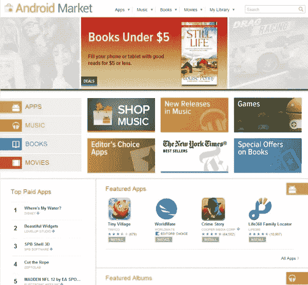
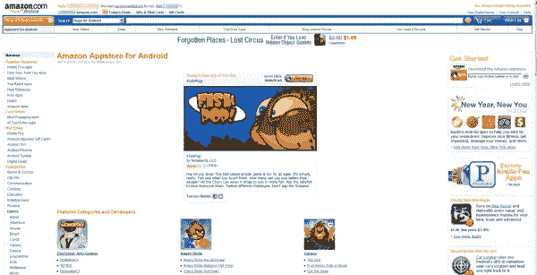
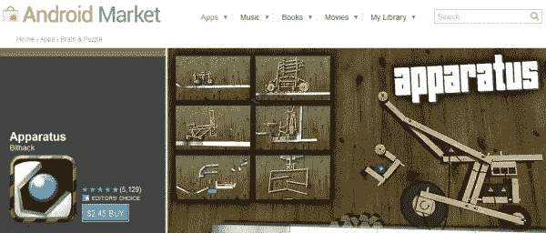
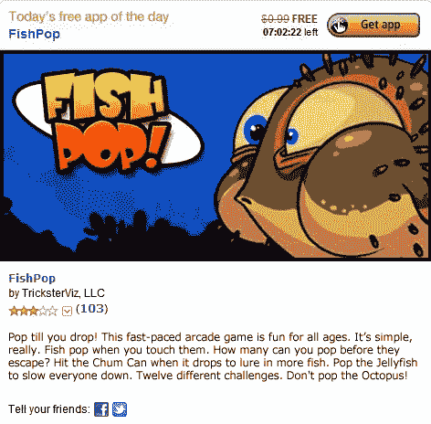
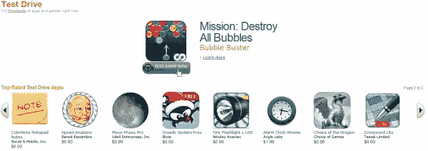

# 谷歌市场 vs 亚马逊应用商店

> 原文：<https://www.sitepoint.com/google-market-vs-amazon-appstore/>

Android 的开源方法使得几乎任何有主动性和资源的人都可以开始提供定制的 Android 应用和服务。亚马逊就是这样一家公司，通过提供亚马逊应用商店来挑战谷歌的安卓市场。

* * *

[谷歌安卓市场](https://market.android.com/)是默认的手机应用和网站，几乎所有安卓设备和所有拥有谷歌账户的安卓用户都可以下载、购买和管理安卓应用。把它想象成一个中央商店:如果你想要一个手机程序，你可以去谷歌安卓市场。

谷歌会在你的谷歌账户中保存你所有的购买信息、应用设置等。这让你可以切换手机和平板电脑，并立即将所有已经下载或购买的应用程序下载到新设备上，而且免费，无需你做任何额外的工作。谷歌安卓市场如此受欢迎和常用，以至于它通常被简称为“安卓市场”。

亚马逊应用商店的目标也是如此，只是有所改变:重点更多地放在你的亚马逊账户和亚马逊偏好的应用上。亚马逊应用商店提供额外服务，比如每天免费赠送一款安卓应用。

此外，亚马逊让任何 Android 设备都能够直接与你的亚马逊账户连接，而不仅仅是下载应用程序。

然而，最终亚马逊的 Appstore 是谷歌 Android Market 的良好替代品吗？Android 官方市场仍然是你应该考虑的唯一选择吗？

## 前两家安卓商店

Android Market 是官方和最大的在线 Android 应用程序集合库。它由谷歌维护，谷歌允许任何人向它提交应用程序，并允许每个人将他们所有的市场活动和应用程序链接到他们的谷歌账户。

谷歌安卓市场

由于 Android 是开源的，亚马逊在 Android 中发现了一个巨大的市场，并将其作为其最新和最强大的设备 [Kindle Fire](http://www.amazon.com/kindlestore) 的起点，还启动了自己的[亚马逊应用商店](http://www.amazon.com/mobile-apps/b?ie=UTF8&node=2350149011)。

亚马逊安卓应用商店

虽然你的应用程序有多个选项是好事，但当你开始管理此类应用程序的帐户时，问题就出现了。所有 Google Market 购买都与您的默认 Google 帐户相关联。默认情况下，几乎所有手机和平板电脑的安卓库存和定制 ROM，或者此类设备的操作软件，都是谷歌市场自带的。

另一方面，亚马逊的 Appstore 是单独提供的，需要一个亚马逊账户。这意味着你需要开始单独管理一个亚马逊账户。

然而，亚马逊的背后确实有很大的推动力，因为它是由亚马逊直接运营的。广受欢迎的亚马逊 Kindles 的最新版本充分利用了亚马逊应用商店，亚马逊正在不停地向每个亚马逊用户推广其应用商店。

你应该选择哪一个？还是应该两者都选？

为了帮助了解市场之间的差异，让我们来看看每个市场的优缺点。

## 谷歌安卓市场的亮点在哪里

*   Android Market 与开发者的关系更好，价格也更确定。

开发者似乎从谷歌而不是亚马逊上受益更多，因为谷歌专注于允许任何人提交应用程序，并以应用程序开发者指定的固定价格在市场上出售。谷歌只是从每笔销售中抽取一部分，除非该应用是由开发者免费提供的。

相比之下，亚马逊侧重于直接合作关系。历史已经证明，如果这种合作关系结束，应用程序通常会从亚马逊应用商店下架。最著名的安卓游戏之一《Apparatus》的开发者有更多关于亚马逊合作如何没有帮助他的信息。

设备应用——从亚马逊应用商店下载——仅在谷歌安卓市场上恢复

基本上，亚马逊开发者合同允许亚马逊改变价格和支付给开发者的每个应用的金额，而无需先询问开发者。虽然开发者仍然可以从这种价格变化中获得报酬，但开发者通常通过亚马逊应用商店赚的钱更少，并且对他们在亚马逊应用商店中的应用程序的控制也更少。

顺便说一句，仪器评估和比较马上就要开始了！

*   谷歌安卓市场提供 15 分钟免费试用。

所有在 Google Market 购买的商品都可以在购买后的 15 分钟内[全额退款。亚马逊 Appstore 不提供退款。](http://support.google.com/androidmarket/bin/answer.py?hl=en&answer=134336)

*   Google Android Market 提供真正的设备控制。

如果一个应用程序与你的设备不兼容，谷歌不会在你的手机上显示它，或者会让你知道你不应该购买该应用程序。亚马逊没有这样的设备排除控制，因此你可以最终购买不能在你的特定设备或 Android 版本上运行的应用程序。

亚马逊应用商店中有许多评级较低的应用程序，因为客户无法运行与他们的设备不兼容的应用程序。亚马逊没有通知用户这样的规格，客户最终购买了谷歌 Android Market 不允许他们购买的应用。

*   **谷歌 Android Market 拥有超过 40 万个应用程序。**

相比之下，亚马逊的应用不到 5000 个。而且我想不出有哪个亚马逊 Appstore 的应用不在安卓市场上。可以吗？

*   Google Android Market 与您的 Google 帐户直接绑定。

你的谷歌账户为你提供了 Gmail、Gtalk、谷歌日历、Google+和许多其他服务。由于每台 Android 设备都允许您登录 Gmail 帐户，因此您可以使用同一个帐户来管理通过 Android Market 购买的 Android 应用程序。如果你更换设备，你只需要用你的账户信息登录新设备的谷歌账户。

相比之下，除了最新的亚马逊 Kindle Fire，几乎所有的安卓设备都会让你单独登录和下载亚马逊 Appstore，要求你在手机上也有谷歌账户的同时，单独登录亚马逊 Appstore。你将有两个账户，谷歌和亚马逊，基本上可以做你的主要谷歌账户已经可以做的事情，而且做得更好。

## 亚马逊应用商店的亮点

虽然以上都是很强的优势，但亚马逊为 Appstore 提供了一些锦囊妙计，这促使越来越多的人更多地尝试和使用它。亚马逊应用商店成立不到一年，于 2011 年 3 月推出，因此仍在学习中。与谷歌 Android Market 相比，它已经有了一些坚实的优势。

*   亚马逊应用商店提供免费试驾。

虽然谷歌市场允许你在购买后 15 分钟内为任何应用退款，而亚马逊不允许，但亚马逊将这一概念提升到了一个不同的水平:亚马逊允许你在电脑上的虚拟浏览器中至少 30 分钟试驾几乎每个应用。亚马逊称之为[试驾应用](http://www.amazon.com/gp/feature.html?ie=UTF8&docId=1000667581)。

通过您的浏览器，您可以确切地看到该应用程序如何运行，演示实际使用。你可以运行应用程序、玩游戏、更改设置、浏览日历等。请注意，这并不保证应用程序可以在您的设备上完美运行。

除非谷歌的市场提供一个小时的退款时间，否则试驾仍将是首选。谷歌 Android Market 从你购买应用程序的那一刻开始计算 15 分钟的试用时间，而不是从你实际将应用程序安装到手机的那一刻开始。由于许多应用程序需要很长时间来下载和配置，有许多用户抱怨他们整个 15 分钟的试用时间都花在了下载有问题的应用程序上。

*   亚马逊应用商店每天免费提供一款高级应用。

大约一年来，亚马逊每天免费提供一款高级应用。这意味着你可以保留应用程序并免费升级。

今日亚马逊免费应用

*   亚马逊应用商店与你的亚马逊账户绑定。

亚马逊是最大的在线商店。亚马逊让直接从你的亚马逊账户查看你的应用购买和下载历史变得超级简单。

*   亚马逊应用商店与开发者有一对一的合作关系。

如前所述，亚马逊专注于合作伙伴关系，而不是关系。如果你和亚马逊有良好的合作关系，你的应用可以在亚马逊网站上被大量推广，而且不收取任何费用。尽管与亚马逊 Appstore 相比，开发者关系是负面的，但如果你的合作进展顺利，你可以获得大量的下载。这也是亚马逊 Appstore 能够每天免费为你提供优质应用的原因之一。

## 我更信任哪个应用商店？

我喜欢简单，也喜欢尽可能地进行整合。对我来说，谷歌 Android Market 是最好的选择，我认为它是我主要的，也是唯一的应用来源。亚马逊 Appstore 也是一个非常稳定的产品，对于亚马逊的客户来说，它允许所有的应用购买被合并到同一个亚马逊账户中。然而，有两个主要缺点。

首先，与谷歌 Android Market 上的 40 万个应用相比，亚马逊 Appstore 的应用很少。

第二，我拿到了至少 4 款亚马逊 Appstore 高级应用，包括 Apparatus game 应用，现在已经从亚马逊 Appstore 下架了。再也没有办法从亚马逊下载这些应用了。所有这些开发者都以合作和收入问题为由，专门回到了谷歌 Android Market。我想要一个稳定的应用商店，我的所有应用将永远存在，不会仅仅因为亚马逊没有与有问题的开发商建立良好的合作伙伴关系或合同协议而消失。

虽然我不使用亚马逊应用商店，但我希望我能更经常地使用它的一些工具。例如，我已经广泛尝试了试驾应用程序功能，它非常漂亮。当然，这可能不是确认该应用程序将在我的特定手机或平板电脑上工作，但它让我 100%清楚地知道该应用程序有什么，它的菜单看起来像什么，它的行为如何，我可以用它做什么，等等。网上没有任何东西能与之媲美。在我看来，谷歌 Android Market 提供的 15 分钟试用确实不是谷歌非常认真的激励措施。谷歌的理由可能是，很多人可以下载一个应用程序，然后通过各种方法复制它，然后要求退款。然而，由于这种基本原理或其他原因，数百万想要试用应用程序的用户被蒙在鼓里，或者测试的窗口非常有限。

亚马逊应用商店——在浏览器中试用应用程序

许多 Android 开发者在 Android Market 中围绕 15 分钟的短暂试用窗口开展工作，提供他们应用程序的两个独立版本。一个版本是他们可以立即付费的，另一个是他们可以永久保留的有限功能的免费试用版。许多其他开发者免费提供他们应用程序的基础版本，同时提供带密钥的高级版本。这就像一个免费增值模式，同时也允许人们在购买高级功能之前，花很多天甚至几个月来测试免费版本的应用程序。

## 你会更信任哪个安卓应用商店？

我使用谷歌安卓市场，并完全依赖它。尽管我通过亚马逊 Appstore 获得了几个高级 Android 应用程序，但当我可以通过谷歌 Android Market 获得同样的东西时，通过一个额外的帐户管理它们对我来说似乎是一件不必要的事情。

不过，最终选择哪家 Android 应用商店取决于你的偏好、你希望哪家公司处理你的数字 Android 购买、你在寻找哪种应用等等。只有在你从谷歌 Android Market 和亚马逊 Appstore 分别购买和下载了一款付费应用后，你才能得出结论。

你最终更喜欢哪家安卓应用商店？你对亚马逊应用商店有什么看法？到目前为止，你觉得谷歌安卓市场怎么样？你会使用和推荐哪一个，为什么？

请在下面的评论中分享你的想法。感谢阅读！:)

## 分享这篇文章