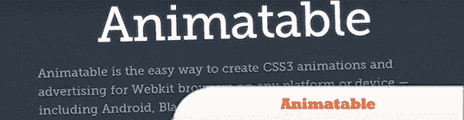
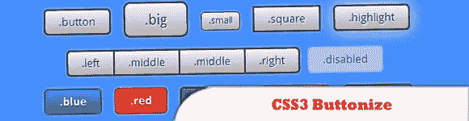
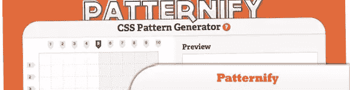
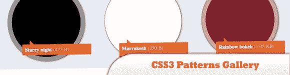
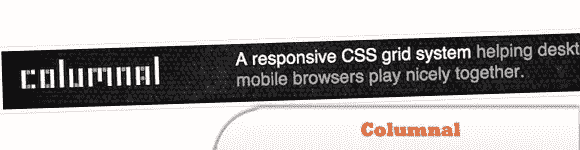
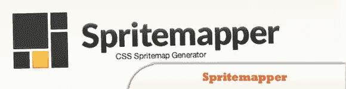
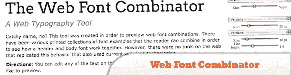
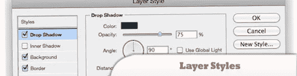
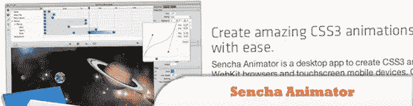
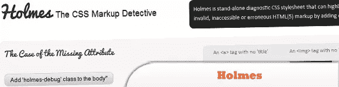

# 2011 年 10 款简化 CSS 开发的酷工具

> 原文：<https://www.sitepoint.com/10-cool-tools-easier-css-development-2011/>

在本帖中，我们整理了 2011 年以来的 **10 个用于简化 CSS 开发的酷工具。这些工具极大地改进了工作流程，处理了许多每个项目都需要的单调重复的任务，或者简单地提供了许多耗时且有时具有挑战性(CSS3 动画)的任务的解决方案。尽情享受吧！**

相关帖子:

*   [**10 必须知道 CSS 和 CSS3 的资源和工具**](http://www.jquery4u.com/dynamic-css-2/10-css-css3-resources-tools/)
*   [**jQuery Css 函数示例**](http://www.jquery4u.com/function-demos/css/)

## 1.可制作动画

是一种在任何平台或设备(包括 Android、BlackBerry、iOS 和 WebOS)上为 WebKit 浏览器创建 CSS3 动画的简单方法。它让你在不了解 CSS 或动画的情况下创建多场景的 CSS3 动画。不仅对设计师和开发者有用，对动画师也有用。

  
[源+演示](http://animatable.com/)

## 2.CSS3 按钮化框架

是一个轻量级的、灵活的即时按钮框架。只需选择一个按钮样式的例子，然后从提供的链接中下载 CSS 代码，将它给你的代码添加到它告诉你放置它的地方，你就可以让你的网站使用该按钮样式了。

  
[源+演示](http://css3framework.co.uk/)

## 3.模式化

是一个简单的 CSS 模式生成器。它的基于网络的图形界面让你画出你想要的图案，然后它为你生成 CSS 代码。不用启动你的图形编辑器并创建一个 2px 乘 2px 的图像，你可以使用它在线构建你的图案。

  
[源+演示](http://www.patternify.com/)

## 4.CSS3 模式库

正如它听起来的那样:CSS3 模式的图库。你可以得到图库中每个图案的预览，如果你喜欢，只需点击它，它的代码就会弹出，同时还有该图案的全屏预览。

  
[源+演示](http://lea.verou.me/css3patterns/)

## 5.柱状的

是一个 CSS 网格系统，是其他两个系统的混合，并加入了一些自定义代码。弹性网格系统是从 cssgrid.net 借鉴来的，而一些代码灵感(以及子列的想法)则来自 960.gs

  
[源+演示](http://www.columnal.com/)

## 6.Spritemapper

是一个将多个图像合并为一个图像并为相应的切片生成 CSS 定位的应用程序。它缩短了加载时间，为您提供了 CSS 代码，因此您不必编写任何额外的语法，它是自包含的，没有任何第三方依赖性，并且通过实现模拟退火，最大限度地减少了图像打包器使用的空间。

  
[源+演示](http://yostudios.github.com/Spritemapper/)

## 7.网络字体组合器

允许您预览 web 字体组合。它向你展示了字体的例子，你可以把它们组合起来，看看标题和正文字体是如何一起工作的——但是它是在网络上进行的，并且使用了当前的网络字体技术。

  
[源+演示](http://font-combinator.com/)

## 8.图层样式

是一个基于 web 浏览器的图形编辑器，但它不是创建图形，而是创建 CSS。如果你曾经使用过 Photoshop 或类似的图形编辑器(比如，99%的读者)，那么你会知道如何使用图层样式的界面。对于那些喜欢用图形用户界面来创建视觉效果的人来说，这很好，只是在这种情况下，您创建的是 CSS 代码而不是图像。

  
[源+演示](http://layerstyles.org/)

## 9.Sencha 动画师

是一个桌面应用程序，允许您为 WebKit 浏览器和触摸屏移动设备创建 CSS3 动画。为当今最流行的设备创造丰富的体验。

  
[源+演示](http://www.sencha.com/products/animator/)

## 10.霍姆斯

是一个独立的诊断 CSS 样式表，可以通过添加一个类来突出显示潜在的无效、不可访问或错误的 HTML 和 HTML5 标记。holmes.css 文件将为标记显示错误(红色轮廓)、警告(黄色轮廓)或不推荐使用的样式(深灰色轮廓)，如标记上缺少必需的属性、潜在的可改进标记、不推荐使用的和非 W3C 元素和属性等。

  
[源+演示](http://www.red-root.com/sandbox/holmes/)

## 分享这篇文章