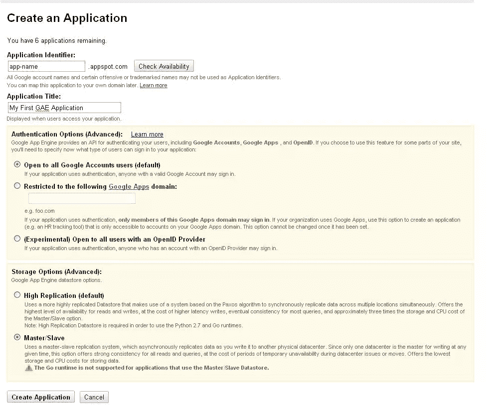
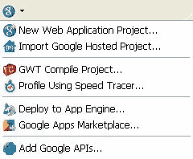
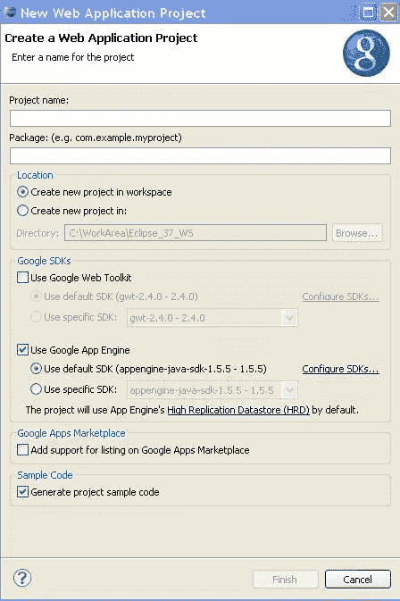
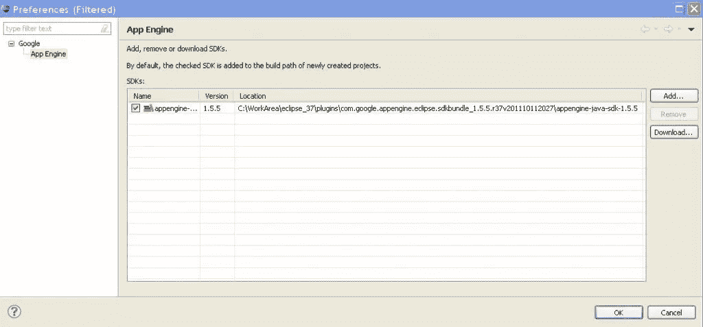

# Google App Engine (GAE) Java API 第 3 部分:API 入门

> 原文：<https://www.sitepoint.com/google-app-engine-gae-java-api-part-3-getting-started-with-apis/>

在这一长段时间的休息中，我希望您已经设置好了您的 Eclipse 环境，并且很高兴开始学习 GAE API。有一些不可避免的延误，但现在我们将开始和放大到 GAE！所以让我们用一些代码来弄脏我们的手:)

我们将遵循的方法是通过示例代码学习 API。我还将提供适用的演示和源代码的链接。

在我们开始我们感兴趣的主题之前，让我们创建我们将要使用的应用程序。使用您的凭证登录到[https://appengine.google.com/](https://appengine.google.com/)并“创建应用程序”。在以下屏幕中，填写应用程序名称和描述，并通过编辑存储选项选择“主/从”。高复制数据存储区非常适合必须立即进行数据备份且一致性保证较高的情况。

如果您已经正确安装了 Eclipse 插件，您应该会看到如下所示的 Google 图标。在 Eclipse 中，单击“新建 web 应用程序项目”这也可以通过菜单，文件→新建→ Web 应用项目来完成。

在出现的新窗口中，为您的项目选择一个名称和基础包名称。在继续之前，请确保您取消了“使用谷歌网络工具包”选项(谷歌网络工具包-[GWT](http://code.google.com/webtoolkit/)是一种令人兴奋的用 Java 编写超级干净和响应迅速的网页的新方法，GWT 编译器将 Java 转换成 HTML & JavaScript)。此外，启用“生成示例代码”,以便您可以使用示例项目开始。

如果你有找不到 GAE SDK 的问题，你可以点击“使用谷歌应用引擎”旁边的“配置 SDK ”,然后指向 SDK 所在的目录。在我的例子中，Eclipse 插件目录有所需的 SDK 包，如下面的屏幕所示

既然您的示例应用程序是在本地创建的，那么让我们将其部署到 Google 的基础设施中。使用我们用来创建应用程序的同一菜单，选择“部署到应用程序引擎”。或者，右键单击项目，在“谷歌”中选择“部署到应用引擎”。如果您没有登录到 Google，在 Eclipse 中，它会要求您提供凭据，您可以选择我们之前创建应用程序时使用的 ID。接下来，您必须通过单击“应用引擎项目设置”来配置您之前创建的“应用名称”。这在后续部署中不是必需的，除非您想要更改应用程序部署到的版本。如您所见，我们正在将应用程序部署到“app-name”。 *app-name* 应该是您在 appengine.google.com 使用“创建应用程序”创建应用程序时选择的名称

部署完成后，您的应用就可以在 APP_NAME.appspot.com 上使用了，因此我们已经将第一个 GAE 应用部署到了云上。您也可以在本地运行相同的应用程序，方法是在 Eclipse 中右键单击 project 并选择“运行方式→ Web 应用程序”。控制台将显示您可以在本地访问的 URL。我们通过创建示例项目部署的应用程序链接到一个简单的 servlet，它将“Hello，world”打印到您的浏览器。您可以在本地以及服务器上检查，以交叉检查到目前为止您是否在正确的路径上。如果你看到一个“Hello，World”Servlet，请继续，否则我强烈建议进行适当的设置，以便更好地理解剩余的教程。有问题就问！

## 用户和认证

正如你可能已经注意到的，在我们在 AppEngine 上创建应用的屏幕上，Google 提供了三种认证机制:Google 帐户、Google Apps 域和 OpenID。出于本教程的目的，我们将只看谷歌帐户，但当然 API 支持所有三种机制。更多关于谷歌应用程序和 T2 OpenID 的信息

用于认证的 API 相当简单， *UserServiceFactory* 用于获取一个 *UserService* 的实例。 *UserService* 用于让用户登录，并检索*用户*以及创建登录和注销 URL。*用户*对象本身可以用来获取*用户*的相关信息。我们来看一个 servlet:
【source code language = " Java "】
//CloudSpringAuthServlet。java
导入 Java . io . io exception；
导入 javax . servlet . http . *；
导入 com . Google . app engine . API . users . userservice；
导入 com . Google . app engine . API . users . userservicefactory；

@SuppressWarnings("serial")
公共类 CloudSpringAuthServlet 扩展 HttpServlet {
公共 void doGet(http servlet request req，HttpServletResponse resp)
抛出 IOException {

resp . setcontenttype(" text/plain ")；
String base URL = req . getrequesturi()；
String log in URL = " "；
字符串 logOutURL =
UserService UserService = userservicefactory . get UserService()；
//通过用户服务，我们正在检查用户是否登录，以及他是否登录
//我们正在获取用户的信息以及一个可以用来注销的链接
if(userservice . isuserloggedin()){
logout URL = userservice . createloguturl(base URL)；
resp . get writer()。println("Hello CloudSpring-er，我们检测到您的电子邮件 ID 为:"+ userService.getCurrentUser()。getEmail())；
resp . get writer()。println("要注销，请单击下面的链接")；
resp . get writer()。println("<a href = " "+logout URL+" ">登出</a>")；
}
//如果用户没有登录，我们会将他重定向到 Google 登录屏幕，这将
//在认证后将用户重定向到原始 URL
else {
resp . get writer()。println("<a href = " "+userservice . createloginurl(base URL)+" ">请登录后继续</a>"；
}

}
}
[/sourcecode]

您可以将上面的 servlet 复制到 Eclipse 中本地创建的应用程序中，确保对 web.xml 中的包名和映射进行适当的更改，并在本地或远程运行。

为了使用 Eclipse 进行本地开发，GAE SDK 模拟了用户身份验证。向用户显示一个没有密码的登录屏幕。一个人可以输入任何电子邮件地址，该电子邮件地址将表现得像一个真正的用户。登录时，如果您想以管理员身份登录，可以勾选复选框。

## 邮件

GAE 支持用 JavaMail 发送电子邮件。您不需要为此添加额外的库。在谈论接收电子邮件之前，让我们看一个使用 Google App Engine 发送消息的简单示例。作为练习，通过将 email ID 更改为应用程序用户的 ID，使用下面的代码片段创建一个 servlet，为 web.xml 中的 URL 配置 servlet，并点击 URL，这将调用这个 servlet。

[source code language = " Java "]
//cloudspringmailservlet . Java
导入 Java . io . io exception；
导入 Java . io . unsupportedencodingexception；
导入 Java . util . properties；

导入 javax . mail . message；
导入 javax . mail . messaging exception；
导入 javax . mail . multipart；
导入 javax . mail . session；
导入 javax . mail . transport；
导入 javax . mail . internet . internet address；
导入 javax . mail . internet . mime body part；
导入 javax . mail . internet . mime message；
导入 javax . mail . internet . mime multipart；
导入 javax . servlet . http . http servlet；
导入 javax . servlet . http . http servlet request；
导入 javax . servlet . http . http servlet response；
//注意，在我们使用的所有导入中，没有一个是 GAE 类
公共类 CloudSpringMailServlet 扩展 http servlet {
public void doGet(http servlet request req，http servlet response resp)
throws io exception {
String recipientemailadder = " your _ email id @ Gmail . com "；
属性 props =新属性()；
Session Session = Session . getdefaultinstance(props，null)；
Message msg =新 MimeMessage(会话)；
//我们正在创建 multipart，这样我们就可以将多个部分发送到 Email
Multipart MP = new mime Multipart()；
try {
msg . set from(new internet address(" your _ email id @ Gmail . com "，"测试名称"))；
msg . add recipient(消息。RecipientType.TO，new internet address(
recipient email address，“Hello”)；
msg . set subject(" cloud spring test ")；
mime body part html part = new mime body part()；
html part . set content("这只是一封来自 CloudSpring 的测试邮件！"，“文本/html”)；
//在发送
mp.addBodyPart(htmlPart)之前，我们正在用电子邮件的各个部分组成 multipart
msg . set content(MP)；
transport . send(msg)；
} catch(messaging exception e){
e . printstacktrace()；
} catch(UnsupportedEncodingException e){
e . printstacktrace()；
}
resp . get writer()。println("邮件已发送")；

}

}
[/sourcecode]

在本地开发环境中，邮件实际上并没有被发送，但是文档表明它们显示在日志中(不知为什么我在本地系统上看不到日志中的邮件，但是它在 GAE 服务器上工作得很好，请告诉我您的理解是否正确！).

## 收到的邮件

接收邮件的工作方式略有不同。正如在[上一篇文章](https://www.sitepoint.com/understanding-google-app-engine-gae-java-api-part-2-setup-and-introduction/)中提到的，必须启用入站服务。其次，所有传入的电子邮件都作为 HTTP POST 请求在/_ah/mail/ <地址>接收，其中地址可以是 any_string@app-name.appspotmail.com。

从应用程序角度来看，您必须为 URL 模式“/_ah/mail/*”配置一个或多个 servlet。servlet 可以使用 MimeMessage，如下所示。第 3 行从请求对象获取 POST 数据。从电子邮件获取数据的进一步操作遵循[JavaMail](http://www.oracle.com/technetwork/java/javamail/index.html)API

[source code language = " Java "]
Properties props = new Properties()；
Session sess = Session . getdefaultinstance(props，null)；
mime message mail message = new mime message(sess，req . getinputstream())；
[/sourcecode]

我们已经创建了基本的 GAE 应用程序，只需点击一个按钮就可以部署到云中。在我们的迷你项目中，我们还使用了身份验证和邮件 API 来完成一些基本任务。我们已经奠定了基础，并准备深入到 GAE 的其他地区！请继续关注本系列的下一部分。

## 分享这篇文章