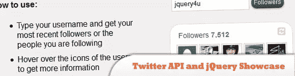
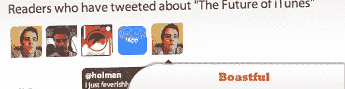
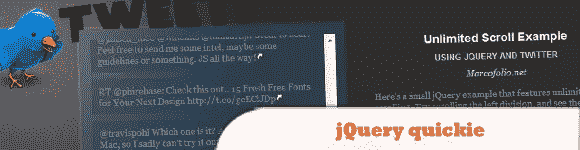
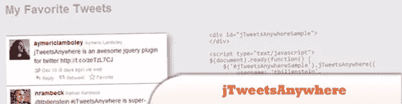
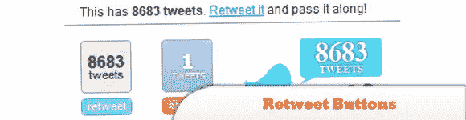
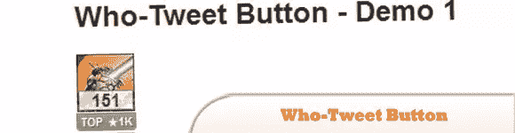
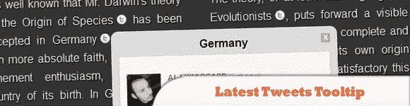

# 10 个有用的 jQuery 插件，将 Twitter 整合到博客/网站中

> 原文：<https://www.sitepoint.com/10-helpful-jquery-plugins-incorporate-twitter-blogwebsite/>

我们都知道，Twitter 已经成为全世界最受欢迎和最流行的在线交流和讨论的社交网络之一。将 Twitter 引入您的网站将有助于您吸引访问者并为您的内容做广告，将 Twitter 集成到网站的最简单方法是 Tweeter 自己创建的 widget？？？

不再是了，因为有更有效的方法可以轻松地将 Twitter 整合到你的博客或网站中。jQuery 插件提供了为你的项目开发大量不同效果的能力。当然，它们是当今网页设计不可或缺的一部分。

所以这里列出了 10 个 jQuery 插件，可以将 Twitter 整合到你的博客或网站中。尽情享受吧！

相关帖子:

*   [**jQuery Twitter 风格登录窗口**](http://www.jquery4u.com/menus/jquery-twitter-style-login-window/)
*   [**10 款最好的 Twitter 插件**](http://www.jquery4u.com/plugins/10-twitter-plugins/)
*   [**示例 Twitter JSON 文件**](http://www.jquery4u.com/json/twitter-json-example/)

## 1.Twitter API 和 jQuery Showcase:显示您的追随者或朋友

一些功能是:你可以得到你最近的 100 个追随者或朋友追随者或朋友显示在集…

  
[来源](http://tympanus.net/codrops/2009/12/02/twitter-api-and-jquery-showcase-display-your-followers-or-friends/)
[演示](http://tympanus.net/TwitterConnections/)

## 2.推特报价

一个简单的 JavaScript 插件，可以根据你的搜索词提取最新的 Twitter 消息，并显示在你的网站上。

  
[源+演示](http://www.tweetquote.co.uk/)

## 3.自吹自擂——一个新的博客推回库

一个为你的博客抓取“回推”的 jQuery 插件。Tweetbacks 就像 trackbacks——每当有人在 Twitter 上提到你的博客时，你可以把这些提到的内容拉进来，并打印在你的博客上。

  
[源+演示](http://zachholman.com/2010/02/boastful-a-new-tweetback-library-for-your-blog/)

## 4.jQuery quickie:使用 Twitter API 无限滚动

是时候学习另一个相对简单的 jQuery 教程了，就像我之前的 jQuery quickie 一样。这是一个很棒的技术，可以用在很多网站上。与常规分页不同，在常规分页中，用户必须单击才能看到下一页，无限制滚动会在用户位于底部时自动加载下一页。

  
[来源](http://www.marcofolio.net/webdesign/jquery_quickie_unlimited_scroll_using_the_twitter_api.html)
[演示](http://demo.marcofolio.net/unlimited_scroll/)

## 5.支持@Anywhere 的 jQuery Twitter 小部件

jTweetsAnywhere 是一个 jQuery Twitter 小部件，它简化了 Twitter 服务到站点的集成。

  
[来源](http://thomasbillenstein.com/jTweetsAnywhere/)
[演示](http://thomasbillenstein.com/jTweetsAnywhere/demo/)

## 6.转发按钮

一个定制的、CSS 样式的转发按钮的 jQuery 插件现在遍布互联网。它们是一个方便的工具，可以让访问者快速分享文章。topsy 按钮有一些定制，但不多。它只是允许你改变配色方案。

  
[来源](http://www.gethifi.com/blog/a-jquery-plugin-for-custom-css-styled-retweet-buttons)
[演示](http://files.gethifi.com/posts/customRetweet/example.html)

## 7.实时相关推文栏:另一个 jQuery 插件

随着最近关于 Twitter 实时搜索的沸沸扬扬。为什么不从你的 twitter 时间线或任何人那里添加一个与你的帖子相关的实时 tweets 栏，甚至用地理编码坐标来限制它！

  
[来源](http://www.moretechtips.net/2009/09/realtime-related-tweets-bar-another.html)
[演示](http://realtime-related-tweets-bar.googlecode.com/svn/v1/html-realtime-users.htm)

## 8.Who-Tweet 按钮:用于 Twitter 的奇特的 jQuery 插件

“是谁”部分是关于通过在“转发”按钮中显示他们的推特照片来确定发你的故事的人的归属。托普斯保留了关于你的链接的 Twitter 引用的完整历史，我在另一个 jQuery 插件中利用了它，并激发了我的这个想法。

  
[来源](http://www.moretechtips.net/2009/12/who-tweet-button-fancy-jquery-plugin.html)
[演示](http://who-tweet-button.googlecode.com/svn/v1/demo1.htm)

## 9.一个 Twitter 列表支持的粉丝页面

这使得我们可以使用这些新工具来创建一个小部件，将列表反过来——一个可以放在侧边栏中的粉丝页面，允许您的访问者填写他们的 twitter 名称，并加入您的 twitter 帐户中特制的粉丝列表。

  
[来源](http://tutorialzine.com/2009/11/twitter-list-ajax-fanpage/)
[演示](http://demo.tutorialzine.com/2009/11/twitter-list-ajax-fanpage/demo.html)

## 10.带有 jQuery 的最新推文工具提示

如果你有一个新闻网站，让你的用户看到关于某个话题的最新推文可能会很有趣。这是一个 jQuery 插件，用于显示关于某个单词或短语的最新推文。

  
[来源](http://tympanus.net/codrops/2010/07/20/latest-tweets-tooltip/)
[演示](http://tympanus.net/Development/LatestTweetsTooltip/)

## 分享这篇文章