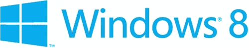
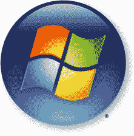
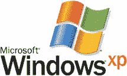
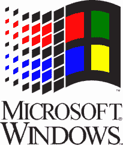

# 微软展示新的 Windows 8 标志

> 原文：<https://www.sitepoint.com/microsoft-new-windows-8-logo/>

微软公布了新的 Windows 8 标志。我通常不会写一篇关于它的文章，但这是 22 年来第一次重大的重新设计。由于我们大多数人每天都在使用 Windows，这是一个相当大的问题。

你准备好了吗？开始了…

虽然这不是 2012 年伦敦奥运会的标志，但我不禁感到有些乏味。

改变你的品牌不是公司心血来潮的事情。[微软声明](http://windowsteamblog.com/windows/b/bloggingwindows/archive/2012/02/17/redesigning-the-windows-logo.aspx)新标志以简洁的线条、简单的颜色和新的 Metro 界面反映了对 Windows 操作系统的重新想象。他们也承认旧标志是一面旗帜，而不是一扇窗户。*这让你困惑过吗？*

我不完全相信。字体有点过于简单，为什么 Windows 8 看起来很平时窗口图标会以透视方式显示？

这是一个大胆的举动，可能会引起用户意见的分歧。很像 Windows 8。因此，让我们简单回顾一下历史，看看微软是如何走到这一步的…

## Windows Vista/7

半透明的全彩 Aero 主题对 Vista/7 徽标和开始按钮有很大的影响:

它仍然可以识别为 Windows 标志，但高光、阴影和渐变使它感觉更现代。

## Windows XP

XP 发布 11 年后仍是世界上使用最多的操作系统。同样，这个标志与 XP 的默认主题相匹配，虽然今天看起来有点简单，但在当时这是一个相当激进的进步…

## Windows 3+

在通向 XP 的十年中，所有版本的 Windows 包括 3.x、NT、95、98、Millennium 和 2000 都使用了一种带有熟悉运动轨迹的标志变体:

它在 20 世纪 90 年代看起来相当过时，但那是微软成为这个星球上最具统治地位的操作系统制造商的时期。该标志是商业的，企业蜂拥而至的窗口。

## Windows 1.0

你还记得 20 世纪 80 年代最初的 Windows 徽标吗？我也没有。它让你想起什么了吗？…

我们兜了一圈。近三十年的调整和重新设计产生了一个标志，它看起来几乎与 1985 年首次使用的标志一模一样。我想我更喜欢原文——尽管无衬线字体会更好。

不管你有什么看法，你最好习惯它。在新操作系统发布之前，Windows 8 徽标将随处可见！

## 分享这篇文章