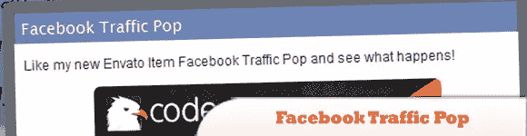
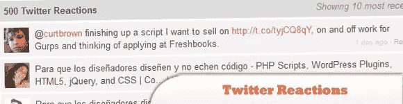
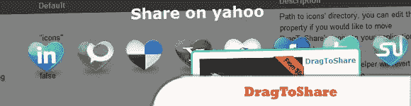
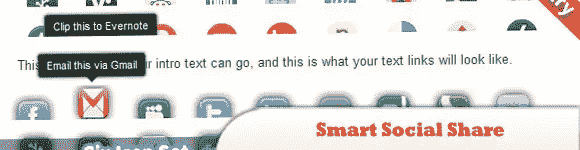
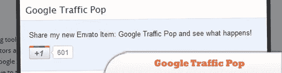
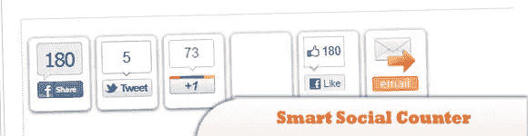

# 10 个需要花钱的 jQuery 社交网络插件

> 原文：<https://www.sitepoint.com/10-jquery-social-network-plugins-cost-money/>

每个企业，无论大小，都在尽最大努力通过社交媒体宣传自己的活动。jQuery 以插件和小部件的形式提供了各种解决方案，在这方面非常有用。在本帖中，我们分享了我们收集的 **10 个 jQuery 社交网络插件**，你肯定会发现它们很有用，但可能会花你几个便士。享受吧。

相关帖子:

*   [**前 15 名 jQuery 社交网络**](http://www.jquery4u.com/social-networking/top-15-jquery-social-networks/)
*   [**10 jQuery 社交书签插件**](http://www.jquery4u.com/plugins/10-jquery-social-bookmarking/)

## 1.tweetGrab

是一个不引人注目的 jQuery 插件和 jQuery-ed WordPress 插件，它简化并增强了嵌入和引用单个 Tweets、@ user feeds、# hashtag feeds、$ ticker feeds 和一般搜索结果的过程。

  
[来源](http://codecanyon.net/item/tweetgrab/54083?WT.ac=category_item&WT.seg_1=category_item&WT.z_author=makfak)
[演示](http://codecanyon.net/item/tweetgrab/full_screen_preview/54083)

## 2.分享+:分享你的网站的最棒的方式

一个非常强大和高度可定制的社交共享 jQuery 插件，它可以让你的站点用户在各种社交和书签网络上共享页面。

  
[来源](http://codecanyon.net/item/share-the-most-awesome-way-to-share-your-site/1300846?WT.ac=category_item&WT.seg_1=category_item&WT.z_author=DanielPaul)
[演示](http://codecanyon.net/item/share-the-most-awesome-way-to-share-your-site/full_screen_preview/1300846)

## 3.脸书交通流行

利用最热门的脸书流量插件，进入脸书的 6 亿多用户。脸书流量弹出窗口是一种新型的弹出窗口，它可以让你的用户喜欢你的页面，而不是试图让他们点击广告。更多的喜欢=更多的曝光=更多的流量=更多的钱！

  
[来源](http://codecanyon.net/item/facebook-traffic-pop/142429?WT.ac=category_item&WT.seg_1=category_item&WT.z_author=TylerQuinn)
[演示](http://codecanyon.net/item/facebook-traffic-pop/full_screen_preview/142429)

## 4.脸书朋友选择器

这个插件用于显示使用脸书 JavaScript API 的朋友列表。然后用户可以选择一些人，给他们发消息。脸书朋友选择器插件的输出可以是用户名或用户 ID 或整个脸书图形 API 获得的用户对象。

  
[来源](http://codecanyon.net/item/facebook-friend-chooser/1293133?WT.ac=category_item&WT.seg_1=category_item&WT.z_author=adamantium)
[演示](http://codecanyon.net/item/facebook-friend-chooser/full_screen_preview/1293133)

## 5.推特上的反应

Twitter Reactions 是一种在网站上显示提到特定页面的推文的快速简单的方法。这是一个简单的脚本，只要您能够访问源代码，就可以轻松集成到任何网站上。

  
[来源](http://codecanyon.net/item/twitter-reactions/98160?WT.ac=category_item&WT.seg_1=category_item&WT.z_author=phpdude)
[演示](http://www.phpdude.me/demo/98160/Twitter-Reactions.html)

## 6.jQuery 社交吧

jQuery Social Bar 是一个专业而优雅的插件，它增加了以时尚和创新的方式展示你的社交资料的可能性。

  
[来源](http://codecanyon.net/item/jquery-social-bar/1168207?WT.ac=category_item&WT.seg_1=category_item&WT.z_author=DPereyra)
[演示](http://codecanyon.net/item/jquery-social-bar/full_screen_preview/1168207)

## 7.DragToShare

一个 jquery 插件，可以将所有文档图像设置为用户交互拖动共享元素。它非常容易使用，只需从带有元素标识符的文档头部分调用，它将自己完成所有的魔术。它极大地帮助网站管理员增加其网站的受欢迎程度。

  
[来源](http://codecanyon.net/item/drag-to-share/143070?WT.ac=category_item&WT.seg_1=category_item&WT.z_author=dilab)
[演示](http://codecanyon.net/theme_previews/143070-drag-to-share)

## 8.智能社交共享–jQuery 插件

它有六个图标集。你可以根据自己的需要轻松地加载它们。这个插件是完全灵活的。您可以自己更改图标的顺序。不错的工具提示展示。如果你想显示，那么你可以显示，否则隐藏工具提示。

  
[来源](http://codecanyon.net/item/smart-social-share-jquery-plugin/842917?WT.ac=category_item&WT.seg_1=category_item&WT.z_author=smartdatasoft)
[演示](http://codecanyon.net/item/smart-social-share-jquery-plugin/full_screen_preview/842917)

## 9.谷歌流量流行

充分利用谷歌的 5 亿多用户群，给你的访问者提供一个替代广告的选择，也为你创造价值。

  
[来源](http://codecanyon.net/item/google-traffic-pop/299533?WT.ac=category_item&WT.seg_1=category_item&WT.z_author=TylerQuinn)
[演示](http://codecanyon.net/item/google-traffic-pop/full_screen_preview/299533)

## 10.智能社交计数器 jQuery 插件

这个插件将帮助你显示你的网站社交网络计数器。您可以使用浮动栏或在您的页面内。

  
[来源](http://codecanyon.net/item/smart-social-counter-jquery-plugin/491449?WT.ac=category_item&WT.seg_1=category_item&WT.z_author=smartdatasoft)
[演示](http://codecanyon.net/item/smart-social-counter-jquery-plugin/full_screen_preview/491449)

## 分享这篇文章