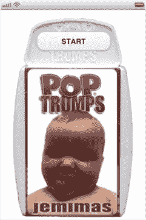
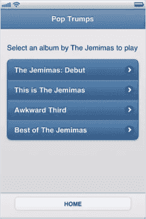
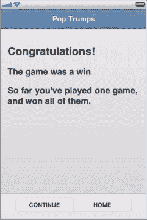
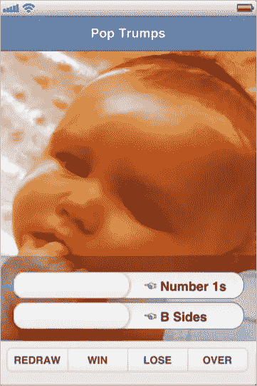

# 新的挑战和技巧:jQuery Mobile(书籍节选)

> 原文：<https://www.sitepoint.com/new-kicks-and-tricks-jquery-mobile-book-excerpt/>

*如果你还没有下载 Earle Castledine 和 Craig Sharkie 最新力作 SitePoint 的[免费样本章节](https://www.sitepoint.com/books/jquery2/samplechapters.php)，**[【jQuery:忍者新手，第二版——新踢腿和技巧](https://www.sitepoint.com/blog/)** ，现在是时候下载了。或者直接切入正题[买书](https://www.sitepoint.com/blog/)！*
*为什么？嗯，作为一个买了第一版的人，我可以保证这个版本中有大量的新材料，样本章节就是一个很好的例子。*
*告诉你:我们现在就来看看吧。开始了。*

如果没有对最新成员 [jQuery Mobile](http://jquerymobile.com/) 的致敬，任何对高级 jQuery 和 jQuery 插件的探索都是不完整的。

Mobile 将 jQuery 从桌面转移到“移动”设备上。更好的是，它建立在从 Core 和 UI 中学到的经验的基础上，所以即使你只是对这些项目有一点点了解，你也可以准备好使用 Mobile。事实上，当你使用移动设备进行开发时，最难接受的事情之一就是在目标平台上查看你的作品需要额外的步骤。

移动开发者不再需要 **ALT+TAB** 和`refresh`——现在是 **CTRL+S** ，拿起你的手机或平板电脑，点击`reload`。

jQuery Mobile 融合了我们熟悉并喜爱的 jQuery 跨浏览器和跨平台支持，以及我们求助于 UI 的功能、灵活性和设计——它是一个插件，但它不仅扩展了 jQuery，还扩展了您可以依赖 jQuery 的地方。您可以选择、绑定、制作动画和链接插件，但是您也可以点击和滑动，使用比以前更多 CSS3，最重要的是，使用您对 jQuery 的掌握来制作下一个必备应用程序。

您可以专注于您的应用程序的目标，让移动设备帮您解决问题，而不会碍手碍脚——包括两个文件，一个 jQuery UI，然后您就可以离开了！

```
<link rel=stylesheet href="https://code.jquery.com/mobile/1.0/

➥jquery.mobile-1.0.min.css">

...

<script src="https://code.jquery.com/mobile/1.0/

➥jquery.mobile-1.0.min.js"></script>
```

看着眼熟！像您习惯的那样，您可以使用 jQuery 自己的 CDN 来交付您的文件，就像我们在这里所做的那样，或者您可以自己抓取文件并将其包含在本地。

使用 jQuery 的 CDN，您的压缩文件大小分别为 7kB 和 24kB 非常小，足以在移动网络上使用。而且，您有许多平台选项来访问这些移动网络。正如 jQuery 移动网站上所说，“移动设备广泛支持绝大多数现代桌面、智能手机、平板电脑和电子阅读器平台。”

这不是一个小的声明:jQuery Mobile 的分级浏览器支持矩阵看到它迎合了令人印象深刻的 24 个目标平台。如果你考虑到一些竞争对手的产品官方只支持一个，这还不错。

## 四个等级的支持

平台太多，我们无法复制分级支持矩阵的完整列表，但您可以在 [jQuery 移动网站](http://jquerymobile.com/gbs/)上找到它们。

相反，让我们来看看每个年级的覆盖水平:

*   a 级:基于 Ajax 的动画页面过渡的全面增强体验
*   b 级:增强的体验，没有 Ajax 导航功能
*   c 级:基本的，非增强的 HTML 体验，仍然是功能性的
*   不被官方支持:可能有效，但是还没有经过彻底的测试或调试

Mobile 的文档几乎和支持一样全面。每个方法和属性都包含在内，文档本身是使用 Mobile 编写的——很聪明，是吧？可以说，文档在智能手机上比在桌面上更容易浏览！

就插件而言，jQuery Mobile 甚至比 jQuery UI 更加丰富——它内置了更多的特性，并且一旦您将文件添加到应用程序中，就会有更多的功能发挥作用。由于移动是基于推动桌面开发的 HTML5 和 CSS3，它甚至可以吸引非移动用例。

它的支持仍在增长，可能会有一些功能，我们会看到在以后的版本中增加。

虽然在 jQuery 核心或 UI 站点的导航中，移动设备还不值得一提，但有无数的特性可以让应用程序证明这个库有多新。让我们来看看其中的一些特性。

## 打出王牌

到目前为止，我们对客户的了解几乎和我们对 jQuery 和 jQuery UI 的了解一样多，所以对我们来说，一个具有社交功能的移动应用程序是一个安全的赌注。

让我们加大赌注，通过创建一个基于移动设备的纸牌游戏来处理他们的下一个请求。

我们将通过制作 *Pop Trumps: The Jemimas* 来实现 jQuery Mobile，这是世界上第一款将击败朋友的刺激与最新摇滚明星的面孔相结合的纸牌游戏，如图 4.1、图 4.2 和图 4.3 所示。


图 4.1。*天王的脸胜过*
** 
图 4.2。我们的*流行胜过*主页

** 
图 4.3。赢家的屏幕

让我们不要遍历每一行代码，而是将重点放在特定于移动设备的代码上:

```
<link rel=stylesheet href="https://code.jquery.com/mobile/1.0/

➥jquery.mobile-1.0.min.css">

⋮

<script src="https://code.jquery.com/mobile/1.0/

➥jquery.mobile-1.0.min.js"></script>
```

我们已经了解了移动需求的内容，但是它们仍然值得一提。与其他 jQuery 项目不同，为了获得广泛的平台支持，大量的操作发生在`document.ready`事件触发之前。因此，我们需要在文档的头部添加 includes，以获得最佳的用户体验。

当我们在文档头时，让我们来看看这个新的`meta`元素:

```
<meta name=viewport content="width=device-width, initial-scale=1,

➥user-scalable=0">
```

jQuery Mobile 大量借鉴了 HTML5，这里我们有一个 HTML5 元素，它规范了应用程序的跨平台显示。它告诉我们的浏览器，我们的内容应该尽可能的宽，并且应该是 1:1 的比例。这很重要，因为我们的应用程序可能会遇到各种各样的分辨率。

最后一个内容值——user-`scalable=0`——告诉我们的浏览器不要缩放我们的内容。如果你想在你的应用中使用缩放，只需忽略这个值，使用浏览器的默认行为。

说到 HTML5，现在让我们看看我们的文档结构。同样，如果你已经使用过 HTML5，你应该不会感到惊讶——除了手机对这种语言的接受程度。

```
<section data-role="page" id="home">

⋮

</section>

<section data-role="page" id="albums">

<header data-role="header">

⋮

</header>

<div data-role="content">

⋮

</div>

<footer data-role="footer">

⋮

</footer>

</section>

<section data-role="page" id="album">

⋮

</section>

<section data-role="page" id="results">

⋮

</section>
```

在它的核心，我们的页面是一组具有 page 的`data-role`属性的`section`元素。您也可以使用`div`元素来代替`sections`——在这里，属性比元素更重要，因为`data-role`告诉 Mobile 每个`sections`将是我们应用程序中的一个页面。我们用独特的`id`属性进一步描绘我们的页面，作为我们导航的锚定目标。台式机可能使用 id 跳转或滚动到内容，而移动设备使用 id 在页面视图之间转换。

在我们的第二个`section`中，我们已经展示了我们的基本页面视图布局——一个`header`、`div`和`footer`，同样都带有`data-role`属性，帮助移动应用它的底层变化。在这些元素中，我们只需添加我们需要的 HTML，并在合适的地方应用`data-role`属性。现在让我们来试试:

```
<a href="#albums" data-role="button">START</a>
```

我们的第一个带有`home`的`id`的`section`有一个锚，我们告诉 Mobile 我们希望在我们的 UI 中显示为一个按钮——我们简单地提供了`button`的【tell Mobile 为我们完成了繁重的工作。在我们的锚中使用散列引用是我们所需要做的，来加载我们的下一个`section`，带有一个`albums`的`id`到视图中。

在我们的`albums`部分，我们继续使用简单的 HTML5 `data`属性驱动方法。我们告诉我们的`header`使用`data-theme`来应用一个主题，你猜对了。

我们对无序列表做了同样的事情，告诉它是一个`data-listview`，列表中的锚有一个`flip`的`data-transition`来控制我们的页面如何“翻转”:

```
<header data-role="header" data-theme="b">

<h1>Pop Trumps</h1>

</header>

<div data-role="content">

<p>Select an album by The Jemimas to play</p>

<ul data-role="listview" data-inset="true" data-theme="b">

<li><a href="#album" data-transition="flip">

➥The Jemimas: Debut</a></li>

<li><a href="#album" data-transition="flip">

➥This is The Jemimas</a></li>

<li><a href="#album" data-transition="flip">

➥Awkward Third</a></li>

<li><a href="#album" data-transition="flip">

➥Best of The Jemimas</a></li>

</ul>

</div>
```

点击我们迷人风格的`listview`中的锚点，现在会导致`album`指定的页面“翻转”到视图中，这很好地增加了我们类似卡片的效果。也可以用`slide`、`slideup`、`slidedown`、`pop`、`fade`；如果你是 jQTouch 的粉丝，你可能会注意到这些转换是从那个库中移植过来的，只有很小的改动。在我们的`flip`之后，我们将会发一张我们的牌，玩家可以进入一些严肃的王牌阶段。然而，对我们来说，真正的兴趣在于三个新的`data-roles`和一个无缝的 DOM 操作:

```
<div data-role="content">

<div data-role="fieldcontain">

<label for="flip-a" class="ui-hidden-accessible">

➥Select slider:</label>

<select name="slider" id="flip-a" data-role="slider"

➥data-theme="c">

<option value="no">☜ Number 1s</option>

<option value="yes">6</option>

</select>

⋮

</div>

</div>

<footer data-role="footer" data-theme="c">

<div data-role="controlgroup" data-type="horizontal">

⋮

</div>

</footer>
```

第一个新的`data-role`是一个`fieldcontain`，它做了你所期望的事情:包含字段。如果你愿意，这个`data-role`可以被应用到一个`fieldset`上来获得一些额外的语义糖。接下来是我们的`fieldcontain`中的`slider`角色，最后是一个`controlgroup`，它的名字来源于一个 HTML5 `hgroup`，用于分组按钮。

从`slider` `data-role`触发的 DOM 操作显示了移动设备在 jQuery UI 中的根——`select`元素及其关联的`label`隐藏在界面中，并被移动设备中流行的滑动翻转开关所取代，如图 4.4 所示。


图 4.4。jQuery Mobile 翻转切换和分组按钮

`controlgroup`值在界面中有着同样显著的效果，这是单独使用 CSS(没有 DOM 操作)实现的。就其本身而言，`controlgroup`值将链接画在一起，并将圆角应用于组中的第一个和最后一个元素。如果您还将`data-type=”horizontal”`添加到包含`controlgroup`值的`div`中，就像我们在前面的标记中所做的那样，分组后的按钮会如您所料显示在一行中。

我们的最后一个`data`属性是`data-direction=”reverse”`，它通过反转它们来处理我们的转换。例如，默认行为是视图从屏幕的右边移进，我们的`data-direction`属性使它向右移出。当被控制时，它为用户提供了一种在应用程序中运动的强烈感觉。它不是简单地沿着一系列看似无止境的视图移动；相反，它在一系列页面之间移动，就像在一本书的各个章节之间移动一样:

```
<a href="#album" data-role="button" data-direction="reverse"

➥id="continue">CONTINUE</a>
```

说到逐章阅读，我们已经到了可以开始讨论编写 jQuery 移动代码的时候了。嗯，差不多了。

在我们讨论将要编写的代码之前，我们需要介绍一段无需我们做任何事情就能运行的代码:事件`mobileinit`。jQuery Mobile 的默认转换和样式非常好，您几乎不需要应用任何更改，但是在极少数需要的时候，您可以利用`mobileinit`事件——它允许您在事件触发时立即扩展或配置选项。

这意味着您不需要克服默认设置——您可以在应用设置之前更改它们，并且不需要等待 DOM 加载。所以你不用等`$(document).ready()`生效，也不用等`document.loaded`。

因此，建议您像往常一样，在引用 jQuery 库的之后引用自己的本地脚本文件*，在引用移动设备的*之前引用*，如下所示:*

```
<script src="https://code.jquery.com/jquery-1.7.1.min.js"></script>

<script src="../path/to/your/scripts.js"></script>

<script src="https://code.jquery.com/mobile/1.0/

➥jquery.mobile-1.0.min.js"></script>
```

因此，我们已经对语义 HTML 进行了排序，我们的源文件都已就绪，并且已经触发了`mobileinit`事件。让我们来看看我们为让游戏变得生动而编写的代码…

但是我们必须把节选留在这里。除了下载这个[免费样本章节](https://www.sitepoint.com/books/jquery2/samplechapters.php)，你还可以浏览[目录](https://www.sitepoint.com/books/jquery2/toc.php?SID=66df965304b356264f49d478bbb3c98b)和[索引](https://www.sitepoint.com/books/jquery2/bookindex.php)，然后再决定购买厄尔·卡斯尔丁和克雷格·沙尔基的**[《jQuery:忍者新手，第二版——新的踢腿和技巧](https://www.sitepoint.com/blog/)** 》。

## 分享这篇文章