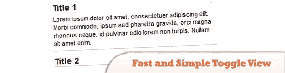
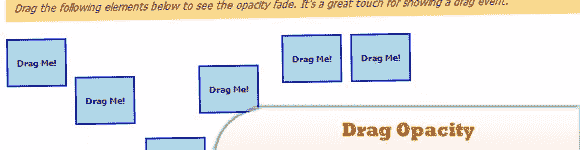
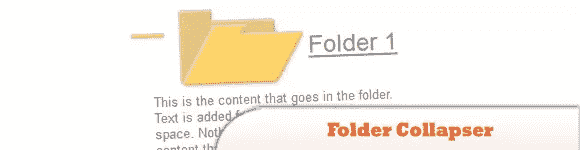
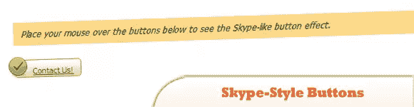
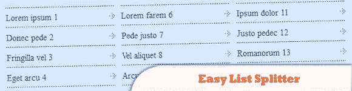
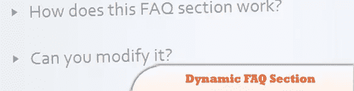

# 10 个漂亮的(各种各样的)JavaScript 和 jQuery 插件

> 原文：<https://www.sitepoint.com/10-nice-assorted-javascript-jquery-plugins/>

只是一个由各种 JavaScript 和 jQuery 插件组成的集合，你可能会发现这对开发你的网站很有用。玩得开心！

相关帖子:

*   [**2000+jQuery 插件目录**](http://www.jquery4u.com/plugins/)

## 1.使用 jQuery 快速简单地切换视图内容

这个脚本使用 UL 列表，并允许用户切换显示李项目的内容。这是一个有用的用户界面特性，可以帮助设计者节省空间，构建一个不太复杂的用户界面。

  
[来源](http://www.queness.com/post/1743/create-a-fast-and-simple-toggle-view-content-with-jquery)
[演示](http://www.queness.com/resources/html/toggle/index.html)

## 2.玻璃箱子

是一个轻量级的 JavaScript 用户界面(UI)库，它使用 Prototype 和 Script.aculo.us 来实现一些效果。GlassBox 可以让你轻松构建透明的边框、多彩的布局和“类似 Flash”的效果。

  
[来源](http://www.glassbox-js.com/)
[演示](http://www.glassbox-js.com/#examples)

## 3.复古动画翻转时钟

在本教程中，您将创建一个受 70 年代启发的动画翻转时钟。使用 Mootools 框架，Alexandru Pitea 试图复制衬垫的翻转动作，并尽可能使其逼真。

  
[来源](http://net.tutsplus.com/tutorials/html-css-techniques/learn-how-to-create-a-retro-animated-flip-down-clock/)
[演示](http://d2o0t5hpnwv4c1.cloudfront.net/470_clock/Source/index.html)

## 4.类似 Twitter 的加载更多小部件

你点击链接，新鲜的东西神奇地出现在屏幕上。本教程教你使用 AJAX、CSS、JavaScript、JSON、PHP 和 HTML 来创造这种魔力。

  
[来源](http://net.tutsplus.com/tutorials/javascript-ajax/create-a-twitter-like-load-more-widget/)
[演示](http://davidwalsh.name/dw-content/load-more.php)

## 5.MooTools 拖动不透明度

在本教程中，大卫沃尔什将学习如何在一些 MooTools 的帮助下制作一个“拖动不透明度和褪色”效果。代码本身非常简单——拖动。移动的 onStart 和 onComplete 事件以开始和结束褪色。

  
[来源](http://davidwalsh.name/mootools-drag-opacity)
[演示](http://davidwalsh.name/dw-content/drag-opacity.php)

## 6.用于动态内容的文件夹折叠器

如何使用纯 JavaScript 和一些添加到最终产品中的 JQuery 来创建一组可折叠的文件夹，使其更具亮点。该代码将被构造成这样一种方式，允许实现到一个动态页面。

  
[来源](http://www.impressivewebs.com/javascript-folder-collapser-for-dynamic-content-tutorial/)
[演示](http://www.impressivewebs.com/demo-files/javascript-folder-collapser-demo.html)

## 7.使用 MooTools 的 Skype 风格按钮

jQuery 专家 Janko Jovanovic 提供了一个很棒的教程，向您展示如何使用 jQuery 创建一个类似 Skype 的按钮。David Walsh 对 Janko 的文章印象深刻，因此他决定将效果移植到 MooTools。

  
[来源](http://davidwalsh.name/skype-mootools)
[演示](http://davidwalsh.name/dw-content/mootools-skype.php)

## 8.简易列表拆分器——jQuery 插件

简单的列表拆分器插件将获取你的列表，把它打包到一个容器 div 中，生成你需要的列数的列表，并平均地把列表项拆分成不同的列表元素。它生成一个有效的 HTML 代码，您可以根据自己的意愿设置样式。

  
[来源](http://www.madeincima.it/en/articles/resources-and-tools/easy-list-splitter-plugin/)
[演示](http://www.madeincima.it/download/samples/jquery/easyListSplitter/)

## 9.动态常见问题部分——jQuery & YQL & Google 文档

在本教程中，您将学习如何在 jQuery 和 YQL 的帮助下创建动态 FAQ 部分，jQuery 和 YQL 从 Google Docs 中提取共享电子表格的内容，并使用这些数据在 FAQ 部分填充问题和答案。

  
[来源](http://tutorialzine.com/2010/08/dynamic-faq-jquery-yql-google-docs/)
[演示](http://demo.tutorialzine.com/2010/08/dynamic-faq-jquery-yql-google-docs/faq.html)

## 10.赠品随机数发生器应用——jQuery

在本教程中，你将学习如何创建一个专用的 randomizer jQuery 应用程序——特别是用于选择竞赛和赠品中的获胜者。目标是获得一个随机选择的参赛者名单和他们的奖品。

  
[来源](http://tutorialzine.com/2010/09/giveaway-randomizer-app-jquery/)
[演示](http://demo.tutorialzine.com/2010/09/giveaway-randomizer-app-jquery/randomizer.html)

## 分享这篇文章