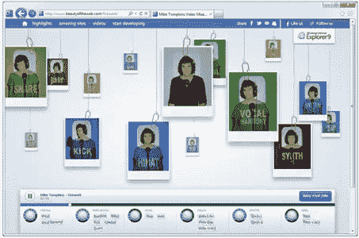
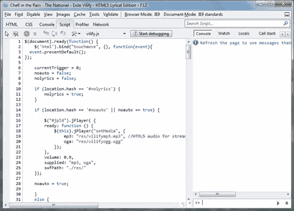
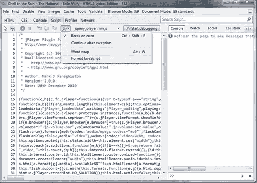
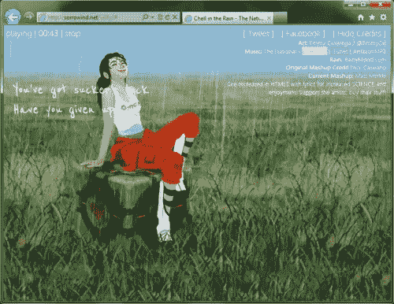
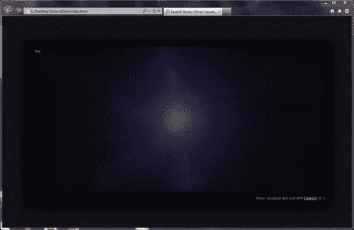

# 可视化 HTML5 音频的 3 种突破性方法

> 原文：<https://www.sitepoint.com/3-breakthrough-ways-to-visualize-html5-audio/>

今天，HTML5 有点像一部没有任何未来季节的电视剧。

它有一些已经拍摄的剧集，一些需要编辑的原始素材，一些符合酷炫特效的镜头，以及许多许多粗糙的草稿。是的，我说的是整个 HTML5 的故事，不仅仅是规范，但希望你能明白。

我将重点关注一个有趣的场景，它没有直接包含在 HTML5 标准中，但是有很高的需求并且在视觉上令人印象深刻。这是使用 HTML5 音频的音频可视化[，就像这样](http://www.beautyoftheweb.com/firework):



在我的电视剧类比中，音频可视化(特别是访问音频流的低级 API)正好落在早期草案和未来系列的想法之间。

### **你能对音频做什么…不能做什么**

您可能已经猜到，HTML5 中的 Audio 元素不提供低级 API。它允许你在高层次上管理音频流回放:播放和暂停，设置和获取时间轴上的当前位置，了解总持续时间，处理文本轨道，控制音量。

如果你试图做比播放一个带音频的音乐文件更复杂的事情，比如同步音频样本，你会发现这并不像你想的那么简单。

对于您可能想要在站点上实现的其他音频任务，也有一些限制:

*   支持多种文件[格式或编解码器](http://msdn.microsoft.com/en-us/library/gg589524%28v=VS.85%29.aspx)，如 MP3 和 H.264
*   用于[控制音乐播放器的浏览器功能](http://blogs.msdn.com/b/ie/archive/2011/05/13/unlocking-the-power-of-html5-lt-audio-gt.aspx)
*   和网络测试

如您所见，它不仅取决于规范本身，还取决于在实际浏览器中的实际实现。

**未来** **标准** **对于音频来说……也许是**

 **

W3C 的[音频工作组正在为音频流提供底层 API。](https://www.w3.org/2011/audio/)

> *“音频 API 将提供读取音频样本、写入音频数据、创建声音以及以最小延迟执行客户端音频处理和合成的方法。它还将增加对 PCM 音频流的编程访问，以便直接在脚本中进行低级操作。”*

因此，也许在未来的某一天，我们会看到一个通用的、基于标准的音频流处理解决方案。

与此同时，让我们回到现实世界，深入了解今天我们可以用 HTML5 做些什么。

### 实用方法:我今天能做什么？

首先，构建可视化到底需要什么？您需要一些与音频回放时间一致的数据。它可以是文本信息，如歌词、代表音量的数据或任何其他您想要播放的数据。

从哪里可以得到数据？实用的方式是[预处理](http://blogs.msdn.com/b/ie/archive/2011/05/13/unlocking-the-power-of-html5-lt-audio-gt.aspx)。耶！如此简单琐碎…

基本上，如果你想可视化音频，你需要做一些功课。首先分析您的音频流，然后您将能够生成与背景中播放的音频同步的可视化效果。

例如，如果你想提取语义上重要的数据(比如一首歌的歌词)，预处理是唯一可能的解决方案(除非你有足够熟练的 AI 来理解歌曲中的单词和句子)。

通常，这是一项单调乏味的手工任务。你坐下来，打开你的音频播放器，开始播放这首歌，记住一行，暂停，写下它，看计时器，写下当前时间…并重复这样做。有时候，你可以从网上随便找个地方下载。

事实是，预处理非常有效。使用这种方法节省了计算资源，从而减少了客户端的负载。这意味着你应该只计算(或写)一次音频可视化的数据，然后使用这些数据让你的魔法随时发生。

现在让我们看看它在现实生活中是如何工作的…

### 处理现实世界的例子

为了熟悉我稍后将介绍的所有优秀解决方案，您可以在自己喜欢的浏览器中使用开发工具。Internet Explorer 为此提供了很棒的[开发工具](http://msdn.microsoft.com/en-us/library/gg589512%28v=VS.85%29.aspx)——只需按 F12。您可以使用“脚本”面板来查看 JavaScript 代码、调试它、设置断点或在控制台中运行您自己的代码。



有时你需要处理压缩的(或精简的)代码。在这种情况下，只需按“格式化 JavaScript”使其更具可读性。



### 例子 1:雨中的切尔



《雨中的切尔》是一首由[马修·默克尔](http://twitter.com/#%21/matt_merkle)创作的歌曲[流放丑化](http://itunes.apple.com/us/album/exile-vilify-from-game-portal/id432601217 "Exile Vilify")的惊人的音频文本可视化。你会看到这首歌的歌词与音频流完美同步。

**里面有什么**

*   jQuery + [Sizzle.js](http://sizzlejs.com/ "Sizzle") (构建 jQuery)
*   [jp player](http://www.jplayer.org/ "jPlayer")(播放音频和视频的库)
*   和一些我们感兴趣的代码。)

**工作原理**

歌曲被分割成几个片段或时间帧(或计时),指向一个短语或一些动画的开始。所有计时都存储在一个数组中:

```
var timings = newArray();
timings[0] = 11.5;
timings[1] = 17;
timings[2] = 24;
timings[3] = 29;
timings[4] = 35.5;
```

与此同时，还有一系列歌词:

```
var lyrics = newArray();
lyrics[0] = 'Exile';
lyrics[1] = 'It takes your mind... again';
lyrics[2] = "You've got sucker's luck";
lyrics[3] ='Have you given up?';
```

现在，回放中的当前时间可以与计时数组相链接，并触发相应的事件触发器来跳转到下一个短语:

```
if(event.jPlayer.status.currentTime >= timings[currentTrigger] && nolyrics != true) {
    fireTrigger(currentTrigger);
    currentTrigger++;
}
```

接下来，被触发的触发器使用 jQuery 制作一些动画:

```
function fireTrigger(trigger) {
    switch (trigger) {
        case 0:
            $('#lyrics1 p').addClass('vilify').html(lyrics[0]).fadeIn(1500);
            break;
        case 1:
            $('#lyrics2 p').html(lyrics[1]).fadeIn(1000).delay(5000).fadeOut(1000);
            $('#lyrics1 p').delay(6000).fadeOut(1000);
            break;
        case 2:
            $('#lyrics1 p').fadeIn(1000);
            break;
        case 3:
            $('#lyrics2 p').fadeIn(1000).delay(4000).fadeOut(1000);
            $('#lyrics1 p').delay(5000).fadeOut(1000);
            break;
        case 4:
           $('#lyrics1 p').removeClass('vilify').html(lyrics[2]).fadeIn(1000);
           break;
        case 5:
           $('#lyrics2 p').html(lyrics[3]).fadeIn(1000).delay(3000).fadeOut(1000);
           $('#lyrics1 p').delay(4000).fadeOut(1000);
           break;
...
```

这很简单，也很有效。

请注意，您可以多么轻松地混合音频流回放和 HTML、CSS 和 JavaScript 的功能。

### 示例#2:提取音频数据



在他的博客文章[中，Grant 分享了他使用 HTML5 进行音频可视化的经验。](http://gskinner.com/blog/archives/2011/03/music-visualizer-in-html5-js-with-source-code.html "Music Visualizer in HTML5 / JS with Source Code")

由于 HTML5 Audio 没有提供任何从音频文件中提取低级数据的 API，Grand 编写了一个小的 [AIR 应用程序](http://gskinner.com/blog/assets/VolumeData.zip)(带有示例)来帮助我们从 MP3 文件中提取音量级别的数据，然后将其存储在文本文件或图像中。

放大后，音量数据如下所示:


现在，有了这个图像，我们可以使用 HTML5 Canvas 轻松提取我们需要的所有数据。对于文本文件来说要容易得多——我没有展示它，因为所有的数据都被压缩了，自己阅读它是没有意义的。

为了处理这种类型的预处理数据，Grant 还编写了一个小的 JS 库(VolumeData.js，是。上面我下载的 zip)。

为了可视化，您需要首先加载数据:

```
loadMusic("music.jpg");
```

函数 loadMusic 只是加载图像:

```
function loadMusic(dataImageURL) {
    image = new Image();
    image.src = dataImageURL;
    playing = false;
    Ticker.addListener(window);
}
```

现在，您应该创建一个新的 VolumeData 对象:

```
volumeData = new VolumeData(image);
```

然后在每次更新时，您可以使用当前时间的平均音量数据或每个通道(左右)的单独数据做任何事情:

```
var t = audio.currentTime;
var vol = volumeData.getVolume(t);
var avgVol = volumeData.getAverageVolume(t-0.1,t);
var volDelta = volumeData.getVolume(t-0.05);
volDelta.left = vol.left-volDelta.left;
volDelta.right = vol.right-volDelta.right;
```

所有的视觉效果都是基于这些数据完成的。为了可视化，Grant 使用了 [EaselJS](http://easeljs.com/ "EaselJS") 库。这里有一些例子:[星域](http://easeljs.com/demos/MusicVisualizer/index.html)和[原子](http://easeljs.com/demos/MusicVisualizer/index2.html)。

现在，您已经拥有了制作酷酷的音频可视化效果所需的所有工具。

总结一下:使用预处理让你的解决方案更高效。尝试将音频回放与基于音量数据的文本数据、动画和图形效果相结合，以获得引人注目的用户体验。让它看起来像魔术一样！

### 其他资源和更多信息:

*   雨中的切尔

### 下载:

*   格兰特·斯金纳的[空中应用](http://gskinner.com/blog/assets/VolumeData.zip)(。zip)
*   [Sizzle.js](http://sizzlejs.com/ "Sizzle")
*   [jPlayer](http://www.jplayer.org/ "jPlayer") 库
*   [画架 JS 库](http://easeljs.com/)** 

## **分享这篇文章**