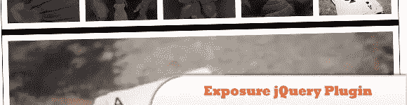
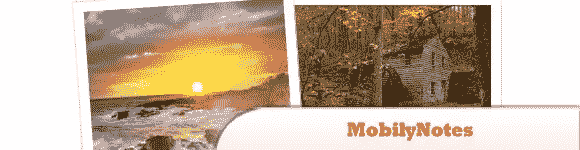
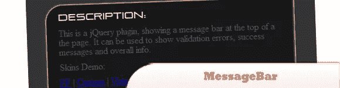
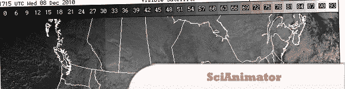
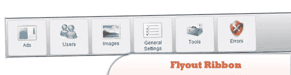
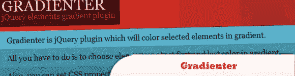
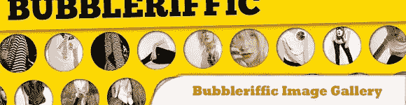
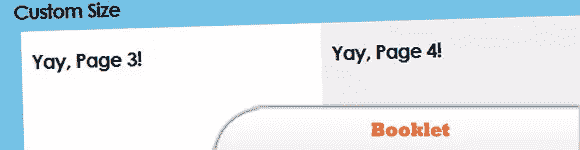
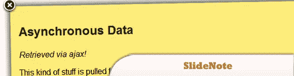

# 10 个值得一试的 jQuery 插件

> 原文：<https://www.sitepoint.com/10-worth-checking-jquery-plugins/>

每天，才华横溢、富有想象力的程序员们都会发布 jQuery 插件，来帮助我们这些开发者让我们的网站更有吸引力，最重要的是更有活力。今天的帖子是另一组值得一看的 jQuery 插件！尽情享受吧！

相关帖子:

*   [**10 新派 CSS3 文字效果与网页排版教程**](http://www.jquery4u.com/dynamic-css-2/10-nouveau-css3-text-effect-web-typography-tutorials/)
*   [**10+1 疯狂 JavaScript 压缩工具**](http://www.jquery4u.com/javascript/101-crazy-javascript-compressor-tools/)

## 1.曝光 jQuery 插件

Exposure 是一个 jQuery 插件，用于丰富和智能的照片查看，可以处理非常大量的照片。

  
[来源](http://exposureforjquery.wordpress.com/documentation/)
[演示](http://exposure.blogocracy.org/demos/demo3.html?v=0.7)

## 2.手机短信

是一个轻量级(2KB) jQuery 插件，以有趣的方式显示你的 html 内容。

  
[来源](http://playground.mobily.pl/jquery/mobily-notes.html)
[演示](http://playground.mobily.pl/jquery/mobily-notes/demo.html)

## 3.消息栏

这个插件在页面顶部(或者你设置它的父 div 的地方)显示一个状态栏。它可以用来显示系统消息，验证错误，问候和任何你能想到的东西。

  
[源+演示](http://www.andreyvoev.com/programming/jquery-plugin-messagebar/)

## 4.科学图像动画师

提供了一个简单而强大的界面来制作一系列图像的动画。包含对科学家分析时序图像非常有用的功能。

  
[源+演示](http://brentertz.github.com/scianimator/)

## 5.弹出功能区

是一个简单的 jQuery 插件，用于创建高度可定制的弹出型功能区。这个插件非常适合以一种不引人注目的方式为用户提供过多的选项。只需点击一下鼠标，您就可以显示或隐藏所有开发人员定义的选项。

  
[来源](http://www.how-to-asp.net/flyout-ribbon-jquery-css3/)
[演示](http://www.how-to-asp.net/demos/flyout-ribbon-plugin/example.aspx)

## 6.渐层

是一个 jQuery 插件，它将为选中的元素添加渐变颜色。你所要做的就是选择元素，并设置渐变的第一个和最后一个颜色。

  
[来源](http://workshop.rs/2010/09/gradienter-add-gradient-to-elements/)
[演示](http://workshop.rs/projects/gradienter/)

## 7.使用 jQuery 的 bubbler 流量图像库

这个想法是以圆形的方式显示相册的缩略图，允许用户通过移动鼠标来自动滚动它们。点击缩略图将放大一个大圈，整个图像将自动调整大小以适应屏幕。

  
[来源](http://tympanus.net/codrops/2010/12/10/bubbleriffic-image-gallery/)
[演示](http://tympanus.net/Tutorials/BubblerifficImageGallery/)

## 8.小册子

是一个 jQuery 工具，用于以“动画书”布局显示 web 上的内容。它是使用 jQuery 库构建的。在 MIT 和 GPL 许可下授权。

  
[来源](http://builtbywill.com/code/booklet/)
[演示](http://builtbywill.com/code/booklet/examples/size)

## 9.带 jQuery 小册子的 Moleskine 笔记本

了解如何使用博客中的最新帖子创建虚拟 Moleskine 笔记本。

  
[来源](http://tympanus.net/codrops/2010/12/14/moleskine-notebook/)
[演示](http://tympanus.net/Tutorials/MoleskineNotebook/)

## 10.slide note——滑动通知的 jQuery 插件

如果你想给你的读者显示一个通知，那么这个 jQuery 插件是一个完美的解决方案。SlideNote 是一个可定制的、灵活的 jQuery 插件，它使得在您的网站或 web 应用程序中显示滑动通知变得很容易。

  
[来源](http://moreco.de/slide-note/)
[演示](http://moreco.de/slide-note/demo/)

## 分享这篇文章