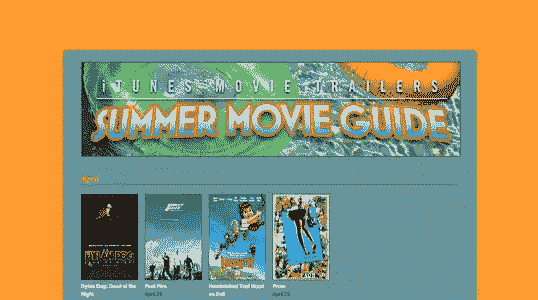
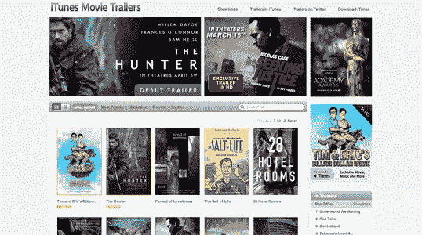

# 苹果:你在想什么？

> 原文：<https://www.sitepoint.com/apple-what-were-you-thinking/>

从产品到包装再到营销材料，苹果公司为技术世界带来美丽设计的声誉坚如磐石。每当史蒂夫·乔布斯掌舵的时候，伟大的设计就成了焦点。

但是我们为你找到了一个异常点。苹果的夏季电影指南采用了一个非常难看的设计，它看起来不像是应该通过乔布斯关注的东西。让我们来看看这个设计，看看它有什么问题，并找出如何补救。

### 色彩设计

首先打动我的是配色方案。亮橙色背景上的暗蓝绿色会立即产生一个对比问题，将眼睛吸引到亮橙色上，同时很难将注意力集中在黑暗、柔和的中心。虽然在任何配置中使用这种明亮的背景都很麻烦，但两者之间的对比度是主要问题，甚至用白色前景代替蓝绿色也是更好的。

你会注意到，在页面顶部，“iTunes 电影预告片”和导航链接在明亮的橙色背景下几乎看不见。

如果你随着渐变的进行向下滚动页面，你会在深绿色背景上看到更亮的蓝色，而不是橙色背景上的蓝绿色。这对眼睛更容易，让你更容易把注意力集中在文本上。

然而，每个月标题中使用的橙色文本在页面顶部效果更好。它与页面下半部分的亮蓝色冲突激烈。

**苹果如何修复？**更改配色方案，使用较深的背景和较浅的前景，如页面底部所示。将部分标题设为白色或其他更中性的颜色。

### 夏季电影指南横幅

对我来说，横幅——蓝绿色盒子里的第一张图片——是网站设计得最好的部分之一。不过，它可以使用一些熟悉的品牌来吸引观众的忠诚度。

**苹果如何修复？**苹果可以考虑在“iTunes 电影预告片”字样的左边加上苹果的标志，并在网站的所有标题中使用经典的苹果字体。“夏季电影指南”这几个字看起来很棒，也很切题。

这里有一个例子，上面的“iTunes 电影预告片”是用更传统的苹果字体写的，在网站的其他地方也可以看到:

### 布局

该页面的布局将内容(电影)放在最前面和中心，由对读者来说最重要的信息来描述:特定电影何时上映？

苹果在 iTunes 商店的典型平铺外观不见了，留下了一些大的空白。空白很重要，但是在苹果的设计中，唯一的空白是设计出来的，而不是因为缺少内容。

我喜欢苹果设计师的一点是，他们让他们的商店页面看起来生动而令人兴奋，移动元素和悬停效果揭示了更多信息；这是页面中缺少的，这使得设计看起来比较死气沉沉。将鼠标悬停在电影缩略图上，可以看到覆盖在图像上的更多信息。

**苹果如何修复？**探索一种平铺布局，不要留下明显的对页面结构发展没有帮助的空白空间。为电影缩略图等元素提供一些微妙的移动和交互性；在过去一年左右的时间里，悬停以获取更多信息已经成为用户期望的一部分。

### 结论

这个页面有一些好的元素，但总的来说，它是一个灾难。苹果需要立即改变配色方案，并在工作中考虑其他一些改进。如果你对这个页面有其他建议，请在评论中告诉我们——我们希望你喜欢这个解构。

## 分享这篇文章