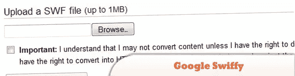
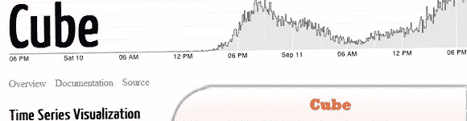
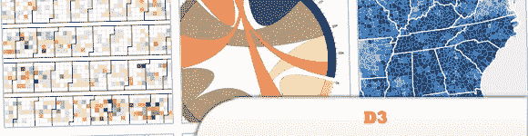
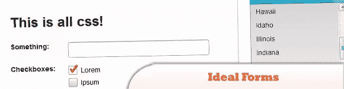
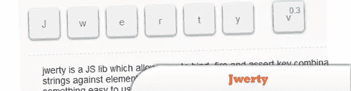

# 10 ++ 2011 年最佳 Web 开发人员资源和工具(第一部分)

> 原文：<https://www.sitepoint.com/10-web-developers-resources-tools-2011-part-1/>

今天，我们为您精选了 2011 年最有用、最具创新性的工具和资源。我们已经列出了一个很大的列表，但是我们只会给你 20 个工具和资源(包括框架、样板、应用程序、JavaScript 资源、CSS3 动画工具等等)。)这里是它的第一部分。因此，无论如何，你一定会从 2011 年开始发现一些非常非常有用的东西。玩得开心！

相关帖子:

*   [**2011 年 10 个独家 JavaScript 和 jQuery 教程**](http://www.jquery4u.com/plugins/10-exclusive-javascript-jquery-tutorials-2011/)
*   [**20 个新鲜的 jQuery 插件 2011**](http://www.jquery4u.com/plugins/20-fresh-jquery-plugins-2/)

## 1.动员者

是一个基于 Webkit 的 Adobe AIR 应用程序，允许您在各种手机外壳上预览您的移动网站、设计模型和本地 HTML。有了 Mobilizer，你所要做的就是访问任何网址或拖放本地 HTML，Flash，甚至图像文件。它可以导出设备视图的 PNGs 非常适合作品集。

  
[源+演示](http://www.springbox.com/mobilizer/)

## 2.即时 WordPress

是一个完全独立的，可移植的 Windows WordPress 开发环境。它有一个内置的 Apache web 服务器，PHP 和 MySQL 安装，可以自动启动和停止，并带有虚拟帖子和页面，用于快速主题和插件测试。

  
[源+演示](http://www.instantwp.com/)

## 3.谷歌 Swiffy

将 Flash SWF 文件转换为 HTML5，允许您在没有 Flash 播放器的设备(如 iPhones 和 iPads)上重复使用 Flash 内容。输出可以在所有 Webkit 浏览器中工作，比如 Chrome 和 Mobile Safari。

  
[源+演示](http://www.google.com/doubleclick/studio/swiffy/)

## 4.剑道 UI

结合了现代 JavaScript 开发所需的一切，包括强大的数据源、通用拖放、模板、主题和 UI 小部件。

  
[来源](http://www.kendoui.com/) [演示](http://demos.kendoui.com/)

## 5.杰出的/一流的

是一个用 JavaScript 编写的独立代码编辑器，其目标是创建一个基于浏览器的编辑器，匹配并扩展现有本机编辑器(如 TextMate、Vim 或 Eclipse)的功能、可用性和性能。

  
[源+演示](http://ace.ajax.org/)

## 6.Microjs

是一个大型的微框架和微库集合，大部分小于 2kb。获得您所需要的一切，保持轻松。

  
[源+演示](http://microjs.com/)

## 7.立方

是一个用于可视化时间序列数据的开源系统，构建于 MongoDB、Node 和 D3 之上。如果您发送带有多维数据集时间戳的事件(带有可选的结构化数据)，您可以轻松地为内部仪表板构建聚合指标的实时可视化(例如，您可以使用多维数据集来监控网站的流量)。

  
[源+演示](http://square.github.com/cube/)

## 8.D3

允许您将任意数据绑定到文档对象模型(DOM)，然后对文档应用数据驱动的转换。它不是传统的可视化框架。D3 没有提供一个具有任何人都可能需要的所有特性的整体系统，而是仅仅解决了问题的关键:基于数据的文档的有效操作。这给了 D3 非凡的灵活性，展示了 CSS3、HTML5 和 SVG 等底层技术的全部功能。

  
[来源](http://mbostock.github.com/d3/) [演示](http://mbostock.github.com/d3/ex/)

## 9.理想形式

是一个非常容易使用的小框架，帮助您建立强大而美丽的在线表单。一切都可以用 CSS 进行样式化，并且打包了三种样式(sapphire、comix 和 forest)来帮助您入门。禁用 JavaScript 时，它会优雅地降级。

  
[源+演示](http://code.google.com/p/idealforms/)

## 10.Jwerty

是一个小的(1.5kb) JS 库，它允许你绑定 fire 和断言针对元素和事件的组合键字符串。它将糟糕的 std api 正常化为易于使用和清除的东西。

  
[源+演示](http://keithcirkel.co.uk/jwerty/)

## 分享这篇文章