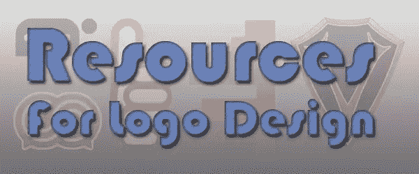
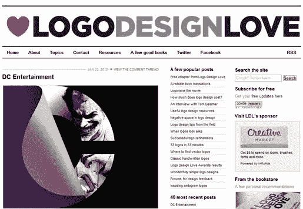
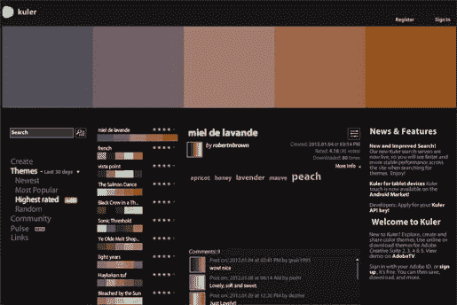
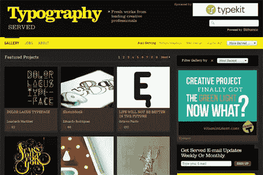
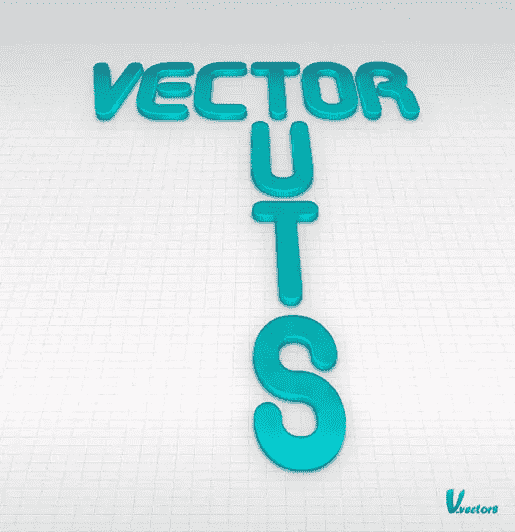

# 31 个极好的标志设计和灵感资源

> 原文：<https://www.sitepoint.com/best-resources-for-logo-design-and-inspiration/>

是时候设计一些标志了？盯着一个空白的画板(为你的插画爱好者)？或者也许你的公司想把 logo 设计留在内部(囧！)而任务就落到了你的身上。设计一个标志可能是令人生畏的，即使你以前设计过一些。标志是代表一个公司的东西；它应该有助于公众识别你的商业形象和他们可能看到的任何公开文件或产品。标志设计的另一个困难方面是确保它很容易辨认，无论是在像名片一样小的东西上还是在像广告牌一样大的东西上。

无论你在标志设计方面的专业水平如何，你都应该能够在下面的资源中找到一些帮助你开始的东西。如果您知道我们应该包括的任何其他资源，请在下面告诉我们！

### 灵感

首先，看看其他一些做得好的标志是一个好主意。网上有很多一站式商店，人们可以上传他们的商标并获得评论。你可以用这些来细读他人的作品，并从中获得一些想法。这不仅能帮你获得一些想法，还能让你远离那个空画板:

*   [世界品牌](http://www.brandsoftheworld.com/)
*   [Logo 设计爱情](http://www.logodesignlove.com/)
*   [Logo 休息室](http://www.logolounge.com/)
*   [标志池](http://www.logopond.com/)
*   [今日标志](http://www.logooftheday.com/)
*   [好的 Logo](http://www.goodlogo.com/)
*   [标志设计作品](http://www.logodesignworks.com/blog/)

### 颜色样本

一旦你有了灵感，你知道你要做什么，花些时间分析和制作你的调色板。有时这已经在品牌的风格指南中为你预先定义好了。否则，绝对的自由有时会让人麻痹。花时间发展你的颜色也能帮助你巩固你的概念和表达你的想法:

*   [Adobe 的 Kuler 系统](http://kuler.adobe.com/)
*   [颜色组合](http://www.colorcombos.com/)
*   [配色方案设计师](http://www.colorschemedesigner.com/)
*   [色彩爱好者](http://www.colourlovers.com/)
*   [颜色混合器](http://www.colorblender.com/)
*   [降解](http://www.degraeve.com/color-palette/)
*   [网页上的颜色](http://www.colorsontheweb.com/colorwizard.asp)

### 类型

您已经有了自己的设计和色板，但现在您需要得到恰到好处的排版元素。可能你的 logo 没有排版。太好了！不要读这一节。对于我们其他人来说，我们需要一些参考点来开始:

*   [部式](http://www.ministryoftype.co.uk/words/index/)
*   [排版服务](http://www.typographyserved.com/)
*   [我喜欢字体设计](http://www.ilovetypography.com/)
*   [字体馈送](http://www.fontfeed.com/)
*   [每日类型](http://www.dailytype.com/)
*   [微软排版](http://www.microsoft.com/typography/AboutFontsOverview.mspx)
*   [型瘾君子](http://typejunkies.posterous.com/)

### Illustrator 教程

一切都在一起。灵感—检查。颜色—检查。类型—检查。现在你到底要怎么做才能把这一切联系起来？有时候，在开发字体时，你会遇到一些似乎无法解决的问题。这里有一些教程可以帮你度过最糟糕的阶段。我们将跳过像使用钢笔工具这样的基本操作，直接跳到更高级的功能:

*   [使用实时跟踪的快速徽标](http://layersmagazine.com/quick-logos-with-live-trace-in-adobe-illustrator.html)
*   渐变网格
*   使用透视网格
*   [创造玻璃效果](http://www.attitudedesign.co.uk/how-to-create-the-glass-effect/)
*   [3D 文本](http://vector.tutsplus.com/tutorials/designing/create-a-variety-of-3d-lettering-effects-for-poster-design/)(不使用 3D 挤压&斜面)
*   [3D 文本](http://vector.tutsplus.com/tutorials/text-effects/create-a-bending-3d-text-effect-in-adobe-illustrator/)(使用 3D 挤压&斜面)
*   口感
    *   [木头](http://vectips.com/tutorials/create-a-wood-grain-texture/)
    *   [铬合金](http://www.blog.spoongraphics.co.uk/tutorials/how-to-create-a-cool-chrome-text-effect-in-illustrator)
    *   [金属](http://vectips.com/tutorials/create-a-brushed-metal-texture/)
    *   [液体](http://www.digitalartsonline.co.uk/tutorials/?featureid=3243754)

你可能不需要所有这些资源，但希望这些列表中有一些你可以带走。让他们引导你在下一个项目中达到新的设计水平，并确保让我们知道哪些是你认为最有用的。

## 分享这篇文章