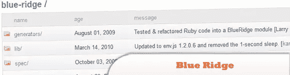
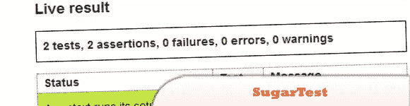
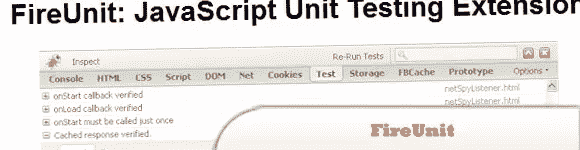
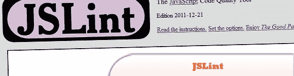
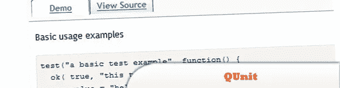
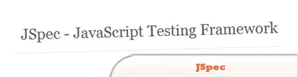
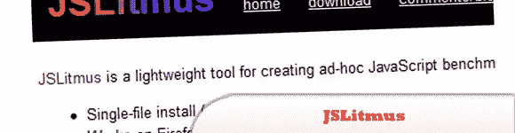
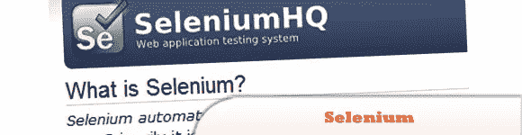
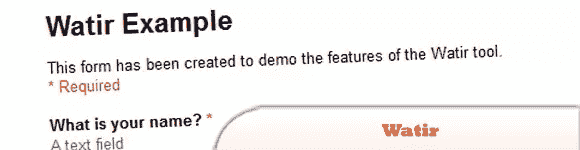

# 10 个 JavaScript 测试工具

> 原文：<https://www.sitepoint.com/10-javascript-testing-tools/>

与可以利用 Visual Studio 调试功能的 C#等其他语言相比，测试像 jQuery 这样的 JavaScript 库有时会非常困难。当然你不一定需要开发你自己的测试套件，因为已经有很多了。以下是我们发现的一些 **JavaScript 测试工具**，我们认为它们可能对测试你的脚本有用。玩得开心！

## 1.blue Ridge–JavaScript 测试框架

该插件为您的 Rails 应用程序添加了对命令行和浏览器内 JS 单元测试的支持。它以一种约定胜于配置、类似 Rails 的方式将几个优秀的工具捆绑在一起。

  
[源+演示](https://github.com/relevance/blue-ridge)

## 2.SugarTest–JavaScript 测试

使得编写优雅且易于理解的 JavaScript 测试变得容易。它的 API 受 RSpec、Shoulda 和 jQuery 的启发。它作为 DSL 运行在 JsUnitTest 之上。

  
[源+演示](http://sugartest.scriptia.net/)

## 3.fire Unit–JavaScript 单元测试扩展

FireUnit 提供了一个简单的 JavaScript API，用于在 Firebug 的新标签中进行简单的测试日志记录和查看。FireUnit 是 Firefox/Firebug 的扩展。

  
[源+演示](http://fireunit.org/)

## 4.JSLint——JavaScript 代码质量工具

一个在线 JavaScript 程序，寻找 JavaScript 程序中的问题。JSLint 获取一个 JavaScript 源并扫描它——如果发现问题，它会返回一条描述问题的消息和源中的大致位置。

  
[源+演示](http://www.jslint.com/)

## 5.QUnit–JavaScript 测试套件

QUnit 是一个易于使用的 JavaScript 测试套件。jQuery 项目使用它来测试其代码和插件，但是它也能够测试任何通用的 JavaScript 代码。

  
[源+演示](http://docs.jquery.com/QUnit)

## 6.JSpec

是一个非常小，但是非常强大的测试框架。利用自己的定制语法和预处理器，JSpec 可以以其他 JavaScript 测试框架无法做到的方式运行。

  
[源+演示](http://voodootikigod.com/jspec-javascript-testing-framework)

## 7.石蕊

是一个轻量级工具，用于创建专门的 JavaScript 基准测试。

  
[源+演示](http://www.broofa.com/Tools/JSLitmus/)

## 8.selenium——JavaScript Web 应用安全测试工具

是一个用于 web 应用程序的测试工具，可以像真实用户一样直接在浏览器中运行测试。支持 Windows、Linux 和 Macintosh 上的 Internet Explorer、Mozilla 和 Firefox。没有其他测试工具能覆盖如此广泛的平台。

  
[源+演示](http://seleniumhq.org/)

## 9.Watir(发音为水)

是一个开源(BSD)的 Ruby 库家族，用于自动化 web 浏览器。它允许您编写易于阅读和维护的测试。它既简单又灵活。

  
[来源](http://watir.com/)
[演示](https://spreadsheets.google.com/viewform?hl=en&formkey=dDliTk5XU1R4RUMtb2c1WDZxWHNENmc6MQ#gid=0)

## 10.萨希

是一个成熟的、业务就绪的自动化 web 应用程序测试工具。Sahi 可以在任何支持 JavaScript 的现代浏览器上运行。

  
[源+演示](http://sahi.co.in/w/)

## 分享这篇文章