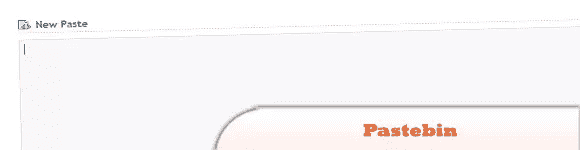
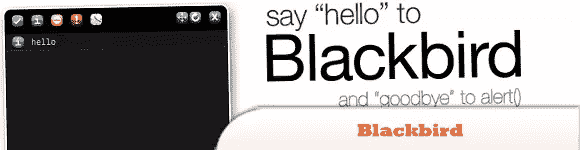
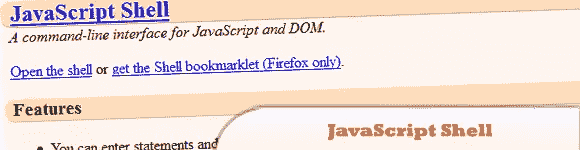
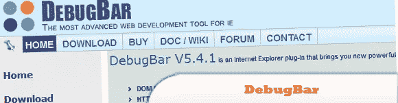

# 10 个 JavaScript 在线和基于浏览器的调试工具

> 原文：<https://www.sitepoint.com/10-javascript-online-browser-based-debugging-tools/>

让我们面对现实吧，调试 JavaScript 有时可能是 web 开发中最痛苦的部分。所以我们决定寻找一些好的工具来调试 JavaScript 问题。这里是我们收集的 10 个在线和基于浏览器的调试工具。玩得开心！

相关帖子:

*   [**安装和使用 Firebug 的简易指南**](http://www.jquery4u.com/utilities/live-jquery-debugging-firebug/)
*   [**掌握 Firebug 控制台的 10 个技巧**](http://www.jquery4u.com/utilities/firebug-console-tips/)

## 在线调试工具

### 1\. Pastebin

是一个协作调试工具，允许您在 IRC、IM 或留言板上聊天时共享和修改代码片段。

  
[源+演示](http://pastebin.com/)

### 2.JSON 格式化程序和验证程序

创建 JSON 格式化程序是为了帮助调试。由于用 JSON 表示的数据通常不换行以节省空间，所以实际读取变得非常困难。这个工具希望通过将 JSON 格式化成人类易于阅读的数据来解决这个问题。

  
[源+演示](http://jsonformatter.curiousconcept.com/)

### 3.JS Bin–协作 JavaScript 调试

一个 web 应用程序，专门设计来帮助 JavaScript 和 CSS 人员在某些上下文中测试代码片段，并协作调试代码。允许您编辑和测试 JavaScript 和 HTML(重新加载 URL 还会保持代码的状态，而新标签页不会)–一旦您满意了，您就可以保存了。

  
[源+演示](http://jsbin.com/#javascript,html)

## 基于浏览器的调试工具

### 4.黑鸟 JavaScript 调试助手

Alert()广泛用于在 JavaScript 开发中创建检查点。Blackbird 提供了一个时尚的控制台，可以用 JavaScript 记录、查看和过滤消息，通过消除每个警报的暂停并更好地分析每个警报，加快了开发过程。

  
[源+演示](http://www.gscottolson.com/blackbirdjs/)

### 5.JavaScript 外壳

是 JavaScript 和 DOM 的命令行接口。

  
[源+演示](http://www.squarefree.com/shell/)

### 6.JSDT–JavaScript 调试工具包

JSDT 是可以在 IE、Firefox、Safari、Chrome、Opera、mobile IE 浏览器和 mobile Opera 浏览器中调试 JavaScript 的软件。它适用于所有支持 Ajax 的浏览器。

  
[源+演示](http://code.google.com/p/jsdt/)

### 7.CJS-同伴。JS JavaScript 调试器

CJS 是一个互联网浏览器的 JavaScript 调试器。详细的 JavaScript 错误报告(错误发生的调用堆栈和真实文件名)和类似“Firebug”的控制台 API 特性。

  
[源+演示](http://www.my-debugbar.com/wiki/CompanionJS/HomePage)

### 8.debug bar–面向 Web 开发人员的 IE 扩展

查看 DOM 树并动态修改标签属性和 CSS 属性以测试您的页面，查看 JavaScript 函数以简化调试，CSS 检查器等等。

  
[源+演示](http://www.debugbar.com/?langage=en)

### 9.蜻蜓歌剧院

是一个跨设备、跨平台的 Opera 浏览器调试环境——调试 JavaScript，检查和编辑 CSS 和 DOM，查看手机或电脑上的任何错误。

  
[源+演示](http://www.opera.com/dragonfly/)

### 10.Venkman JavaScript 调试器

Venkman 是 Mozilla 的 JavaScript 调试器的代号。Venkman 的目标是为基于 Mozilla 的浏览器提供一个强大的 JavaScript 调试环境。

  
[源+演示](https://addons.mozilla.org/en-US/firefox/addon/javascript-debugger/)

## 分享这篇文章