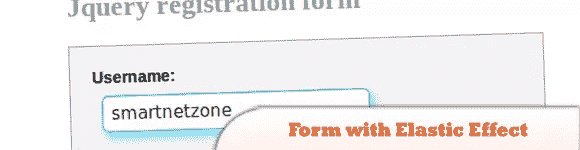
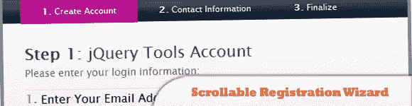
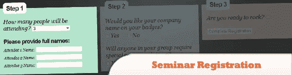
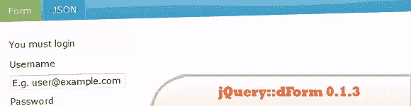

# 10 个 jQuery 注册表单演示

> 原文：<https://www.sitepoint.com/10-jquery-signup-form-demos/>

表单可以是任何网站的一个非常重要的方面，无论是注册表单、登录表单还是评论表单。这些表单是你的网站和用户之间互动的来源，所以今天我们收集了 **10 个 jQuery 注册教程和演示**，它们将帮助和促进你增强网站上各种表单的美感。尽情享受吧！

## 1.具有弹性效果的 Jquery 注册表

对于 web 开发者来说，用一个交互性强、耗时少的注册表单来打动用户是非常必要的。因为在大多数网站中，第一步是注册。所以今天我们将学习一个具有弹性 jQuery 效果的交互式 jQuery 注册表单。

  
[来源](http://demo.smartnetzone.com/jquery-registration-form-with-elastic-effect/)
[演示](http://demo.smartnetzone.com/wp-content/uploads/2011/05/registration_form.png)

## 2.用 jQuery 创建类似脸书的注册表单

在本教程中，我们将向最好的人学习，创建一个类似 facebook 的注册表单。

  
[来源](http://tutorialzine.com/2009/08/creating-a-facebook-like-registration-form-with-jquery/)
[演示](http://demo.tutorialzine.com/2009/08/creating-a-facebook-like-registration-form-with-jquery/)

## 3.可滚动的注册向导

这是一个注册向导，带有原始的输入验证逻辑和一个用于验证错误的“twitter”风格的消息框。

  
[源+演示](http://flowplayer.org/tools/demos/scrollable/wizard.html)

## 4.使用 jQuery 注册研讨会

在本教程中学习如何使用 jQuery 注册研讨会。

  
[源+演示](http://css-tricks.com/examples/SeminarRegTutorial/)

## 5.用 jQuery (FormToWizard 插件)将任何 web 表单变成一个强大的向导

这个详细的教程将向你展示如何把长的 webform 变成一个带有“向左走几步”信息的向导。一个插件也可以下载。

  
[来源](http://www.jankoatwarpspeed.com/post/2009/09/28/webform-wizard-jquery.aspx)
[演示](http://www.jankoatwarpspeed.com/examples/webform_to_wizard/)

## 6.jQuery::dForm 0.1.3

jQuery.dForm 插件允许您从 JavaScript 对象(因此也包括 JSON)以编程方式创建 HTML 表单。

  
[来源](http://neyeon.com/p/jquery.dform/doc/files2/readme-txt.html)
[演示](http://neyeon.com/p/jquery.dform/doc/files2/examples-txt.html)

## 7.jQuery 重力登记表

有时候注册表格决定了你的 web 应用程序的成功率，我觉得第一步(注册)应该少一些字段，引人注目，一定会给用户留下深刻印象。

  
[来源](http://www.9lessons.info/2011/01/gravity-registration-form-with-jquery.html)
[演示](http://demos.9lessons.info/slidereg/demo.html)

## 8.用 jQuery 构建一个令人难以置信的登录表单

在本教程中，我们将创建一个滑动面板，滑入显示更多内容，使用 JQuery 动画显示面板的高度。

  
[来源](http://net.tutsplus.com/tutorials/javascript-ajax/build-a-top-panel-with-jquery/)
[演示](http://d2o0t5hpnwv4c1.cloudfront.net/041_TopPanelWithJquery/demo/index.html)

## 9.如何用 CSS3 和 jQuery 创建多步注册表单

在本教程中，我们将看到如何使用 CSS3 和 jQuery 创建一个简单的多步注册表单。为了增加趣味，我们将在表单中包含进度条，这样用户就可以看到表单完成的百分比。

  
[源+演示](http://webexpedition18.com/articles/how-to-create-a-multi-step-signup-form-with-css3-and-jquery/)

## 10.完美的登录下拉框就像带有 jQuery 的 Twitter

这将向你展示如何使用 jQuery 创建一个 Twitter 风格的登录下拉列表。

  
[来源](http://aext.net/2009/08/perfect-sign-in-dropdown-box-likes-twitter-with-jquery/)
[演示](http://aext.net/example/twitterlogin/)

## 分享这篇文章