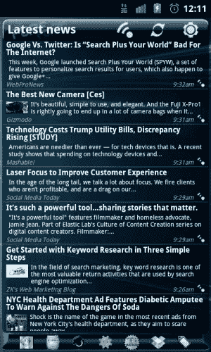
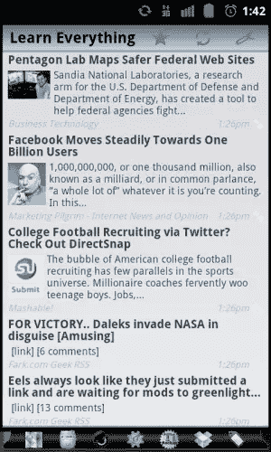
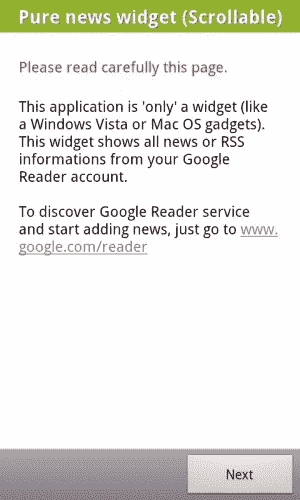
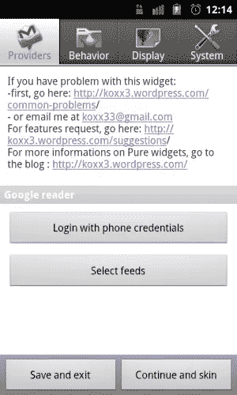
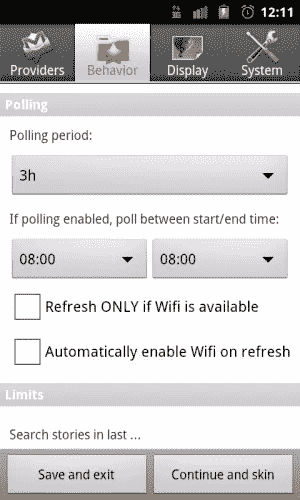
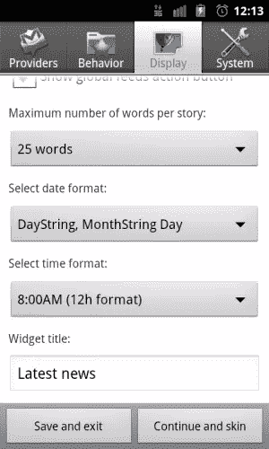
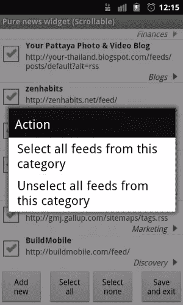
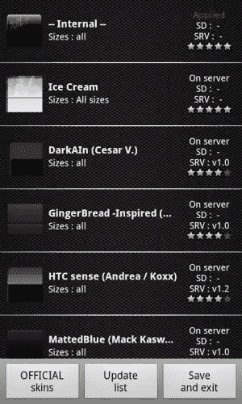
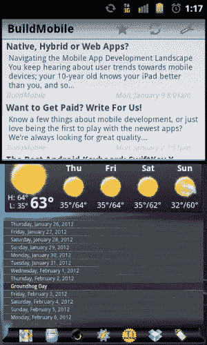
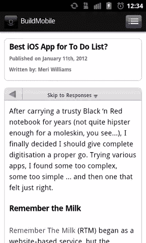

# 纯新闻小工具

> 原文：<https://www.sitepoint.com/pure-news-widget-review/>

我喜欢寻找在线使用手机的新方式，这样我就不那么依赖笔记本电脑了。考虑到这一点，我发现我的笔记本电脑的 RSS 订阅的最佳替代品之一是纯新闻小工具的形式。

纯新闻小工具将任何 Android 设备变成新闻源阅读发电站。

## 纯新闻小工具

 

纯新闻窗口小部件通过主屏幕小部件向您显示任何或所有的谷歌阅读器订阅源。

如果你有一个谷歌阅读器账户，并使用它与 SitePoint 网络、博客和其他订阅源保持联系，你需要一个类似纯新闻的小工具。它可能会完全取代你在另一个平台上查看谷歌阅读器的需求。

在你从 Android Market 安装了[纯新闻插件](https://market.android.com/details?id=org.koxx.pure_news)之后，你将会被引导去使用这个插件。这就是使用超级简单的纯新闻小部件所需的全部信息。如果你需要更多的帮助，在这个小工具上有一个非常强大的设置按钮，可以给你更多的关于纯新闻小工具的信息。

 
*安装指南*

几乎任何 Android 设备的主屏幕都是使用最广泛的区域，除此之外，它还是手机打开或退出应用程序时发送给你的第一个位置。由于这种行为，您实际上可以使用纯新闻小部件，通过直接访问新闻，使新闻成为您日常移动生活中不令人生畏的一部分。

凭借其易于使用的界面和滚动功能，Pure Widget News 允许我立即阅读所有我想要的新闻。因为纯新闻窗口小部件是一个窗口小部件，你可以把它和任何你想要的窗口小部件混合，在你的主屏幕上把多种东西和你的提要结合起来。

## 灵活的小部件设置

纯新闻小部件是可滚动的，所以它充分利用了 Android 的滚动能力。任何自定义主页启动器的可滚动功能都允许您完全浏览您的提要，就像它是一个完整的应用程序一样。设置区域允许您控制应用程序的行为和外观。

Pure News Widget 在你希望的任何时间间隔更新任意数量或全部的 RSS 订阅，并在你的主屏幕上自动显示结果。你还可以选择你想要同步的谷歌账户，一天中你想要 Pure News Widget 获取最新消息的时间，甚至是应用程序应该为每个新项目显示的每篇文章的长度。

 
*选择谷歌账号和上班时间*

 
*获取多少条新闻，如何显示，以及它们的显示格式*

## 纯新闻小工具的最佳特性:

安卓市场上有几十种新闻小工具。以下可能是我推荐纯新闻小工具胜过其他应用的主要原因:

1.  安全。通过手机连接的帐户登录，不要求您提供任何登录信息。
2.  选择是否显示所有最新新闻、特定订阅源或订阅源的特定类别(文件夹):
     
    *选择您的所有订阅源，选择几个，或根据类别选择。*
3.  可以通过任何小工具或完整的文章显示摘要。
4.  你根本不需要离开你的主屏幕或者打开任何应用程序——一切都在你主屏幕上的小工具里。
5.  许多视觉定制，如透明度、字体变化、皮肤和颜色可供选择:
     
    *使用皮肤更改您的新闻外观。*
6.  通过谷歌移动视图打开所有新闻报道的移动版本，或者像平常一样在浏览器中打开网站。
7.  你可以有多个小部件——每个小部件都可以根据你的需要从你的 Google Reader 中获得任意多的特定的不同的 feeds。
8.  您可以指定订阅源更新的频率以及一天中的哪些时段。
9.  定期更新。事实上，似乎每 2 到 4 周就会有一次新功能、增强功能和错误修复的更新。[开发者的博客](http://koxx3.wordpress.com/)也很活跃，在这里你可以提出任何问题和建议。
10.  由于今天越来越多的提要利用高端图像，你也可以通过告诉 Pure News Widget 只在你有 Wifi 时更新提要来限制你的手机数据使用。当您使用有限的数据使用计划时，这一点尤其重要，比如美国电话电报公司或威瑞森。
11.  使用内部浏览器或您的标准浏览器打开文章:
     
    *内部浏览器的示例——在您的小工具中阅读所有新闻*

## 愿望清单

虽然 Google Feeds 在纯新闻窗口中工作得很好，但我希望在未来的版本中可以解决一些问题。顺便说一下，所有这些都是无关紧要的，只是偏好:

1.  允许管理订阅源。尽管纯新闻小工具主要是一个阅读器小工具，但允许你添加、删除或更改订阅可以帮助你节省更多的时间。
2.  允许极简设计。应用程序总是显示标题栏，即使你改变设计。一个没有标题栏的小部件设置按钮会更好。
3.  允许自动更新新的订阅源。如果您在 Google Reader 中添加、更改或删除订阅源，纯新闻小工具不会显示这些更改，直到您进入纯新闻小工具设置并再次检查订阅源选择过程。允许一个选项自动绕过这一步，并以一定的时间间隔更新所有的更改，将有助于许多人省去这一步。
4.  允许灵活设计。这将是很好的看到不同的特定类别的饲料在不同的指定颜色和字体。
5.  允许 Tasker 集成。在当今世界，我认为 Tasker 甚至 Locale 集成对于任何 Android 设备都是必须的。对了，Tasker 评论快到了。有了 Tasker 的集成，你可以在任何你希望的时间或状态触发一个纯粹的新闻窗口刷新，比如当你给手机充电的时候。
6.  允许电池状态检测。当电池电量低于 15%时，可以选择不更新订阅源。经常通过手机上网确实会增加电池的使用量。当手机快没电的时候，可以选择不更新新闻，这无疑会帮助那些大部分时间都想知道最新消息的人，而不会让手机没电。

## 最好的谷歌阅读器小工具应用

Pure News Widget 是一个设计非常精美的应用程序，是开发人员设计的 Pure Widgets 应用程序的一个强大系列的一部分，旨在帮助您提高工作效率。

Pure Widget 直接与您的谷歌阅读器连接，因此您无需创建任何新帐户或更改现有偏好即可开始使用该应用程序。即使你没有互联网连接，纯新闻小工具也可以工作:该应用程序允许你将所有未读的新闻文章保存到你的 SD 卡上，以便将来离线阅读。

*纯新闻小工具——在你的主屏幕上显示你所有的站点和移动新闻*

最棒的是？Pure News Widget 100%兼容 ICS 冰淇淋三明治，让你可以在过时的手机或最新的 Android 平板电脑上全力使用 Pure Widget。

因为以上所有的观点，以及更多，纯新闻窗口是最好的谷歌阅读器窗口。访问 Android Market 获得目前售价为 1.49 美元的纯插件。

和所有新的 Android 应用一样，你可以免费试驾纯新闻插件 15 分钟。您还可以通过一次性购买获得终身免费更新。

## 你会推荐纯新闻 Widget 吗？

如何看待纯新闻 Widget？您在旅途中用什么阅读订阅的订阅源？你更喜欢使用主屏幕小工具来阅读新闻还是直接打开的专用应用程序？

在下面的评论中分享你对这款应用和这篇评论的想法和问题。

感谢阅读！

## 分享这篇文章