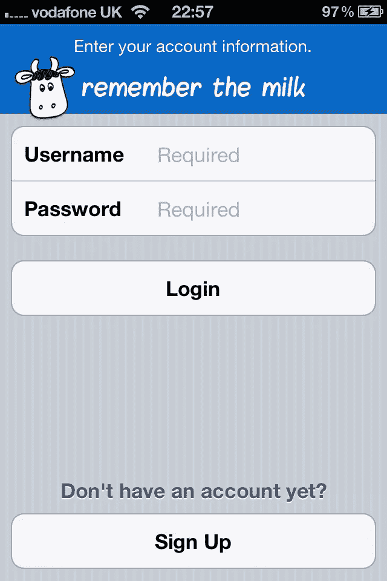
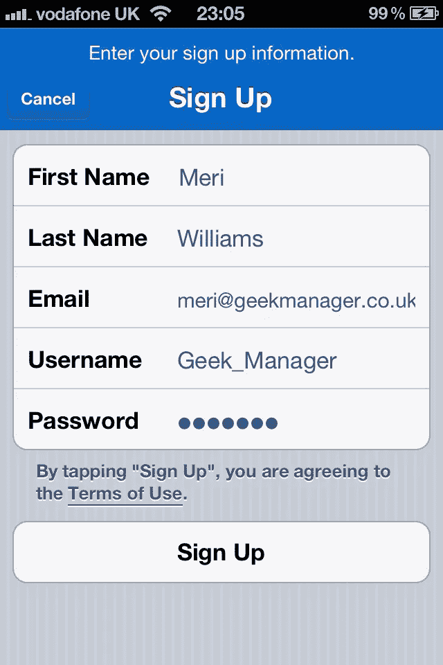
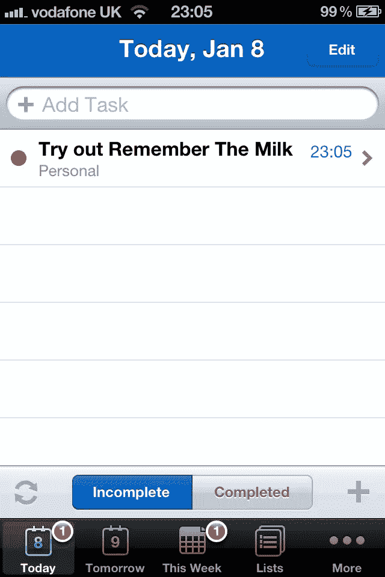
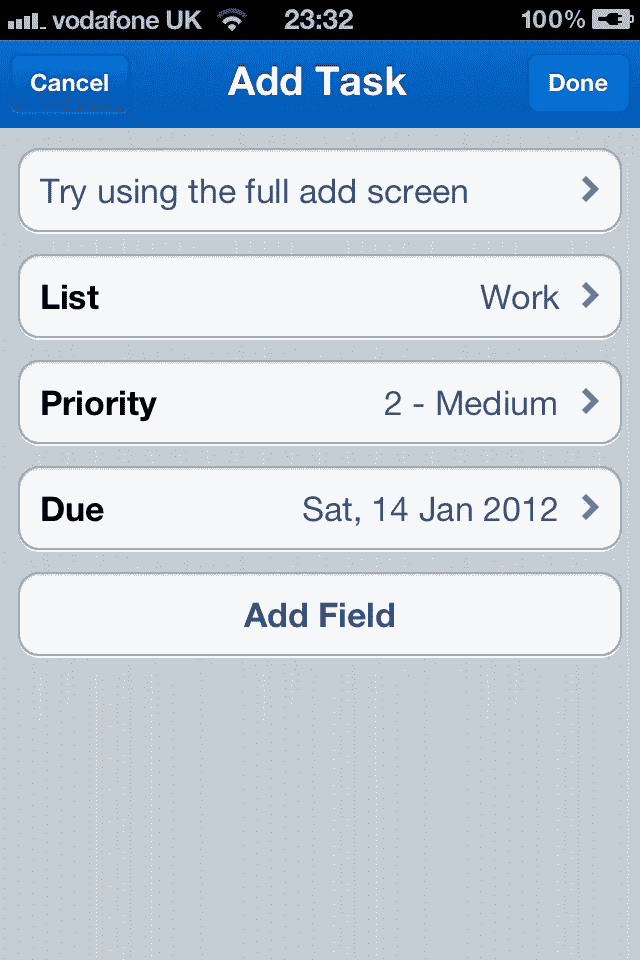
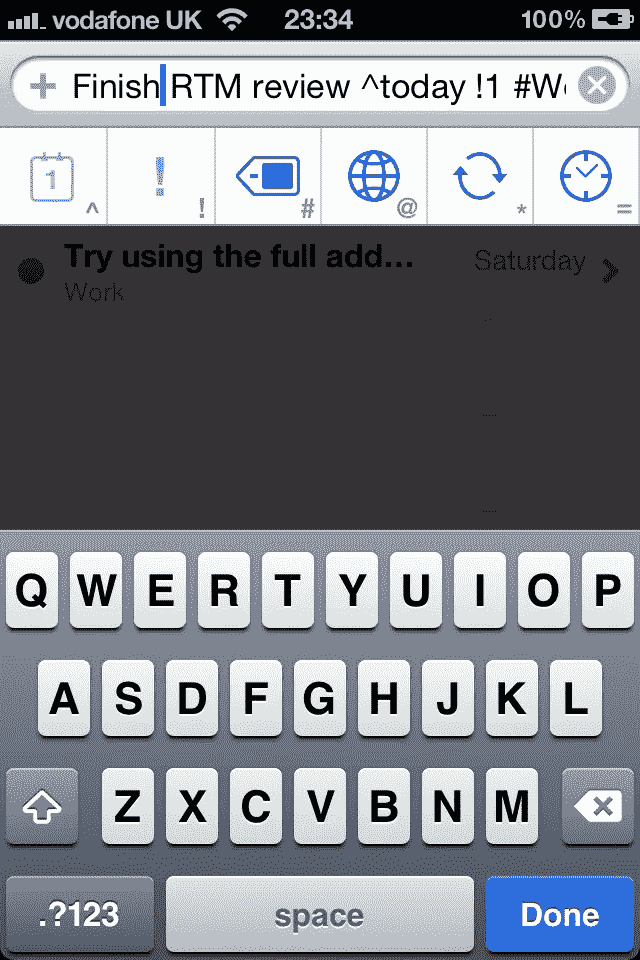
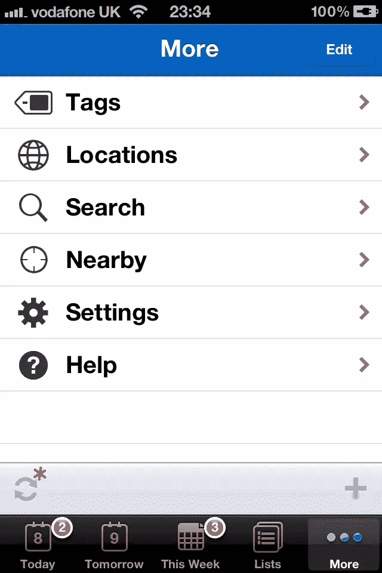
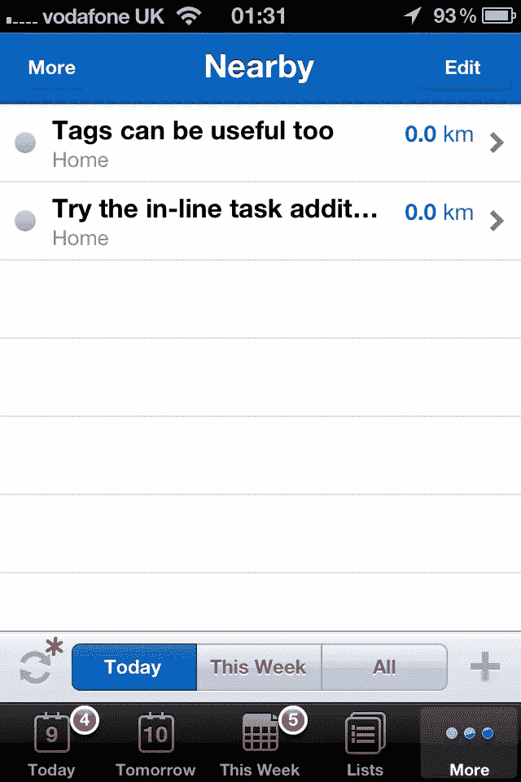
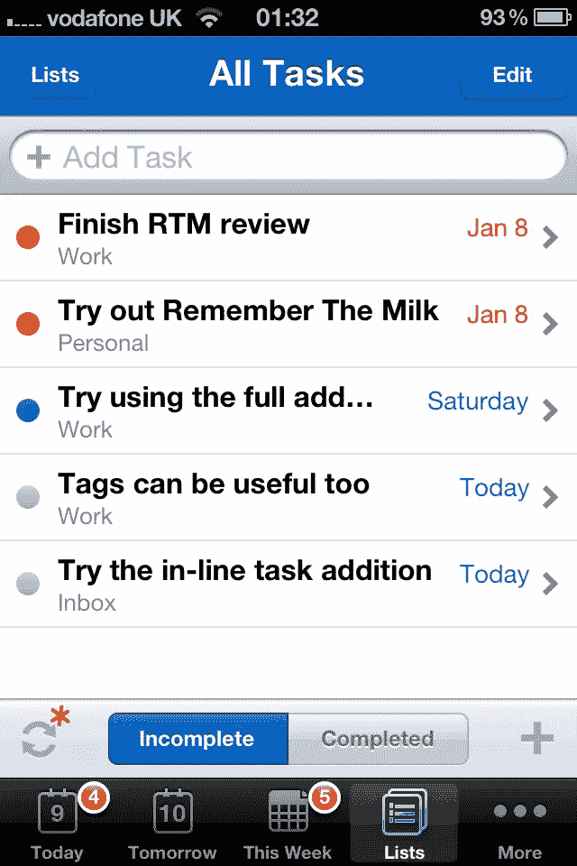

# 待办事项清单最佳 iOS 应用？

> 原文：<https://www.sitepoint.com/best-ios-app-for-to-do-list/>

多年来，我一直带着一台值得信赖的黑红笔记本(你看，对鼹鼠皮来说还不够时髦……)，最终我决定我应该适当尝试一下完全数字化。尝试各种应用程序，我发现有些太复杂，有些太简单…然后一个感觉刚刚好。

## 记得牛奶吗

记得牛奶(RTM)最初是一项基于网站的服务，但配套的 iPhone 应用程序(以及新发布的 iPad 应用程序)将它的实用性提升到了一个新的水平。为了相信任何东西都是保存所有任务和提醒的“唯一”地方，你需要相信你会一直带着它，并且添加东西会很快很容易。iPhone 上的 RTM 正好符合这个要求。

## 正在设置

设置非常简单:从[应用商店](http://itunes.apple.com/app/remember-the-milk/id293561396?mt=8)下载免费应用，然后设置一个帐户(或者如果你已经有了一个帐户，只需登录)。

 

登录或注册

有益的是，它们会自动为你添加第一个任务，所以你可以勾掉一些东西，并从几乎立即完成的任务中获得小小的满足感！

## 连接

界面干净，一点也不生硬。您可以从各种视图中选择——默认为今天、明天和本周，但列表下还有其他选项。就我个人而言，我觉得列出所有的任务是最有用的，但这主要是因为我不一定要给我的任务指定截止日期，因为我是一个热衷于完成事情的人。

 

主屏幕和添加任务表单

### 添加任务

添加任务有两种方式:表单屏幕和内嵌选项。对于前者，点击右下角的+符号，然后填写所需的字段(名称、列表、优先级、标准到期日期、添加字段下的附加选项)。

不过在我看来，内嵌任务添加要快得多&因此在移动中更方便:选择顶部的栏，然后开始输入。您可以使用按钮或定义的字符来添加优先级(！)、到期日(^)、列表/标签(#)、位置(@)、时间(=)、重复(*)。

添加内嵌任务

### 显著的特征

定义位置是一个特别好的特性。您可以在“更多”>“位置”下进行搜索。对于街道地址，它似乎很有关系。

 

所有选项

为什么要这么做？因为你可以将任务分配到一个位置，当你在附近时，应用程序会提醒你这些任务！当你不希望你的待办事项清单上堆满了只与超市(“记得买牛奶”)、办公室(“上交费用”)或家里(“放垃圾桶”)相关的任务时，这真的很有用。

列表可以让你对你的任务进行分类(默认包括工作、学习、个人、收件箱)，如果你以类似的方式划分你的一周，这很有帮助。作为集中注意力的工具也很有用——也许在这个特别的周六，你真的想把注意力放在写作、家庭装修或类似的事情上。

所有任务视图

除了列表，还有标签，以防你有另一个维度。对于 GTD 爱好者来说，这可能是采取行动的地方，也许有一天，等待，等等。

## 付钱还是不付钱？

令人鼓舞的是，基本免费帐户和免费 iPhone 应用程序功能齐全，不像许多免费版本严重受损，只是付费应用程序的试玩/预览。升级到专业帐户(每年 25 美元)主要是允许无限制同步(免费版本限制为每 24 小时一次)和推送通知。

免费应用程序当然足以让你开始使用，但如果你发现自己完全依赖于记住牛奶，你可能需要投资一个专业账户。这使得你的 iPhone，iPad 或其他设备(也有黑莓和 Android 应用程序和 Outlook 集成可用)可以随时与网站同步。如果你在多种设备上工作，一个月几美元对于提高工作效率来说并不是很高的代价！

## 裁决

“记住牛奶”iPhone 应用程序是一个设计精美、直观的伴侣，是已经非常优秀的在线任务管理系统的补充。它功能多样，可定制，设置起来一点也不复杂。这款免费应用功能强大，功能齐全，升级到价格合理的专业帐户主要是为了给你更好的同步和通知。无论你已经井井有条，想要一个伟大的工具让一切数字化，或者你的新年决心是有一个适当的待办事项清单，而不是目前装饰你桌子的便利贴，记住牛奶很可能是答案。

## 分享这篇文章