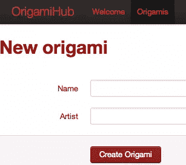
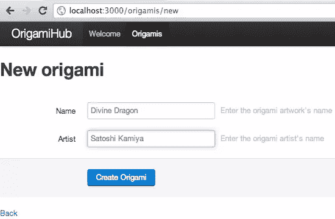
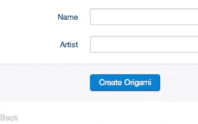
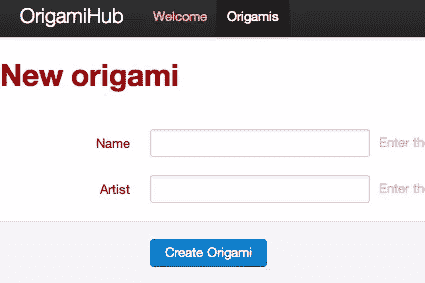
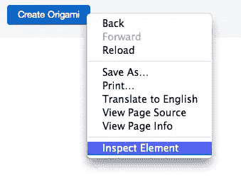
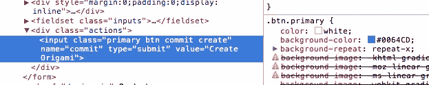

# 如何在 Rails 应用中定制 Twitter Bootstrap 的设计

> 原文：<https://www.sitepoint.com/how-to-customize-twitter-bootstraps-design-in-a-rails-app/>



也许像这样定制 Twitter Bootstrap 的设计并不是一个好主意！

回到 11 月[，我讨论了将](https://www.sitepoint.com/twitter-bootstrap-less-and-sass-understanding-your-options-for-rails-3-1/) [Twitter Bootstrap](http://twitter.github.com/bootstrap/) 集成到 Rails 3.1 应用程序的各种选择，包括使用 [less-rails-bootstrap](https://github.com/metaskills/less-rails-bootstrap) 和 [bootstrap-sass](https://github.com/thomas-mcdonald/bootstrap-sass) gems。上个月[我写了一个后续教程](https://www.sitepoint.com/too-good-to-be-true-twitter-bootstrap-meets-formtastic-and-tabulous/)，展示如何使用 Twitter Bootstrap、Formtastic 和 Tabulous 快速创建一个工作网站。今天，我想继续讨论如何定制 Twitter Bootstrap 设计本身。

你可能会问:为什么要定制 Twitter Bootstrap？毕竟，他们的设计开箱后看起来很棒——为什么要怀疑他们的设计决策呢？好吧，你可能决定你更喜欢某种颜色或字体，或者更有可能你想把你的网站和所有其他使用 Twitter Bootstrap 的网站区分开来。它非常易于使用，许多开发人员都采用了它，越来越多的网站也开始拥有相同的外观和感觉。

或者你可能会问相反的问题:为什么不干脆放弃 Twitter Bootstrap，写你自己的设计，让你的网站从所有使用 Twitter Bootstrap 的网站中脱颖而出？原因是 Twitter Bootstrap 提供了大量有用的 CSS 支持，这需要很长时间来重新实现。只要看看他们主页上的所有功能就知道了——仅仅为了让你的网站看起来有点不同而放弃所有这些功能是错误的。

我最近遇到的一个有趣的选项是“Twitter Bootstrap themes”的概念，它允许你从一系列不同的设计中进行选择，同时保留所有的重置、排版、表单、表格和其他样式支持。虽然现在还没有主题，但巴黎设计师兼企业家 Sacha Greif 目前正在设计第一个主题，为 Twitter 的设计提供一个替代方案，他称之为“模糊”你可以[在这里](http://sachagreif.com/bootstrap/)注册，让 Sacha 在准备好的时候给你发邮件。

然而，由于 Twitter Bootstrap 主题仍然不可用，今天我将讨论如何自己定制 Twitter Bootstrap 的 Less 和/或 Sass 代码的技术机制——假设你是一名优秀的设计师或者正在与一名优秀的设计师合作:Twitter 代码在哪里？如何更改他们的字体和颜色设置？我如何对他们的设计做更多实质性的改变？请继续阅读，了解更多信息…

## 用 Bootstrap-Sass 定制 Twitter 引导变量

[上个月，我展示了如何构建一个简单的 Rails 3.1 搭建网站，名为“OrigamiHub”，最终看起来是这样的:](https://www.sitepoint.com/too-good-to-be-true-twitter-bootstrap-meets-formtastic-and-tabulous/)



上个月的折纸中心应用程序

为了构建 OrigamiHub，我使用了一个名为 [Bootstrap-Sass](https://github.com/thomas-mcdonald/bootstrap-sass) 的 Ruby gem。我通过编写包含以下代码的名为 app/assets/style sheets/origami _ hub . CSS . scss 的文件将 Twitter 代码导入到站点中:

```
@import 'bootstrap';

body {
  padding-top: 60px;
}
```

虽然上个月我没有这样解释，但这已经是如何定制 Twitter 设计的最简单的例子了:“padding-top”样式覆盖或添加到 Twitter 选择的标准正文样式。通过在“@import 'bootstrap””行后声明您的样式，您可以用自己的样式覆盖它们的 CSS 样式代码。这很容易理解:浏览器按照接收的顺序处理所有的 CSS 代码；最后收到的代码将覆盖前面声明的 CSS 样式。通过将样式放在第二位，你可以很容易地覆盖 Twitter 的 CSS 代码所做的任何事情。

然而，Twitter Bootstrap 背后的开发人员预计，设计师可能希望调整他们的颜色、字体或布局选择，并创建了一个名为“变量”的代码文件，其中包含常用的全局值。因为我对 OrigamiHub 使用了 Bootstrap-Sass，所以这个文件将被命名为 variables.css.scss，我将能够使用 Bundler 找到它，如下所示:

```
$ cd `bundle show bootstrap-sass`
$ find vendor/assets/stylesheets
vendor/assets/stylesheets
vendor/assets/stylesheets/bootstrap
vendor/assets/stylesheets/bootstrap/forms.css.scss
vendor/assets/stylesheets/bootstrap/mixins.css.scss
vendor/assets/stylesheets/bootstrap/patterns.css.scss
vendor/assets/stylesheets/bootstrap/reset.css.scss
vendor/assets/stylesheets/bootstrap/scaffolding.css.scss
vendor/assets/stylesheets/bootstrap/tables.css.scss
vendor/assets/stylesheets/bootstrap/type.css.scss
vendor/assets/stylesheets/bootstrap/variables.css.scss
vendor/assets/stylesheets/bootstrap.css.scss
```

详见[11 月的帖子](https://www.sitepoint.com/twitter-bootstrap-less-and-sass-understanding-your-options-for-rails-3-1/)。现在我们来看看 variables.css.scss 的内部是什么:

```
/* Variables.less
 * Variables to customize the look and feel of Bootstrap
 * ----------------------------------------------------- */

// Links
$linkColor:         #0069d6 !default;
$linkColorHover:    darken($linkColor, 15) !default;

// Grays
$black:             #000 !default;
$grayDark:          lighten($black, 25%) !default;
$gray:              lighten($black, 50%) !default;
$grayLight:         lighten($black, 75%) !default;

...etc...
```

不难发现，通过改变其中一个值，我们可以快速改变网站的外观。然而，直接编辑这段代码并不是一个好主意，因为它位于 Bootstrap-Sass gem 内部。相反，正如 Thomas McDonald 在 [Bootstrap-Sass Readme 页面](https://github.com/thomas-mcdonald/bootstrap-sass)上所示，您可以通过在导入 Bootstrap 之前指定您想要的值来更改其中一个值，如下所示:

```
$linkColor: #FF69d6;

@import 'bootstrap';

body {
  padding-top: 60px;
}
```

现在重新加载页面，我得到一个粉红色的“返回”链接:



粉色背面链接

如果这对您不起作用，请确保您拥有最新版本的 Bootstrap-Sass，至少是 1.4.1 版或更高版本:

```
$ bundle update bootstrap-sass
```

原来在上面的 variables.css.scss 文件中有一个微妙但重要的细节——对“！default”在每个变量声明的末尾:

```
$linkColor:         #0069d6 !default;
```

这里”！default”是 Sass 语言的一个特性，意思是:如果已经为这个变量声明了一个值(本例中为“linkColor”)，那么就保持不变并使用它。如果不是，则使用默认的指定值(此处为#0069d6)。实际上，这意味着您需要确保在“import bootstrap”行之前而不是之后声明自定义变量设置。“这样使用！default”是最近添加到 Bootstrap-Sass 中的，所以在尝试从 variables.css.scss 中更改设置之前，请确保更新 gem。

## 用 Less-Rails-Bootstrap 定制 Twitter 引导变量

正如我在 11 月份解释的那样，将 Twitter Bootstrap 纳入 Rails 应用程序的另一个选择是使用 Less 语言而不是 Sass，使用 [Less-Rails-Bootstrap](https://github.com/metaskills/less-rails-bootstrap) gem。虽然不像 Sass 那样默认包含在 Rails 应用程序中，但 Less 可能是一个不错的选择，因为它是 Twitter 最初用来开发 Twitter Bootstrap 的语言。

如果我使用 Less-Rails-Bootstrap 来构建 OrigamiHub，我会有一个名为 origami_hub.css.less 的文件，代码非常相似:

```
@import 'twitter/bootstrap';

body {
  padding-top: 60px;
}
```

这里唯一的区别是“import”命令包含一个不同的 Less 代码路径，因为 Less-Rails-Bootstrap 使用一个稍微不同的目录结构:

```
$ cd `bundle show less-rails-bootstrap`
$ find vendor/assets/stylesheets
vendor/assets/stylesheets
vendor/assets/stylesheets/twitter
vendor/assets/stylesheets/twitter/bootstrap.css.less
```

您只能看到位于 vendor/assets/stylesheets 下的顶级 bootstrap.css.less 文件。下面是其他较少的代码文件:

```
$ find vendor/frameworks
vendor/frameworks
vendor/frameworks/twitter
vendor/frameworks/twitter/bootstrap
vendor/frameworks/twitter/bootstrap/bootstrap.less
vendor/frameworks/twitter/bootstrap/forms.less
vendor/frameworks/twitter/bootstrap/mixins.less
vendor/frameworks/twitter/bootstrap/patterns.less
vendor/frameworks/twitter/bootstrap/reset.less
vendor/frameworks/twitter/bootstrap/scaffolding.less
vendor/frameworks/twitter/bootstrap/tables.less
vendor/frameworks/twitter/bootstrap/type.less
vendor/frameworks/twitter/bootstrap/variables.less
vendor/frameworks/twitter/bootstrap.less
```

这里我们可以看到所有相同的代码文件，但是使用了“less”文件扩展名。您将在 variables.less 中找到与我们在 variables.css.scss 中看到的相同的一组变量和值:

```
// Links
@linkColor:         #0069d6;
@linkColorHover:    darken(@linkColor, 15);

// Grays
@black:             #000;
@grayDark:          lighten(@black, 25%);
@gray:              lighten(@black, 50%);
@grayLight:         lighten(@black, 75%);

...etc...
```

Less 使用了与 Sass 稍有不同的语法:“@linkColor”而不是“$linkColor”。“也是我们看不到的！默认”指令。最重要的是，在 Less 中改变变量的值与在 Sass 中不同；没有默认值和覆盖它的概念。事实上，在 Less 中，变量实际上是作为常量实现的。更多详情见[lesscss.org](http://lesscss.org)。这意味着一旦你为一个变量定义了一个值，它就不能被改变。

乍一看，这可能意味着更改 Twitter 引导设置的唯一方法是直接在 Less-Rails-Bootstrap 中编辑 Twitter Less 代码。但是这将是非常丑陋的:每次我更新 Less-Rails-Bootstrap 时，我都会丢失我的更改。虽然使用 git 跟踪我在分支中的更改是可能的，但每次我得到新版本时都会重新合并，这将是一个明显的维护问题，也是一个令人头疼的问题。

事实上，有一种更简单的方法。由于 Less 编译器中的一个错误，您可以通过在最初声明变量后更改它来覆盖变量的“常量”值。也就是说，变量常量的值将是它最后被赋值的值。似乎 Less 编译器首先评估所有常量的值，然后评估 Less 脚本的其余部分，为每个变量代入值。

这对于定制 Less-Rails-Bootstrap 意味着您需要在导入行之后声明您的定制变量值，而不是像 Bootstrap-Sass 那样在它之前声明。下面是一个将灰度颜色更改为红色的示例:

```
@import 'twitter/bootstrap';

body {
  padding-top: 60px;
}

@black: #200;
```

“#200”指的是不太黑，但有一些红色在里面的颜色；记住“RGB”=“红绿蓝。”现在我的网站看起来像这样:



@黑色变量变为红色

## 变量还不够！

遗憾的是，variables.less 文件中没有足够的可定制设置——除了 linkColor，唯一的其他设置与字体大小、颜色和网格大小有关。正如你从上面的屏幕截图中看到的，颜色设置实际上甚至不能正常工作，因为许多 Twitter Less 代码文件直接引用硬编码的颜色值:这里的导航栏仍然是黑色的，尽管我已经将“黑色”的值改为更红。此外，首先将“黑色”变量的值改为红色非常奇怪…非常令人困惑！

不幸的是，定制 Twitter Bootstrap 设计的唯一好方法是仔细查看您在站点中使用的 HTML，找到您实际使用的样式是在哪里定义的，然后根据需要覆盖 Sass 或更少的代码。

让我们举个例子:假设我或我的设计师决定把“创建折纸”按钮做成红色，而不是蓝色。唯一有效的方法是首先使用 Chrome 的“Inspect Element”命令(或您喜欢的浏览器中的类似命令),如下所示:



Chrome Inspect->元素右键菜单项

…然后找到元素的 CSS 样式:



在 Chrome 开发者工具窗口中查找样式

这里我可以看到按钮的蓝色背景色是由“btn.primary”类设置的。在 Less-Rails-Bootstrap 的 Less 代码中搜索这个定义:

```
$ cd `bundle show less-rails-bootstrap`
$ cd vendor/frameworks/twitter/bootstrap
$ ack btn
patterns.less
512:.btn,
545:// Base .btn styles
546:.btn {
619::root .btn {
624:button.btn,
625:input[type=submit].btn {
697:  .btn {
871:  .btn {
```

…我可以看到与按钮相关的样式是在 patterns.less 中定义的。通过查看文件，我找到了主要的按钮样式代码:

```
// Base .btn styles
.btn {
  // Button Base
  cursor: pointer;
  display: inline-block;

... etc ...

  // Primary Button Type
  &.primary {
    color: @white;
    .gradientBar(@blue, @blueDark)
  }

... etc...

}
```

这里你可以看到主按钮是如何定义的:使用白色字体颜色和渐变蓝色背景(“blue”“>“blue dark”)。您还可以看到蓝色值被硬编码到 patterns.less 文件中 variables.less 中没有变量，称为“$primaryButtonColor”或类似的东西，尽管有一个注释表明该变量可能很快会被添加。

要将表单按钮改为红色，我们需要将这段代码复制/粘贴到应用程序的 Less 文件(origami_hub.css.less)中，并进行所需的更改:

```
@import 'twitter/bootstrap';

body {
  padding-top: 60px;
}

// Custom colors:
@black:   #200;
@redDark: darken(@red, 5);
@linkColor: @redDark;
@titleColor: lighten(@red, 10);

// Copied from vendor/frameworks/twitter/bootstrap/patterns.less in less-rails-bootstrap
.btn {

  // Primary Button Type
  &.primary {
    color: @white;
    .gradientBar(@red, @redDark)
  }
}

.topbar {
  // Hover and active states
  ul .active &gt; a {
    color: @titleColor;
  }

  a {
    color: @titleColor;
  }

  // Website name
  .brand {
    color: @titleColor;
  }
}
```

在这里，我定义了几个新的红色阴影，并使用它们来覆盖与导航栏文本相关的一些其他样式定义，以及主按钮样式，从而使我的站点更红:


OrigamiHub 带有 Twitter 引导设计的定制版本

## 结论

这看起来像是把一些东西从蓝色变成红色的大量工作！何必呢？或者为什么不干脆完全抛弃 Twitter Bootstrap，从头开始呢？

原因是显而易见的:如果您花几分钟时间浏览一下 Twitter Bootstrap Less 或 Sass 代码文件，您会看到大量有用的样式和特性。以下是几个例子:

*   reset . less——基于 Eric Meyer 2007 年的工作，包含了创建一个干净的跨浏览器基础的重置样式。
*   mixins . less——包含一系列有用的函数，可以被其他样式重用。
*   type.less 有用的排版工具。
*   等等……等等……

而这仅仅是开始；有很多 Twitter 的 Bootstrap 特性我还没有在这里提到。此外，Twitter Bootstrap 的新版本 v2.0 正在开发中，很快会添加更多的 Less/Sass 代码文件和 CSS 特性。

我认为 Twitter Bootstrap 是一个 CSS 编码平台。与 Rails 通过实现所有网站都需要的常用功能来简化网站构建一样，Twitter Bootstrap 以小得多的规模实现了任何网站都需要的许多风格特性。问题是，为了有效地使用它，你真的需要花时间去学习 Less，或者翻译的 Sass，代码是如何工作的，因为有许多硬编码的设计细节。要将它与您或与您一起工作的设计师编写的定制、独特的设计一起使用，您需要手动复制、粘贴和定制 Twitter Bootstrap 中您想要更改的部分。希望在未来的版本中，这个过程会变得更容易，因为他们添加了更多的变量和其他方式来定制他们的设计！

## 分享这篇文章