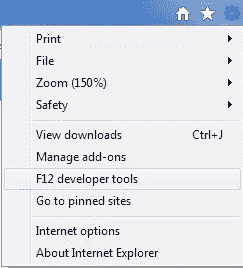
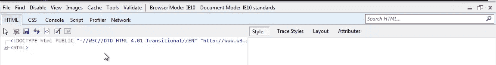

# 为 Web 标准更新您的文档模式

> 原文：<https://www.sitepoint.com/update-your-docmode-for-web-standards/>

文档兼容性定义了浏览器呈现网站的方式。你越是明确地告诉浏览器该期待什么，用户的体验就越好。当使用像 HTML5 这样的 web 标准时，从[显式声明](http://msdn.microsoft.com/en-us/library/cc288325(v=VS.85).aspx)html 5 文档类型:`开始`

 ````
<!DOCTYPE html>
```

这个标记触发了 Internet Explorer 9 和 10 中的标准模式。而且在 Chrome 和 Firefox 上也很好用。四个步骤将使你的网站为许多浏览器和设备做好准备:

### 步骤 1:验证你的站点使用标准模式。

检查您的站点当前是否处于标准模式:

1.在 [IE10 平台预览](http://ie.microsoft.com/testdrive/Info/Downloads/Default.html)中打开网站。

**注意:**你也可以按照同样的步骤，只为 IE9 更新 docmode，不下载预览。

2.按 F12 启动 IE 开发工具或在工具菜单中找到它，如下所示:



**注意:**如果你不熟悉使用 IE F12 开发者工具调试网页，请阅读下面的[教程](http://msdn.microsoft.com/en-us/library/gg589507%28v=VS.85%29.aspx)。

检查您的站点是否显示如下工具栏所示的*浏览器模式:IE10 和文档模式:IE10 标准*:



如果你的站点处于*浏览器模式:IE10 和文档模式:IE10 标准*，你就完成了！请注意您站点的浏览器模式和文档模式是否与上述不同。一个常见的例子是*浏览器模式= IE8* 和*文档模式=怪癖*，这表明你的网站是为 IE 的旧版本设计的，可能还没有为网络标准做好准备。


### 步骤 2:为 web 标准实现 docmode

强制 IE10 标准模式测试您的网站:

1.  将`<!DOCTYPE html>`插入你网站的 HTML 页面。点击了解更多关于如何更新你的文档类型[。](http://msdn.microsoft.com/en-us/library/cc288325(v=VS.85).aspx)
2.  在浏览器中重新加载页面，并使用 F12 开发人员工具再次检查浏览器模式和文档模式。如果*浏览器模式:IE10 和文档模式:IE10 标准*未显示，请继续下面的操作。

### 步骤 3:确定为什么你的站点不在标准模式下

大多数问题都与支持旧版本的 IE 有关。首先确保基于标准的代码在 IE9 和 10 中呈现。然后为旧版本的 IE 保留你的非标准代码。

1.我的页面不在浏览器模式:IE10

**可能的原因:**您的网站可能在[兼容性视图](http://msdn.microsoft.com/en-us/library/dd567845(v=VS.85).aspx)中被标记，并被强制进入旧浏览器模式以确保网站功能。
**解决方案:**查看你的网站是否在列表上[这里](http://ie9cvlist.ie.microsoft.com/ie9CompatViewList.xml)。点击了解有关兼容性视图列表和请求删除[的更多信息。](http://msdn.microsoft.com/en-us/library/dd567845(v=VS.85).aspx)

2.我的页面不在文档模式= IE10

**可能的原因:**您网站的 doctype 无效或缺失。
**解析:**检查一个[有效的、格式良好的 doctype](https://www.w3.org/QA/2002/04/valid-dtd-list.html) 比如:

```
<!DOCTYPE html>
<!DOCTYPE HTML PUBLIC "-//W3C//DTD HTML 4.01//EN" "https://www.w3.org/TR/html4/strict.dtd"> 
<!DOCTYPE html PUBLIC "-//W3C//DTD XHTML 1.0 Strict//EN" "https://www.w3.org/TR/xhtml1/DTD/xhtml1-strict.dtd">
```

点击了解有关如何更新您的文档类型[的更多信息。](http://msdn.microsoft.com/en-us/library/cc288325(v=VS.85).aspx)

**可能的原因:** Docmode 通过[兼容 X-UA 的元标签](http://msdn.microsoft.com/en-us/library/cc288325(v=vs.85).aspx)被强制。
**解析:**在页面的中检查与此类似的代码。

删除它并重新加载您的页面。继续测试。点击了解更多关于指定文档兼容模式[的信息。](http://msdn.microsoft.com/en-us/library/cc288325(v=VS.85).aspx)

### 步骤 4:解决更新 docmode 时常见的 IE 问题

大多数问题都与支持旧版本的 IE 有关。首先确保基于标准的代码在 IE9 和 10 中呈现。然后为旧版本的 IE 保留你的非标准代码。

**可能原因:** [条件评论](http://msdn.microsoft.com/en-us/library/ms537512%28v=vs.85%29.aspx)支持浏览器版本特定功能。
**解析:**检查运行非标准代码的[条件注释](http://msdn.microsoft.com/en-us/library/ms537512%28v=vs.85%29.aspx)。这些通常用在老版本 IE 支持的特定功能上，以允许页面适度降级。检查类似以下内容的代码:

```
<!--[if IE 8]>
<p>Welcome to Internet Explorer 8.</p>
< ![endif]-->
```

删除它并重新加载您的页面。继续测试。点击了解更多关于条件注释[的信息。](http://msdn.microsoft.com/en-us/library/ms537512%28v=vs.85%29.aspx)

**可能原因:**用户代理嗅探支持浏览器版本特定功能
**解决方法:**检查[用户代理嗅探](http://blogs.msdn.com/b/ieinternals/archive/2011/06/30/perils-of-user-agent-sniffing-browser-mode-document-mode-compatibility-view.aspx)。这些通常用于根据通过浏览器模式显示的用户代理字符串专门定位浏览器。检查类似以下内容的代码:

```
if (version = /MSIE (d+.d+)/.exec(navigator.userAgent)) {
​isIE = true;
browserVersion = parseFloat(version[1]);
}
```

从实施[特性检测](http://blogs.msdn.com/b/ie/archive/2010/04/14/same-markup-writing-cross-browser-code.aspx)开始，尽可能使用 web 标准。点击了解更多关于用户代理字符串[的信息。IE10 用户代理字符串位于](http://msdn.microsoft.com/en-us/library/ms537503(v=VS.85).aspx)[这里](http://blogs.msdn.com/b/ie/archive/2011/04/15/the-ie10-user-agent-string.aspx)。

## 我的页面无法正确呈现的其他原因

**可能的原因:**您的网站可能正在使用不再受支持的浏览器特定功能。尽可能使用 web 标准。
**解决方法:**运行[兼容性检查工具](http://ie.microsoft.com/testdrive/HTML5/CompatInspector/Default.html)。

**可能的原因:**您的网站可能正在使用 IE10 metro 不再支持的第三方插件或 Flash、Quicktime 和 Silverlight。尽可能使用 web 标准。
**解决:**学习如何创建插件免费体验。完整的分步指南将很快推出。

**可能的原因:**您的网站可能正在加载特定于浏览器版本的 CSS 文件:
**解决方法:**确保布局尽可能避免 CSS 攻击。点击了解更多关于调查 CSS 问题的信息[。](http://msdn.microsoft.com/en-us/library/gg699340(v=VS.85).aspx)

常见问题列表可在 [IE 兼容性指南](http://msdn.microsoft.com/en-us/library/ff986083(v=VS.85).aspx)中找到。

如果你不能用这些解决步骤更新你的文档模式，发 tweet us @IE 或者查看 MSDN 的论坛。

要了解更多细节，请尝试这些文章:
[定义文档能力](http://msdn.microsoft.com/en-us/library/cc288325(v=VS.85).aspx) @ MSDN
[调查文档模式问题](http://msdn.microsoft.com/en-us/library/gg699340(v=VS.85).aspx) @ MSDN
[互操作怪癖模式](http://blogs.msdn.com/b/ie/archive/2011/12/14/interoperable-html5-quirks-mode-in-ie10.aspx)在 IE10 @ IE 博客
[兼容性检查工具](http://ie.microsoft.com/testdrive/HTML5/CompatInspector/)@ IETestDrive.com
[别忘了添加一个 Doctype](https://www.w3.org/QA/Tips/Doctype)@ W3C.org` 

## `分享这篇文章`