# 有趣的 JavaScript、jQuery 和随机网络开发——2011 年 12 月

> 原文：<https://www.sitepoint.com/javascript-jquery-web-dev-dec-2011/>

## 1kb 以下的竞赛 JavaScript

可怕的竞争，期待下一个。

这是史蒂文·威登的尝试，不错的伙伴！[http://acko.net/blog/js1k-demo-the-making-of](http://acko.net/blog/js1k-demo-the-making-of)

## 术语工具包

这绝对是为那些 linux 用户准备的！
[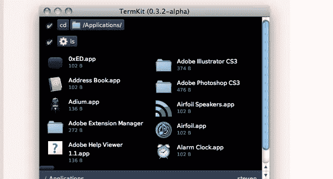](http://acko.net/blog/on-termkit) 

## 画布投影纹理

用 HTML5 Canvas 和 JavaScript 实现令人敬畏的图像倾斜。
[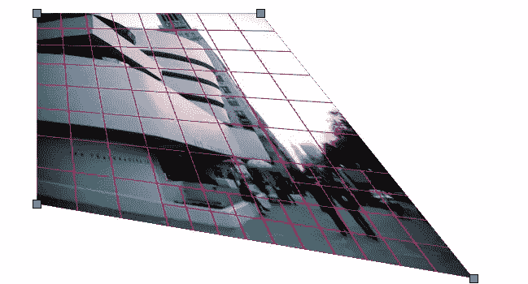](http://acko.net/files/projective/index.html)

## JavaScript 和 CSS3 动画(过渡)

如果在 FF 不行，那就在 Chrome 试试。相信我，这是值得的！

[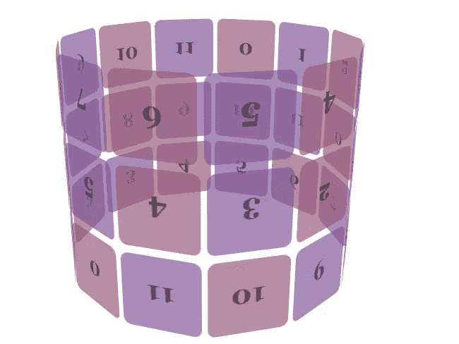](http://www.webkit.org/blog-files/3d-transforms/poster-circle.html)

这是另一个很酷的。

[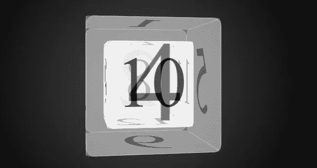](http://www.webkit.org/blog-files/3d-transforms/morphing-cubes.html)

## jQuery 空间库

有趣的画廊效应。
[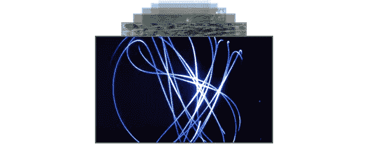](http://www.eyecon.ro/spacegallery/)

## jQuery 流沙插件

重新排序和过滤项目与一个很好的洗牌动画。
[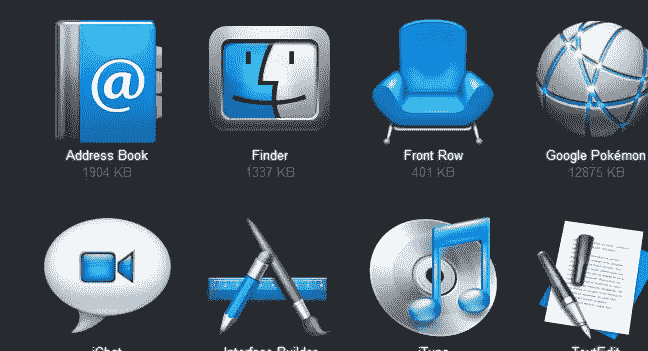](http://razorjack.net/quicksand/)

## 录像

jQuery HTML 5 视频播放器。免费下载。
[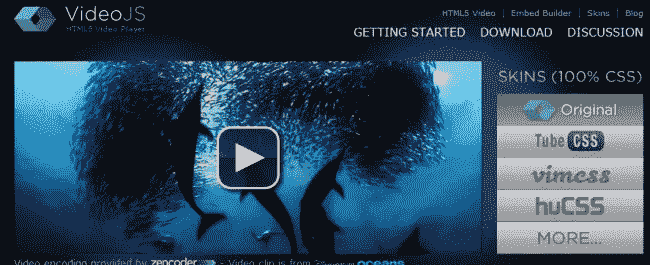](http://videojs.com/)

## 一群小商店

非常好的基于 jQuery 的图像滑块。免费下载。
[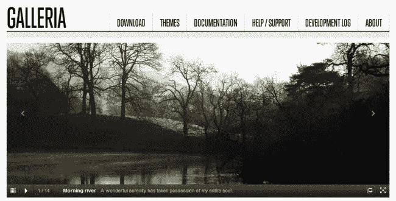](http://galleria.aino.se/)

## Addy Osmani 谈论 jQuery MVC

[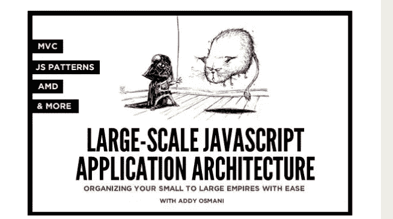](http://addyosmani.com/blog/large-scale-javascript-application-architecture/)

## jpgraph

非常酷的图表选择。
[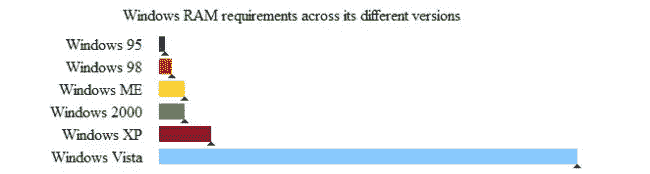](http://webdevnews.net/2009/07/fmcharts-dynamic-accessible-web-charts/)

## 移动电话

值得分享。
[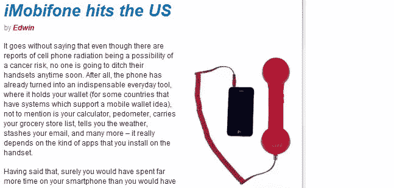](https://www.imobifone.com/) 
文章:[http://www.coolest-gadgets.com/20111130/imobifone-hits/](http://www.coolest-gadgets.com/20111130/imobifone-hits/)

## 防水键盘

嗯，我想知道这在哪里会派上用场？！？
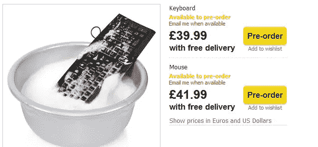【http://www.firebox.com/product/2329/Waterproof-Keyboard】T2

## 浏览 JavaScript/jQuery 编码测试用例

对于热衷于开发的人来说，总是值得一看的。[http://jsperf.com/browse](http://jsperf.com/browse)

## 保罗爱尔兰 jQuery 峰会 2010

[https://vimeo.com/16953637](https://vimeo.com/16953637)

希望你喜欢这个系列，敬请期待下个月的版本。

## 分享这篇文章