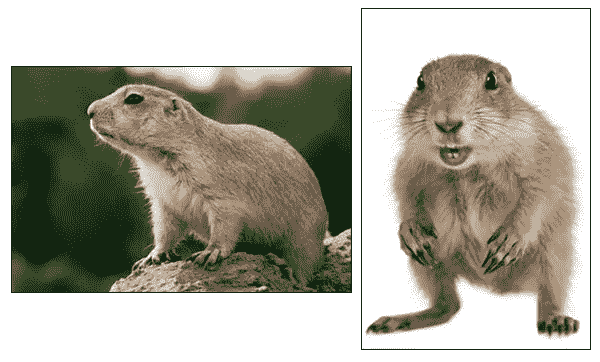
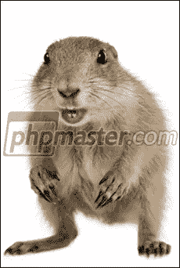

# 使用 Imagick 的图像水印

> 原文：<https://www.sitepoint.com/watermarking-images/>

想象一下，有一天你的一个朋友找到你，希望你给她建一个网站，让她展示自己的摄影作品。她希望能够轻松上传自己的照片，并为它们添加水印，这样人们就不会轻易窃取它们。“放心吧！”你告诉她，因为你知道有一些由 [Imagick 扩展](http://php.net/manual/book.imagick.php)提供的函数使得在 PHP 中给图像加水印变得轻而易举。

这篇文章分享了一些关于什么是有效的水印的要点，然后展示了如何使用 Imagick 函数给你的图像添加水印。在开始之前，请确保 Imagick 扩展在您的主机上可用。还建议找几张图片来测试水印，以评估其有效性。

## 什么是好的水印

为了使水印有效，它需要在各种背景下可见。我建议你至少找一张很亮的测试照片，另一张很暗的。例如，来自 Shutterstock 的这两张草原犬鼠图片是一个很好的测试对:



重要的是，水印足够透明，以便您仍然能够看到原始图像，但又足够不透明，以便不道德的人很难移除。40%的不透明度可能是一个很好的起点，你可以根据情况增加或减少它。

你也希望水印足够大。如果你简单地在右下角放一个小水印，它是被裁剪掉的主要目标。覆盖大部分原始图像的水印更有效。请看 [iStockPhoto](http://www.istockphoto.com/) 和 [Shutterstock](http://www.shutterstock.com) 如何为他们的作品添加水印的例子。

最后，水印要有对比度。考虑用轻击使水印变暗，反之亦然。这就是 iStockPhoto 和 Shutterstock 所做的，无论原始图像是亮还是暗，他们的标记在所有图像上都很容易看到。

对于这篇文章，我将使用它作为我的水印，一个不透明度为 40%的 PNG 文件:


## 添加水印

添加水印是一个简单的 4 步过程:首先，你打开原始图像，其次，你打开水印，然后你覆盖在第一个图像上的水印，然后保存或输出结果。代码如下:

```
<?php
// Open the original image
$image = new Imagick();
$image->readImage("/path/to/image.jpg");

// Open the watermark
$watermark = new Imagick();
$watermark->readImage("/path/to/watermark.png");

// Overlay the watermark on the original image
$image->compositeImage($watermark, imagick::COMPOSITE_OVER, 0, 0);

// send the result to the browser
header("Content-Type: image/" . $image->getImageFormat());
echo $image;
```

您可以通过创建一个新的`Imagick`类实例并使用它的`readImage()`方法从一个路径中打开图像。关于 Imagick 的一个好处是，它可以在任何时候打开 ImageMagick 编译支持的文件，所以你不需要明确地告诉它文件是 JPEG 或 PNG 它很聪明，能自己想明白。

要覆盖水印图像，您可以使用`compositeImage()`方法。在本例中，该方法接受四个参数:第一个是将被覆盖的图像，第二个是预定义的常数，表示 Imagick 应该执行哪种类型的合成操作(有一个[整体旋转可以从](http://www.php.net/manual/en/imagick.constants.php#imagick.constants.compositeop)中选择，以实现不同的效果)，第三个和第四个参数是放置水印的 X 和 Y 坐标，以左上角的像素为单位。

默认情况下，PHP 假定脚本的输出是 HTML，并自动发送一个*文本/html* 内容类型的头。如果你输出图像，浏览器不会正确处理它，因为标题告诉它你在发送文本。为了避免你的访问者看到一页胡言乱语，你需要指示 PHP 在发送图片之前使用`header()`发送一个更合适的标题。该示例不是对 Content-Type 头的值进行硬编码，而是使用 Imagick 本身来访问图像的类型，然后使用 Imagick 动态地构造一个适当的 MIME 类型。

这是最终的结果，一个带水印的图像:


## 缩放水印

前面的示例将水印放置在原始图像的左上角。如果您事先知道原始图像的大小，这种方法是很好的，因为您可以创建具有适当尺寸的水印，如果原始图像的大小不同，您可能需要一种更健壮的方法。这种方法可能是将水印放在图像的中心，如果水印比原始图像大，则预先缩放水印。

```
<?php
$image = new Imagick();
$image->readImage("/path/to/image.jpg");

$watermark = new Imagick();
$watermark->readImage("/path/to/watermark.png");

// how big are the images?
$iWidth = $image->getImageWidth();
$iHeight = $image->getImageHeight();
$wWidth = $watermark->getImageWidth();
$wHeight = $watermark->getImageHeight();

if ($iHeight < $wHeight || $iWidth < $wWidth) {
    // resize the watermark
    $watermark->scaleImage($iWidth, $iHeight);

    // get new size
    $wWidth = $watermark->getImageWidth();
    $wHeight = $watermark->getImageHeight();
}

// calculate the position
$x = ($iWidth - $wWidth) / 2;
$y = ($iHeight - $wHeight) / 2;

$image->compositeImage($watermark, imagick::COMPOSITE_OVER, $x, $y);

header("Content-Type: image/" . $image->getImageFormat());
echo $image;
```

`getImageWidth()`和`getImageHeight()`方法分别返回图像的宽度和高度，以像素为单位。通过将水印图像的宽度和高度与原始图像的宽度和高度进行比较，您可以确定是否有必要调整水印的大小，使其适合较小的图像。

调整水印的大小是通过调用`scaleImage()`方法完成的，该方法采用允许的宽度和高度。该方法将缩小图像，使最大宽度不大于允许的宽度，最大高度不大于允许的高度，同时保持图像的纵横比。

这是这个例子产生的水印图像:



## 摘要

Imagick 库提供了全面的图像处理 API。事实上，您已经看到了打开图像文件、确定它们的尺寸和图像格式、缩放它们以及将它们叠加在另一个之上以给它们添加水印是多么容易。

如果你想了解更多关于一个扩展的能力，我通常推荐 php.net 的文档，但是对于 Imagick 来说，文档是杂乱无章的。许多方法只给出了它们的参数列表。因此，如果你想了解更多，php.net 仍然是一个很好的起点，但是你可能需要在 ImageMagick 网站和谷歌网站上寻找更多的信息。

## 分享这篇文章