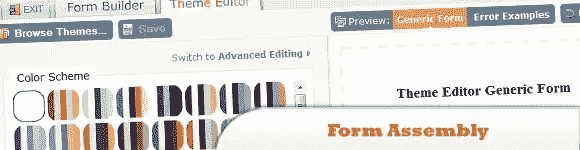
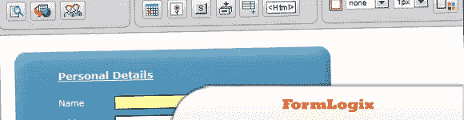
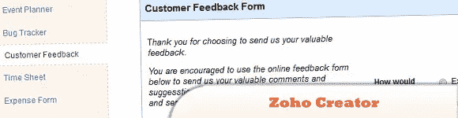

# 10 Ajax/CSS/HTML 在线表单生成器

> 原文：<https://www.sitepoint.com/10-ajaxcsshtml-online-form-builder/>

在本帖中，你会发现我们收集的 **10 个令人敬畏的在线表单生成器**你可以尝试制作自己的网络表单，并将其集成到你的网站中。玩得开心！

注:有些需要会员费。

相关帖子:

*   [**jQuery 表单> 30 个例子和插件**](http://www.jquery4u.com/forms/30-jquery-forms/)
*   [**10 jQuery 表单-可访问性和功能性**](http://www.jquery4u.com/forms/10-jquery-form-%E2%80%93-accessibility-functionality/)
*   [**10 jQuery CSS3 表单教程**](http://www.jquery4u.com/plugins/10-jquery-css3-form-tutorials/)

## 1.模板组件

这是用于 Web 表单的 CSS 样式表集合。

  
[源+演示](http://app.formassembly.com/theme-editor/)

## 2\. JotForm

是第一个基于 Web 的所见即所得的表单生成器。使用浏览器创建和发布 web 表单。它的拖放用户界面使得任何人都可以进行表单构建。

  
[源+演示](http://www.jotform.com/)

## 3.pForm(免费 HTML 表单生成器-在线创建 Web 表单模板)

一个在线工具，有助于立即生成好看的 HTML 表单。

  
[源+演示](http://www.phpform.org/formbuilder/index.php)

## 4.FormLogix

是一个免费的在线表单生成器工具，用于创建 web 表单。我们的在线表格可能会嵌入到您的网页或博客中。

  
[源+演示](http://www.formlogix.com/)

## 5.五福

Is HTML form builder 帮助您创建联系表单、在线调查和邀请，因此您无需编写任何代码就可以收集所需的数据、注册和在线支付。

  
[源+演示](http://www.wufoo.com/)

## 6.表单站点

使用我们的 HTML 表单生成器轻松创建在线表单和调查。

  
[源+演示](http://www.formsite.com/)

## 7.表单 Spring

是一个简单的表单生成器，使公司和组织可以轻松地创建一些在线表单，以开始与网站和数据收集的集成。

  
[源+演示](http://www.formspring.me/)

## 8.冰堡

轻松地为网站和博客创建任何类型的在线表单-不需要编程技能或特殊技能。

  
[源+演示](http://www.icebrrg.com/)

## 9.FAARY

免费的在线 CSS 表单生成器-以简单的方式构建表单！

  
[源+演示](http://faary.com/)

## 10.Zoho 创建者

是所有免费在线表单、网络表单和模板的最简单的在线表单生成器。

  
[源+演示](http://www.zoho.com/creator/online-form-builder/)

## 分享这篇文章