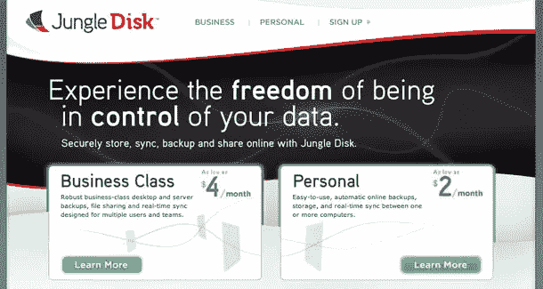
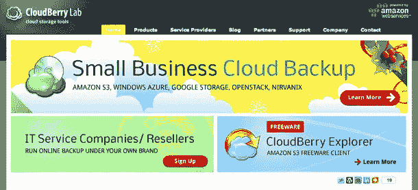

# 5 个有用的亚马逊 S3 备份工具

> 原文：<https://www.sitepoint.com/5-useful-amazon-s3-backup-tools/>

亚马逊网络服务公司的 S3 存储解决方案在很多方面都很有用，并作为许多主要网站的 CDN。但是，尽管这项服务有一系列引人注目的用例，它对于个人便利性来说仍然很方便，比如备份你的数据。在这篇文章中，我们看看五个有用的亚马逊 S3 备份工具。

## S3 备份

“S3 备份是目前最可靠、最快速、最易于使用的解决方案，可以在线备份您的数据，而且仍然安全且经过加密。你可以使用自己的亚马逊 S3 账户，用一些真正强大的密码加密你的文件。运行计划备份作业可以让您放心，因为无论计算机或整个网络发生什么情况，您都可以访问所有重要文件。”

*   获取时间:[马卢克](http://www.maluke.com/software/s3-backup)
*   费用:免费
*   平台:Windows，Mac OS X(测试版)

## 丛林圆盘

“确保你的记忆不会变成单纯的记忆。有了 Jungle Disk，您的重要文档、珍贵照片、家庭电影等总是触手可及。您甚至可以选择存储文件的位置——Jungle Disk 可以与 Rackspace 云文件和亚马逊 S3 无缝协作。”

*   在[丛林盘](https://www.jungledisk.com)获取
*   费用:每月 2 美元起
*   平台:所有

## 龙盘

“DragonDisk 是亚马逊 S3 服务的文件管理系统。DragonDisk 将备份、共享和组织您的数据，这得益于一个类似于 Windows Explorer 的直观界面。它的功能和欢乐会从一开始就说服你，无论你是业余爱好者还是专业用户。”

*   在[龙盘](http://www.dragondisk.com/)获取
*   费用:免费
*   平台:Windows、Mac OS X 和 Linux

## CloudBerry S3 备份桌面

“CloudBerry 在线备份提供了一个强大的备份和恢复程序，旨在利用亚马逊 S3 存储，使您的灾难恢复计划简单、可靠且经济实惠。灾难恢复计划通常是在灾难发生时才想到的。很少有公司能够完全从可能导致业务损失的关键数据丢失中恢复过来。”

*   获取时间: [CloudBerry](http://www.cloudberrylab.com/amazon-s3-microsoft-azure-google-storage-online-backup.aspx)
*   价格:29.99 美元
*   平台:Windows

## 欺骗

“Duplicity 通过生成加密的 tar 格式卷并将其上传到远程或本地文件服务器来备份目录。因为 duplicity 使用 librsync，所以增量归档节省空间，并且只记录自上次备份以来发生变化的文件部分。因为 duplicity 使用 GnuPG 来加密和/或签名这些档案，它们将不会被服务器监视和/或修改。”

*   得到它在:[口是心非](http://duplicity.nongnu.org/)
*   费用:免费
*   平台:GNU/Linux

## 分享这篇文章