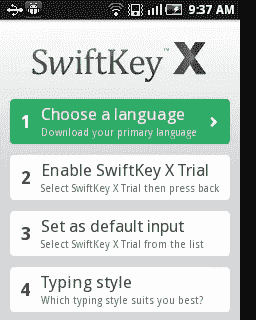
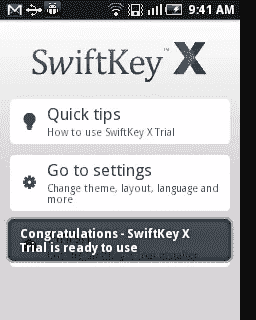
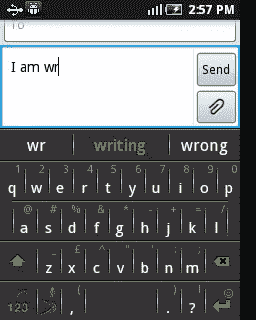
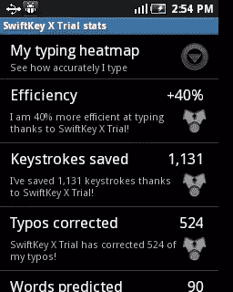

# 最好的安卓键盘:SwiftKey X

> 原文：<https://www.sitepoint.com/android-app-review-swiftkey-x/>

智能手机经常被吹捧为将提高我们日常生活生产力的工具。对于各种类别的大量可用应用程序来说，这通常是正确的。尽管如此，智能手机上最基本的操作是*输入*，这也是使用智能手机的一个痛点。由于智能手机屏幕小，有时还有糟糕的[键盘](https://www.sitepoint.com/best-mechanical-keyboards/)布局，对他们的手指来说往往太小，一些人显然不喜欢在智能手机上打字。

“自动建议”进入需要用户输入文本的网站已经有几年了。谷歌搜索是一个典型的例子。Android 开发者已经认识到智能自动提示可能是在 Android 手机上输入涅槃的一种方式。今天我们来回顾一个这样的应用程序 [SwiftKey X](http://www.swiftkey.net/) ，它可以替代标准的 Android 键盘，并为您将要键入的单词提供智能自动建议，从而使在智能手机上键入变得轻而易举。

SwiftKey X 下载量超过 500，000 次，绝对是 Android 手机的首选键盘替代品之一，我们决定验证一下。

### 下载应用程序

SwiftKey X 可用于 Android 手机和平板电脑。两者都是付费版本，但手机和平板电脑的试用版本都有 30 天，如果你想继续使用智能键盘，这是一个很好的时间，你可以很容易地做出决定。

### 安装和设置

安装很容易，但与大多数 Android 应用程序不同，您需要执行一些安装后步骤来正确设置键盘，特别是下载正确的语言包，并表明您喜欢将 SwiftKey X 作为 Android 手机的默认键盘。

安装后设置屏幕如下所示，将引导您完成整个过程。第一步很重要，包括下载语言包。每一步完成后，您将进入下一步。完成这些步骤后，您将看到一个通知，指示 SwiftKey X 已全部设置为可用，如下所示。

 

### 使用应用程序

由于 SwiftKey X 取代了你的默认键盘，它会在你需要输入内容的任何应用程序中弹出，例如电子邮件和短信应用程序。这个应用程序真正实现了它的人工智能能力，预测接下来可能出现的单词。它不只是查找单词列表，而是不断地从你输入的内容中学习，并做出真正智能的预测。

其预测的一个例子如下所示。在这里，我正在编写一条文本消息，当我简单地键入“wr”时，第一个屏幕显示它如何显示单词“writing”。你所需要做的就是点击中间的单词“writing ”,它就会被插入，这样就省去了几次按键。下一个屏幕显示了它如何建议单词“review”。

 

同样强大的是，它能够从你与 Gmail、脸书和 Twitter 应用的互动中学习，如果你选择让 SwiftKey X 也挖掘这种行为的话。试用应用程序甚至提供统计数据来帮助您检查 SwiftKey X 如何对您的打字产生影响。下面显示了我的使用统计数据的一个示例屏幕。

如上所述，关于安装合适的语言包，SwiftKey X 支持多种语言，因此请确保在初始设置期间或通过应用程序下载适合您的语言包。

### 最后几点

我已经使用 SwiftKey X 试用版(用于手机，SwiftKey Tablet X 版用于平板电脑)一个多星期了，它确实帮助我打字更快了。有时，我很高兴它能读懂我的心思，并预测我句子中可能出现的下一个单词。我相信，使用 SwiftKey X，写东西所需的时间提高了 2 到 3 倍。

我们能想到的唯一缺点是，在较小的屏幕上，对于手指较大的人来说，键盘可能会太小。但事实上，由于它的预测能力，它仍然有利于我们的大手指用户。

SwiftKey X 真正实现了“少打字，多说”的口号。

## 分享这篇文章