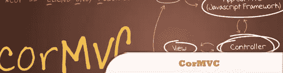
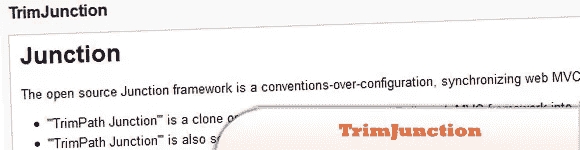
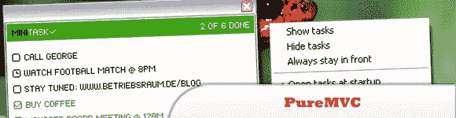
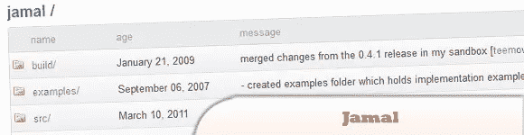
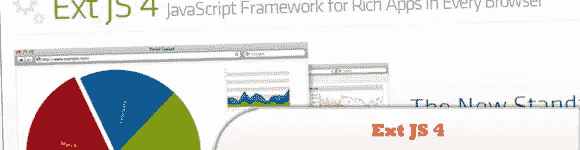
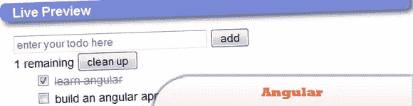
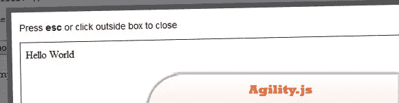
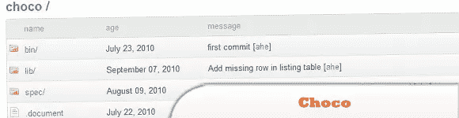

# 10 种可供选择的 JavaScript 框架(第二部分)

> 原文：<https://www.sitepoint.com/10-alternative-capable-javascript-frameworks-part-ii/>

正如我们所承诺的，这里是我们认为最有前途的 JavaScript 框架的最后 10 个。尽情享受吧！

 **## 1.勤务兵

batman.js 是一个从实际使用中提取的全栈微框架，旨在最大化开发者和设计者的快乐。它支持约定胜于配置、无模板视图，以及通过简单地不做太多事情来获得高性能。

  
[来源](http://batmanjs.org/)
[演示](http://batmanjs.org/examples.html)

## 2.CorMVC

是一个基于 jQuery 的模型-视图-控制器(MVC)框架，可以帮助开发单页面、基于 web 的应用程序。CorMVC 代表客户端专用的模型-视图-控制器，旨在成为学习单页面应用程序架构的最低入门点。

  
[来源](http://www.bennadel.com/projects/cormvc-jquery-framework.htm)
[演示](http://www.bennadel.com/resources/projects/cormvc/demo/index.htm)

## 3.三合一

开源 Junction 框架是一个约定胜于配置的同步 web MVC 框架。TrimPath Junction 是将出色的 Ruby on Rails web MVC 框架克隆或移植到 JavaScript 中。

  
[源+演示](http://code.google.com/p/trimpath/wiki/TrimJunction)

## 4.PureMVC

是一个轻量级框架，用于创建基于经典模型、视图和控制器概念的应用程序。

  
[源+演示](http://puremvc.org/)

## 5.贾马尔（男子名）

是一组约定和小型 javascript 库，用于在 web 应用程序中实现 HTML、CSS 和 JavaScript 的完全分离。Jamal 构建于 jQuery 之上，并受到诸如 Ruby on Rails、CakePHP 及其衍生产品等 MVC 框架的启发。

  
[源+演示](https://github.com/adcloud/jamal/)

## 6.迷人的

是一个 JavaScript 库，它可以帮助您创建丰富的、响应迅速的显示和编辑器用户界面，并具有清晰的底层数据模型。

  
[源+演示](http://knockoutjs.com/)

## 7.Ext JS 4

通过将流行的模型-视图-控制器模式引入 Ext JS，带来了构建客户端应用程序的全新方式。

  
[来源](http://www.sencha.com/products/extjs/)
[演示](http://www.sencha.com/products/extjs/examples/)

## 8.有角的

支持整个开发过程，为您的 web 应用程序提供结构，并使用最好的 JS 库。使用 angular，视图和数据模型总是同步的——不需要手动操作 DOM。

  
[源+演示](http://angularjs.org/#/)

## 9.敏捷. js

是一个用于 JavaScript 的 MVC 库，允许您编写可维护和可重用的浏览器代码，而没有其他 MVC 库中的冗长或基础设施开销。

  
[源+演示](http://agilityjs.com/)

## 10.虫火谷

将 MVC 带到客户端！一个虫火谷应用程序只包含一个 HTML 页面，所有的交互都由 JavaScript 管理。你的 UI 只用 HTML 和 CSS！

  
[源+演示](https://github.com/ahe/choco)

## 分享这篇文章**