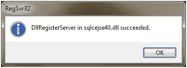

# HTML5 索引的近距离个人化 DB

> 原文：<https://www.sitepoint.com/up-close-and-personal-with-html5-indexeddb/>

多年来，网络已经逐渐从一个内容仓库转变为一个功能齐全的应用市场。作为一个基本目标，属于“HTML5”旗帜下的技术套件具有在这种新型软件中构建的能力。在本文中，我将回顾一项解决应用程序难题的重要技术——在客户端管理特定于用户的数据的存储和检索——称为“IndexedDB”

### 什么是 IndexedDB？

IndexedDB 基本上是浏览器中的持久数据存储，即客户端的数据库。像常规的关系数据库一样，它维护它存储的记录的索引，开发人员使用 IndexedDB JavaScript API 通过键或通过查找索引来定位记录。每个数据库都由“源”限定范围，即创建数据库的站点的域。

IndexedDB 也是 web 标准如何发展的一个很好的例子。通过标准工作组和 [HTML5 实验室](http://html5labs.interoperabilitybridges.com/prototypes/indexeddb/indexeddb/info)(一个发布各种 HTML5 规范的原型实现的网站，因此你可以试用它们并提供反馈)，IndexedDB 将很快准备好供黄金时间网站使用。

如果您不熟悉 IndexedDB，请从这里开始:

1.  [IETestDrive](http://ie.microsoft.com/testdrive/HTML5/Cookbook/) 上的菜谱演示
2.  开发者指南 [MSDN](http://msdn.microsoft.com/en-us/ie/hh440436.aspx#_IndexedDB)
3.  W3C 上的规格

现在，让我们通过构建自己的应用程序来近距离接触个人。

### 设置您的开发环境

从安装开始:

1.  通过点击链接“立即下载原型！”从[到这里](http://html5labs.interoperabilitybridges.com/prototypes/indexeddb/indexeddb/info)。
2.  解压缩下载的文件。
3.  如果您运行的是 32 位版本的 Windows，则运行 *vcredist_x86.exe* 。
4.  通过在提升的命令提示符下运行以下命令来注册“sqlcejse40.dll ”:

**regsvr32 sqlcejse40.dll**

如果一切顺利，那么您应该会看到这个屏幕:



[Internet Explorer 10 平台预览版](http://bit.ly/npkR2M)支持 IndexedDB。或者你可以买一个最新版本的*谷歌 Chrome* 或者 *Firefox* ，这样你就万事俱备了。

### 构建离线笔记应用程序

我们将为笔记 web 应用程序构建一个客户端数据层:

从数据模型的角度来看，这非常简单。该应用程序允许用户编写文本笔记，并用特定的关键词进行标记。每个注释都将有一个惟一的标识符作为它的键，除了注释文本之外，它还将与一组标记字符串相关联。

下面是一个用 JavaScript 对象文字符号表示的示例 note 对象:

```
var note = {
  id: 1,
  text: "Note text.",
  tags: ["sample", "test"]
};
```

我们将构建一个具有以下接口的`NotesStore`对象:

```
var NotesStore = {
    init: function(callback) {
    },

    addNote: function(text, tags, callback) {
    },

    listNotes: function(callback) {
    }
};
```

每个方法做什么应该是显而易见的。所有的方法调用都是异步执行的(也就是说，当结果通过回调报告时)，当结果返回给调用者时，接口接受一个对回调的引用，该回调将与结果一起被调用。让我们看看如何使用索引数据库有效地实现这个对象。

### 测试索引 b

当与 IndexedDB API 对话时，您处理的根对象称为 IndexedDB。您可以检查此对象是否存在，以查看当前浏览器是否支持 IndexedDB。像这样:

```
if(window[“indexedDB”] === undefined) {
  // nope, no IndexedDB!
} else {
  // yep, we’re good to go!
}
```

另外，您可以使用 [Modernizr](http://www.modernizr.com/) JavaScript 库来测试对 IndexedDB 的支持，如下所示:

```
if(Modernizr.indexeddb) {
    // yep, go indexeddb!
} else {
    // bleh! No joy!
}
```

### 异步请求

异步 API 调用通过所谓的“请求”对象工作。当进行异步 API 调用时，它将返回对“请求”对象的引用，这公开了两个事件— `onsuccess`和`onerror`。

典型的电话是这样的:

```
var req = someAsyncCall();
req.onsuccess = function() {
    // handle success case
};
req.onerror = function() {
    // handle error
};
```

当您使用 indexedDB API 时，最终将很难跟踪所有的回调。为了使它更简单，我将定义并使用一个小的实用程序，它抽象出“请求”模式:

```
var Utils = {
    errorHandler: function(cb) {
        return function(e) {
            if(cb) {
                cb(e);
            } else {
                throw e;
            }
        };
    },

    request: function (req, callback, err_callback) {
        if (callback) {
            req.onsuccess = function (e) {
                callback(e);
            };
        }
        req.onerror = errorHandler(err_callback);
    }
};
```

现在，我可以这样写我的异步调用:

```
Utils.request(someAsyncCall(), function(e) {
    // handle completion of call
});
```

### 创建和打开数据库

创建/打开数据库是通过调用`indexedDB`对象的`open`方法来完成的。

下面是`NotesStore`对象的`init`方法的实现:

```
var NotesStore = {
    name: “notes-db”,
    db: null,
    ver: “1.0”,
    init: function(callback) {
        var self = this;
        callback = callback || function () { };
        Utils.request(window.indexedDB.open(“open”, this.name), function(e) {
            self.db = e.result;
            callback();
        });
    },

…
```

如果数据库已经存在，`open`方法打开数据库。它不会，它会创造一个新的。您可以将它视为表示数据库连接的对象。当该对象被销毁时，到数据库的连接被终止。

既然数据库已经存在，让我们创建数据库对象的其余部分。但是首先，你必须熟悉一些重要的 IndexedDB 结构。

### 对象存储

对象存储是关系数据库世界中“表”的索引数据库等价物。所有数据都存储在对象存储中，并作为主要的存储单元。

一个数据库可以包含多个对象存储，每个存储都是记录的集合。每条记录都是一个简单的键/值对。关键字必须唯一地标识特定的记录，并且可以自动生成。对象存储中的记录按关键字自动按升序排序。最后，对象存储只能在“版本变更”事务的上下文中创建和删除。(稍后将详细介绍。)

### 键和值

对象存储中的每条记录都由一个“键”唯一标识键可以是数组、字符串、日期或数字。为了便于比较，**数组**大于**字符串**，大于**日期，**大于**数字**。

键可以是“内联”键，也可以不是。通过“内联”，我们向 IndexedDB 表明特定记录的键实际上是值对象本身的一部分。例如，在我们的 notes store 示例中，每个 notes 对象都有一个`id`属性，其中包含特定 notes 的惟一标识符。这是一个“内联”键的例子——键是值对象的一部分。

每当键“内联”时，我们还必须指定一个“键路径”——一个表示如何从值对象中提取键值的字符串。

例如,“notes”对象的键路径是字符串“id ”,因为可以通过访问“id”属性从 notes 实例中提取键。但是这种模式允许键值存储在值对象的成员层次结构中的任意深度。考虑以下示例值对象:

```
var product = {
  info: {
    name: “Towel”,
    type: “Indispensable hitchhiker item”,
  },
  identity: {
    server: {
      value: “T01”
    },
    client: {
      value: “TC01”
    },
  },
  price: “Priceless”
};
```

在这里，可以使用下面的密钥路径:

```
identity.client.value
```

### 数据库版本控制

IndexedDB 数据库有一个与之关联的版本字符串。web 应用程序可以使用它来确定特定客户机上的数据库是否具有最新的结构。

当您对数据库的数据模型进行更改，并希望将这些更改传播到使用以前版本的数据模型的现有客户端时，这非常有用。您可以简单地更改新结构的版本号，并在用户下次运行您的应用程序时检查它。如果需要，升级结构，迁移数据，更改版本号。

版本号更改必须在“版本更改”事务的上下文中执行。在我们开始之前，让我们快速回顾一下什么是“事务”。

### 处理

像关系数据库一样，IndexedDB 也在事务上下文中执行所有的 I/O 操作。事务是通过连接对象创建的，支持原子的、持久的数据访问和变异。事务对象有两个关键属性:

1.  #### 范围

    范围决定了数据库的哪些部分会受到事务的影响。这基本上有助于 IndexedDB 实现确定在事务的生命周期中应用哪种隔离级别。可以把作用域简单地看作是构成事务一部分的表的列表(称为“对象存储”)。

2.  #### 方式

    事务模式决定了事务中允许哪种 I/O 操作。该模式可以是:

    1.  #### 只读

        只允许对事务范围内的对象进行“读取”操作。

    2.  #### 读/写

        允许对事务范围内的对象进行“读”和“写”操作。

    3.  #### 版本变更

        “版本更改”模式允许“读取”和“写入”操作，还允许创建和删除对象存储和索引。

除非事务对象被显式中止，否则它们会自动提交。事务对象公开事件以通知客户端:

*   当他们完成时
*   当他们放弃的时候
*   当他们超时时

### 创建对象存储

我们的 notes store 数据库将只包含一个对象存储来记录笔记列表。如前所述，对象存储必须在“版本变更”事务的上下文中创建。

让我们继续扩展`NotesStore`对象的`init`方法，以包括对象存储的创建。我用粗体突出显示了更改的部分。

```
var NotesStore = {
    name: “notes-db”,
    store_name: “notes-store”,
    store_key_path: “id”,
    db: null,
    ver: “1.0”,
    init: function (callback) {
        var self = this;
        callback = callback || function () { };
        Utils.request(window.indexedDB.open(“open”, this.name), function (e) {
            self.db = e.result;

            // if the version of this db is not equal to
            // self.version then change the version
            if (self.db.version !== self.version) {
                Utils.request(self.db.setVersion(self.ver), function (e2) {
                    var txn = e2.result;

                    // create object store
                    self.db.createObjectStore(self.store_name,
                                              self.store_key_path,
                                              true);
                    txn.commit();
                    callback();
                });
            } else {
                callback();
            }
        });
    },

…
```

对象存储是通过调用数据库对象上的`createObjectStore`方法创建的。第一个参数是对象存储的名称。接下来是标识键路径的字符串，最后是一个布尔标志，指示在添加新记录时数据库是否应该自动生成键值。

### 向对象存储添加数据

通过调用对象存储上的`put`方法，可以将新记录添加到对象存储中。可以通过事务对象检索对对象存储实例的引用。让我们实现我们的`NotesStore`对象的`addNote`方法，看看我们如何添加一条新记录:

```
    …
    addNote: function (text, tags, callback) {
        var self = this;
        callback = callback || function () { };
        var txn = self.db.transaction(null, TransactionMode.ReadWrite);
        var store = txn.objectStore(self.store_name);
        Utils.request(store.put({
            text: text,
            tags: tags
        }), function (e) {
            txn.commit();
            callback();
        });
    },

    …
```

这种方法可以分为以下几个步骤:

1.  调用数据库对象上的`transaction`方法来开始一个新的事务。第一个参数是将成为事务一部分的对象存储的名称。传递`null`会导致数据库中的所有对象存储成为作用域的一部分。第二个参数表示交易模式。这基本上是一个数值常量，我们这样声明:

    ```
    // IndexedDB transaction mode constants
    var TransactionMode = {
        ReadWrite: 0,
        ReadOnly: 1,
        VersionChange: 2
    };
    ```

2.  一旦创建了事务，我们就通过事务对象的`objectStore`方法获取对所讨论的对象存储的引用。
3.  一旦我们有了现成的对象存储，添加一个新记录就只需要对对象存储的`put`方法发出一个异步 API 调用，传递要添加到存储中的新对象。注意，我们*没有*为新的 Note 对象的`id`字段传递值。因为我们在创建对象存储时为自动生成参数传递了`true`,所以 IndexedDB 实现应该负责为新记录自动分配一个惟一的标识符。
4.  一旦异步`put`调用成功完成，我们就提交事务。

### 使用游标运行查询

从对象存储中枚举记录的 IndexedDB 方法是使用“cursor”对象。游标可以遍历基础对象存储区或索引中的记录。游标具有以下关键属性:

1.  索引或对象存储中记录的 ***范围*** 。
2.  引用光标正在迭代的索引或对象存储的 ***源*** 。
3.  一个 ***位置*** 表示光标在给定记录范围内的当前位置。

虽然游标的概念相当简单，但是考虑到所有 API 调用的异步性质，编写代码来实际迭代对象存储有点棘手。让我们实现我们的`NotesStore`对象的`listNotes`方法，看看代码看起来像什么。

```
    listNotes: function (callback) {
        var self = this,
            txn = self.db.transaction(null, TransactionMode.ReadOnly),
            notes = [],
            store = txn.objectStore(self.store_name);

        Utils.request(store.openCursor(), function (e) {
            var cursor = e.result,
                iterate = function () {
                    Utils.request(cursor.move(), function (e2) {
                        // if "result" is true then we have data else
                        // we have reached end of line
                        if (e2.result) {
                            notes.push(cursor.value);

                            // recursively get next record
                            iterate();
                        }
                        else {
                            // we are done retrieving rows; invoke callback
                            txn.commit();
                            callback(notes);
                        }
                    });
                };

            // set the ball rolling by calling iterate for the first row
            iterate();
        });
    },
```

让我们来分解一下这个实现:

1.  首先，我们通过调用数据库对象的`transaction`方法获得一个事务对象。注意，这一次我们指出我们需要一个“只读”事务。
2.  接下来，我们通过事务对象的`objectStore`方法检索对对象存储的引用。
3.  然后，我们对对象存储上的 openCursor API 发出异步调用。这里的棘手之处在于，游标中记录的每一次迭代本身都是异步操作！为了防止代码淹没在回调的海洋中，我们定义了一个名为`iterate`的局部函数来封装遍历游标中每条记录的逻辑。
4.  这个`iterate`函数对 cursor 对象的`move`方法进行异步调用，如果它检测到有更多的行要检索，就在回调中再次递归调用自己。一旦游标中的所有行都被检索到，我们最终调用调用者传递的回调方法，将检索到的数据作为参数传递。

### 潜得更深！

不管您怎么想，这绝不是对 API 的全面介绍！我只报道了:

1.  目前实施客户端存储的可用选项
2.  IndexedDB API 的各个关键方面，包括:
    1.  测试浏览器是否支持它
    2.  管理异步 API 调用
    3.  创建/打开数据库
    4.  API 的关键部分，包括对象存储、键/值、版本和事务
3.  创建对象存储
4.  将记录添加到对象存储
5.  使用游标枚举对象存储

希望是近距离的，足够私人的！

**现在，如果你已经准备好了解更多，W3C 规范文档** **是一个很好的参考**，它足够短，易于阅读！我鼓励您进行试验——在客户端访问功能数据库为 web 应用程序开辟了一系列新的场景。

**另一个很好的资源是** [**IE 试驾**](http://bit.ly/u9VYpu) **站点上的** [**IndexedDB/AppCache 样本**](http://bit.ly/sQE9GG) **。**此示例涵盖了两种规范在为用户提供丰富体验方面相互补充的场景……即使她没有连接到互联网。该示例还演示了如何使用 IE10 中的新功能，如 CSS3 3D 变换和 CSS3 过渡。

玩得开心！

## 分享这篇文章