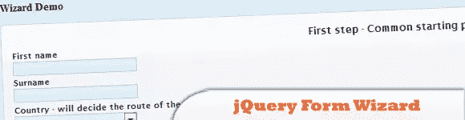
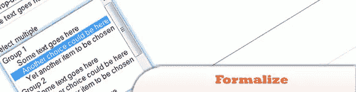
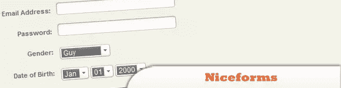
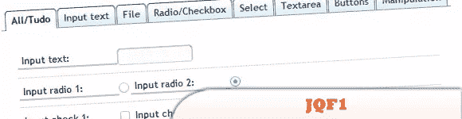
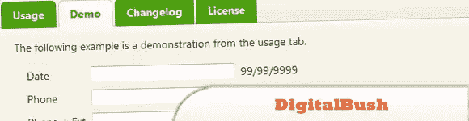
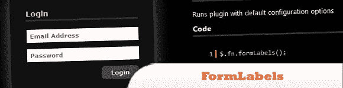

# 10 个最佳 jQuery 表单插件

> 原文：<https://www.sitepoint.com/10-jquery-form-plugins/>

我们几乎每天都与表单交互，同时处理信息，无论是登录表单、在线购物表单、注册表单等。没有多少设计师对这些元素提出新的风格和功能。每个开发人员在与他们一起工作时主要关心的是**使表单在结构本身之外可访问和可用**，因为表单完成帮助访问者、客户和一般人交换信息的角色是非常重要的。

今天我们分享给你一些最好的 jQuery 表单插件。尽情享受吧！

相关帖子:

*   [**jQuery 表单> 30 个例子和插件**](http://www.jquery4u.com/forms/30-jquery-forms/)
*   [**jQuery AutoForm 脚本简易表单自动完成**](http://www.jquery4u.com/forms/jquery-autoform/)

## 1.jQuery 表单向导

jQuery 插件，可用于为表单创建类似向导的页面流，而无需在向导步骤之间重新加载页面。该插件并不引人注目，给了开发者很大的自由来设置向导中不同步骤的流程，因为该插件支持根据用户输入在表单中创建特定的路线。

  
[源+演示](http://www.thecodemine.org/)

## 2.使正式

允许您对表单进行控制，而不需要对它们进行太大的更改，使它们在用户的操作系统中看起来很陌生，这个工具可以被视为表单元素的 webkit 版本，这使得开发兼容的界面变得非常棒。

  
[来源](http://formalize.me/) [演示](http://formalize.me/demo.html)

## 3.美好的形式

将最常用的表单元素替换为自定义设计的表单元素的脚本。您既可以使用提供的默认主题，也可以不费吹灰之力开发自己的外观。

  
[来源](http://www.emblematiq.com/lab/niceforms/) [演示](http://www.emblematiq.com/lab/niceforms/demo/v20/niceforms.html)

## 4.老式打字机:有史以来最性感的 jQuery 联系人表单

有史以来最漂亮的联系形式之一，这个老式打字机可以在你的网站上实现为一个 jQuery 插件，其结构在本教程中有解释。

  
[来源](http://www.webdesignshock.com/jquery-contact-form/) [演示](http://www.webdesignshock.com/demos/typewriter/)

## 5.JQF1

JQF1 是最完整的表单样式插件之一，它是一种很好的方式，可以将一些很酷的格式添加到人们经常在 web 设计中使用的标准 web 表单中。

  
[来源](http://www.azurem.com/jqf1/index.html) [演示](http://www.azurem.com/jqf1/index.html#tabz3)

## 6.洋地黄

很棒的 jQuery 插件，对会计公司很有帮助，因为会计公司的员工必须一直处理日期和电话号码，这个插件会插入所有必须在任何情况下输入的默认字符。

  
[来源](http://digitalbush.com/projects/masked-input-plugin/) [演示](http://digitalbush.com/projects/masked-input-plugin/#demo)

## 7 .模具 0.1.2

jQuery.dForm 插件允许您从 JavaScript 对象轻松创建 HTML 表单(JSON 也是如此)。

  
[来源](http://neyeon.com/p/jquery.dform/doc/files2/readme-txt.html) [演示](http://neyeon.com/p/jquery.dform/doc/files2/examples-txt.html#Examples)

## 8.表单标签

使用 FormLabels，您可以轻松地插入微妙的表单提示，同时显示不同的和有吸引力的表单设计。

  
[来源](http://o2v.net/blog/jquery-formlabels-plugin) [演示](http://o2v.net/demo/formLabels/index.html)

## 9.to 检查列表

jQuery 的 toChecklist 插件将为您提供选择框的功能，而不需要按住 ctrl 键并单击项目来选择它们。

  
[源+演示](http://www.scotthorlbeck.com/code/tochecklist/)

## 10.表单框

有了这个有用的插件，你就可以把“登录”、“注册”和“找回密码”窗口放在同一个网页上。

  
[来源](http://addyosmani.com/blog/formbox/) [演示](http://www.addyosmani.com/resources/formbox/release2/)

## 分享这篇文章