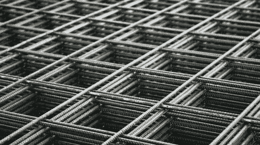
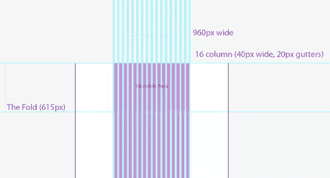
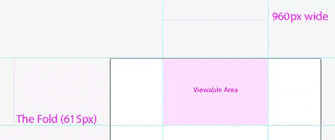
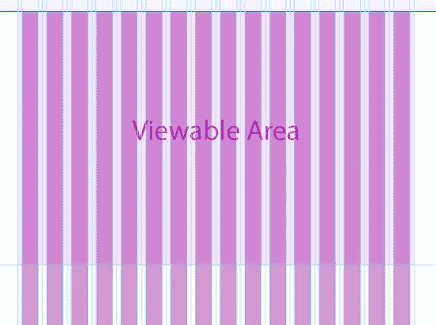

# 为网络设计:模板和网格系统

> 原文：<https://www.sitepoint.com/designing-for-the-web-templates-and-grid-systems/>

从本系列的前一篇文章开始，[为网站设计:分辨率和尺寸](https://www.sitepoint.com/designing-for-the-web-resolution-and-size/)，我们将讨论一些在创建网站设计模板时有用和重要的因素。

* * *

在这篇文章中，我们将涵盖一些重要的问题，并介绍一些工具，供您在设计网站时使用。请记住，与印刷领域一样，web 领域包含了大量的设计和开发选择。这只是一种方法，我们试图更多地从设计者的角度而不是开发者的角度出发。

从上一篇文章中，我们选择了为 1024 x 768 的*桌面*屏幕分辨率进行设计。我们将使用桌面作为我们的主要例子，并将在本文后面讨论平板电脑和手机。

然而，我们需要看看我们可以用来设计一个网站的可用空间。这个可用空间被称为*‘视口’*。*视窗*的定义有所不同——取决于来源，但基本上，它是浏览器中显示网站的区域。

我们将需要制定一个标准化的尺寸来设计我们的网站，这样我们就可以确保我们可以考虑到大多数浏览器的*视窗*，因为这个空间的大小可能会因浏览器和操作系统的不同而不同。

许多设计师一直使用 950 到 999 像素的宽度来设计。然而，作为平面设计师，我们喜欢使用标准，因为它简化了设计和制作。

### **960 网格系统**

正如我们在报纸和杂志等印刷出版物中所做的那样，我们可以使用网格系统来帮助我们进行布局，特别是“960 网格系统”。这将使我们能够更快地创建一个网站布局。有各种各样的其他网格系统可供选择，它们都是有效的，并且有不同的存在理由。虽然看起来他们是在竞争，但不应该这样看。目标是确保你的设计对于给定的项目是吸引人的、有效的和易读的。

我们选择使用 960 网格系统是因为它已经成为一个强大的事实上的标准。

<cite>注意:关于各种网格系统的更多信息，请访问 [960.gs](http://www.960.gs/) 和 [978.gs](http://978.gs/) 。后一个链接涵盖了许多其他不同分辨率的网格系统。还有 www.thegridsystem.org 的。</cite> 

### **模板:概述**

使用模板是加快包括设计网站在内的任何过程的好方法。创建一个考虑到上述因素的模板将会加快设计的进程，并给你的创造性思维更多的自由。我为你提供了一个模板作为例子——你可以随意使用它或从中获取你喜欢的想法。

[下载桌面模板](https://www.sitepoint.com/wp-content/uploads/2011/12/desktop_template.ai_.zip)

这是我构建的一个模板，用作项目的设计基础。使用 Illustrator 的原因是，它是一个很好的印刷排版工具，并且可以转移到 web 上。然而，许多设计师确实更喜欢用 Photoshop 来创建他们的网页设计——如果你经常使用 Photoshop，这是值得研究的。

#### **画板**

在示例模板中，画板为 1920 像素 x 2160px 像素。画板的高度大约是屏幕高度的三倍，也就是具有一般兴趣的普通用户滚动的数量。

画板的宽度相当宽，如果需要，可以提供足够的空间来设计更丰富的背景-如果您觉得画板的宽度太宽，您可以随时调整它的大小。

#### **固定布局**

如果你刚开始设计一个网站，你会学到固定宽度布局和流动布局。如果调整浏览器窗口的大小，固定布局不会导致网站的大小或形状发生变化。流动布局是指在调整浏览器窗口大小时可以“增长”或“收缩”的布局。

虽然模板是为固定布局制作的，但也可以使用它们来创建流动布局，因为这些特定问题可以在编码中解决。对于设计师来说，最重要的是解释一个站点是如何收缩或增长的，以及最小和最大的宽度和高度。

为了保持一些设计控制，最好先创建一个固定的布局。

#### **可视区域**(或视口)

*在 Illustrator 中查看模板或查看本文中的图片，以便跟进。*

粉红色方块是大多数操作系统中的大多数浏览器显示的区域，通常是设计网站的起点，这个区域可以被视为屏幕分辨率为 1024 x 768 像素的最大化浏览器的*视窗*。这个平均可视区域也代表了用户最初看到的网站部分或“*折叠*”上方的内容。

#### **折叠**

*折页*是从*印刷品*中借用的一个术语，代表报纸的折页线。在报摊上可以看到*折页*上方的空间。这个术语已经被网页设计所采用，它代表了你需要开始滚动来查看更多页面(通常是主页)的那一行。所以，你网站的顶部 615 像素左右会在折叠之上。这个想法是，你应该把最相关的信息放在文件夹的上方。折叠的相关性是有争议的，有很多关于这个主题的文章。然而，它与平板电脑和手机设计相关，因为您可能希望创建一个尽可能避免滚动的布局，除非显示书面作品。

###  **网页设计网格系统**

在这些层中，您会发现 960 网格系统有 3 层。每一个都有不同的列，因此列宽也不同，设计者可以单独使用它们，或者一起使用它们来设计页面的网格。使用 12 列网格似乎提供了一个更简单的设计过程，而增加到 24 列则为设计者提供了更多的空间来设计更复杂的网格。您可能想要选择一个 16 列的中间值，这由您自己决定——可以说，您可以在不同的应用中一前一后地使用这三个列，或者一个列在另一个列之上。

### **平板电脑和手机模板**

[平板电脑模板](https://www.sitepoint.com/wp-content/uploads/2011/12/tablet_template.ai_.zip) | [手机模板](https://www.sitepoint.com/wp-content/uploads/2011/12/phone_template.ai_.zip)

这些模板与桌面模板非常相似，只是有些不同，这些不同是针对每种设备类型的设计挑战而言的。

#### *平板电脑模板*

在 tablet 模板中，我们一起去掉了背景。由于实际屏幕比显示器小得多，并且涉及到触摸，我们需要确保这种设计更好的可视性和可用性。虽然模板仍然包括 960 网格，但元素可能需要更加“厚实”。

#### *手机模板*

电话模板是纵向的，宽 320 像素，模板中包含 300 个网格。与平板电脑布局一样，我们需要确保我们的设计易于查看，因为这种布局将用于手机和其他小型手持设备。

### 为什么我们要创建三个网站设计？

为桌面、平板电脑和手机设计特定布局的主要原因是为了让网站的内容在各种情况下都能有效地传达给浏览者。最终结果是，正确的布局应该显示在正确的设备类型上。对于开发人员来说，有不同的方法来实现这一点，这超出了本文的范围。

### **制作自己的模板**

设计时，工具的舒适性和直观性非常重要。我提供的模板只是设计您自己的模板的指南——确保它们按照您想要的方式工作。例如，桌面模板对于大多数设计人员来说可能太宽了。花点时间在背景上(86%的桌面用户可以看到一些背景)可以增加网站设计的丰富性和深度——但这是设计师的偏好。

在下一篇文章中，我们将讨论网站设计和区块中的一般网站元素！

## 分享这篇文章